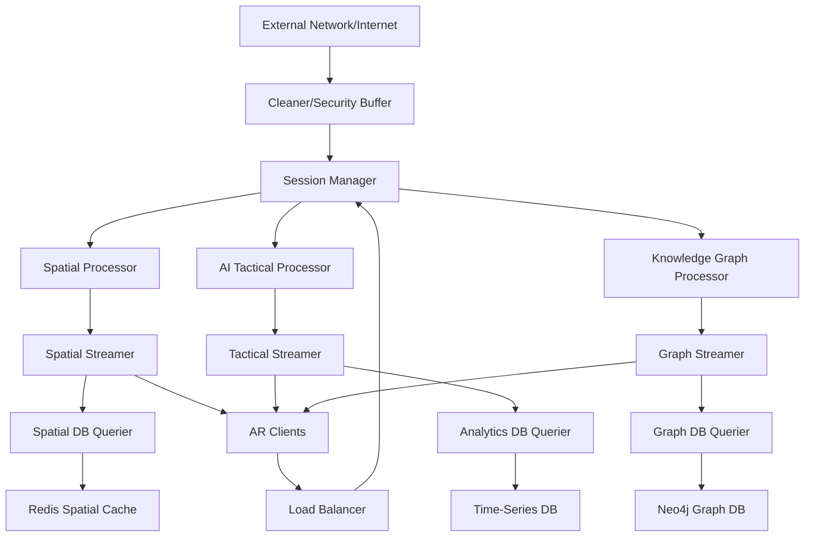
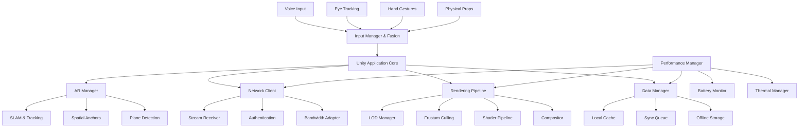

# AR Defense Training System - Implementation Roadmap

## Project Overview

Building a **Scalable Multi-User AR Holographic Terrain Simulation System** for defense training applications. The system integrates cutting-edge AR technologies with AI-driven tactical analysis, multimodal interaction, and semantic compression for immersive, synchronized training environments.

## 🎯 Project Goals

- **Real-time multi-user AR collaboration** with cm-level spatial precision
- **AI-powered tactical overlays** for enhanced training scenarios
- **Advanced multimodal interaction** (Voice + Gaze + Tangible Props)
- **Scalable architecture** supporting 20+ simultaneous users
- **Semantic compression** achieving 24x data reduction
- **Low-latency synchronization** (<100ms response times)

---

## 📋 Development Phases

### **Phase 1: Foundation & Architecture (6 weeks)**

#### **Week 1-4: Project Setup & Core Architecture**
- **Tech Stack Setup**
  - Unity 2024.x with Universal Render Pipeline (URP)
  - ARFoundation for cross-platform AR development
  - OpenXR framework for standardized XR APIs
  - Node.js backend with TypeScript
  - Redis for real-time data synchronization

- **Hybrid Architecture Design**
  - **Cleaner/Security Buffer** for external data filtering
  - **Session Manager** as central coordination hub
  - **Specialized Processors** (Spatial, AI, Knowledge Graph)
  - **Delta Streamers** for bandwidth optimization
  - **DB Queriers** for database load protection
  - Docker containers with gRPC communication
  - Two-tier security model implementation

#### **Week 5-6: Basic AR Framework & Security Foundation**
- **Core AR Implementation**
  - Scene understanding and plane detection
  - Basic object placement and manipulation
  - Camera feed and tracking initialization
  - Performance optimization baseline

- **Client-Side Foundation**
  - **Unity Application Architecture** setup (Core, AR, Rendering, Networking folders)
  - **ARManager** and **SpatialTracker** implementation
  - **NetworkClient** with authentication
  - **Performance Manager** with battery/thermal monitoring
  - **Local caching system** and offline storage
  - **Input fusion framework** for multi-modal interaction

- **Security Infrastructure**
  - **Cleaner/Security Buffer** development
  - External data validation and sanitization
  - Network perimeter defense setup
  - **Client-side authentication** and encryption implementation

**✅ Milestone 1**: Basic AR application with security foundation running on target devices

---

### **Phase 2: Spatial Foundation (4 weeks)**

#### **Week 7-8: Spatial Mapping & Tracking**
- **SLAM Implementation**
  - Visual-inertial odometry (VIO) integration
  - Real-time map generation and persistence
  - Azure Spatial Anchors for cross-session persistence
  - ARCore Cloud Anchors for real-time collaboration

#### **Week 9-10: Multi-User Spatial Anchoring & Early Field Testing**
- **Collaborative Spatial System**
  - SynchronizAR-style UWB distance measurements
  - Drift correction algorithms with Kalman filtering
  - Cross-device spatial registration
  - Support for 5+ simultaneous users

- **Initial Field Validation**
  - **GPS-denied environment testing** (indoor/underground facilities)
  - **Basic battery life assessment** and optimization
  - **Network connectivity variation** testing
  - **Early user feedback** collection and iteration

**✅ Milestone 2**: Multi-user spatial synchronization working with drift correction

---

### **Phase 3: Core Features (6 weeks)**

#### **Week 11-12: Knowledge Graph Integration & Database Infrastructure**
- **3D Graph Visualization**
  - Neo4j database setup for military knowledge structures
  - yFiles Unity integration for 3D graph rendering
  - SPARQL endpoints for real-time querying
  - Command hierarchy and logistics network representation

- **Database Protection Layer**
  - **Graph DB Querier** implementation
  - Query optimization and connection pooling
  - Database load balancing and protection
  - Cache-first query strategies

#### **Week 13-14: LOD Terrain Rendering & Spatial Streaming**
- **Terrain System**
  - 3D Tiles Renderer with Draco compression
  - Multi-resolution Level-of-Detail (LOD) system
  - Real-time terrain streaming
  - Integration with existing spatial anchoring

- **Spatial Data Infrastructure**
  - **Spatial Streamer** implementation
  - **Spatial DB Querier** for real-time data
  - Delta-only spatial updates
  - Bandwidth optimization for mobile devices

- **Client-Side Data Management**
  - **Three-tier caching** (Hot/Warm/Cold storage)
  - **Delta stream processing** with interpolation
  - **Offline scenario storage** for network-denied environments
  - **Sync queue management** for reconnection scenarios
  - **Bandwidth adaptation** with quality degradation

#### **Week 15-16: Basic Tactical Overlays**
- **Static Overlay System**
  - Threat cone visualization with Shader Graph
  - Unit icon rendering system
  - Basic annotation layers
  - Performance optimization for 60+ FPS

**✅ Milestone 3**: Core terrain and knowledge graph visualization with streaming infrastructure working

---

### **Phase 4: Advanced Interaction (6 weeks)**

#### **Week 17-18: Voice + Gaze Fused Input**
- **Multimodal Input System**
  - Tobii Eye Tracking SDK integration
  - Mozilla DeepSpeech for voice recognition
  - Rasa for natural language understanding
  - GazePointAR-style context-aware commands

- **Client-Side Input Processing**
  - **Local voice wake word detection** with server streaming
  - **High-frequency gaze tracking** (90+ Hz) with predictive pre-loading
  - **Context-aware command interpretation** based on gaze targets
  - **Input fusion algorithms** combining voice + gaze + gesture
  - **Offline voice command** recognition for basic operations

#### **Week 19-20: Tangible Physical Props**
- **Physical Interaction**
  - OpenCV-based object tracking
  - ARToolKit for marker-based props
  - Haptic feedback integration
  - 6-DOF object manipulation mapping

#### **Week 21-22: Advanced UI/UX**
- **Interaction Refinement**
  - Entity lens for object examination
  - Path tracer for route visualization
  - Semantic filtering with hand gestures
  - User experience optimization

**✅ Milestone 4**: Advanced multimodal interaction system functional

---

### **Phase 5: AI & Optimization (6 weeks)**

#### **Week 23-24: AI Tactical Overlays**
- **AI Decision Support**
  - TensorFlow/PyTorch model integration
  - Real-time threat analysis engine
  - Tactical pathfinding algorithms
  - Strategic recommendation system

#### **Week 25-26: Predictive Rendering & Client Optimization**
- **Performance Optimization**
  - LSTM-based head movement prediction
  - Gaze prediction for foveated rendering
  - Semantic importance ranking
  - Tile pre-loading system

- **Client-Side Rendering Pipeline**
  - **Adaptive quality system** based on battery/thermal state
  - **LOD Manager** with distance-based quality scaling
  - **Frustum culling** and occlusion optimization
  - **Local vs cloud rendering** decision algorithms
  - **Frame rate adaptation** for different device capabilities
  - **Memory-aware texture streaming** and garbage collection

#### **Week 27-28: Semantic Compression & Tactical Streaming**
- **Data Optimization**
  - Transformer-based semantic understanding
  - Real-time delta compression
  - Priority-based streaming
  - Network bandwidth optimization

- **Tactical Data Infrastructure**
  - **Tactical Streamer** implementation
  - **Analytics DB Querier** for AI model data
  - Semantic importance ranking for streaming
  - AI-driven data priority management

**✅ Milestone 5**: AI systems and optimization features deployed

---

### **Phase 6: Integration & Testing (4 weeks)**

#### **Week 29-30: System Integration & Security Deployment**
- **Full Stack Integration**
  - End-to-end testing of all modules
  - Performance benchmarking
  - Scalability testing (20+ users)
  - **Two-tier security model** deployment and testing

- **Infrastructure Validation**
  - **Cleaner** security buffer stress testing
  - **Streamers** (Spatial, Tactical, Graph) performance validation
  - **DB Queriers** load protection verification
  - External data source integration and validation

#### **Week 31-32: Defense Training Scenarios & Field Validation**
- **Scenario Development**
  - Military training scenario creation
  - Instructor tools and controls
  - Assessment and analytics system
  - User training and documentation

- **Real-World Testing**
  - **Environmental stress testing** (various lighting, weather conditions)
  - **Battery life optimization** and hot-swap procedures
  - **Network degradation simulation** and offline mode validation
  - **User adoption studies** and training effectiveness measurement
  - **Security penetration testing** and compliance validation
  - **Extended session testing** (1hr+ continuous operation)

**✅ Final Milestone**: Complete AR Defense Training System with two-tier security and optimized streaming ready for deployment

---

## 🛠️ Technical Implementation Details

### **Core Technology Stack**

| Component | Technology | Purpose |
|-----------|------------|---------|
| **AR Framework** | Unity + ARFoundation + OpenXR | Cross-platform AR development |
| **Client Architecture** | **C# Unity Scripts** + **Performance Manager** | Modular client-side organization |
| **Input Processing** | **Tobii SDK** + **ARFoundation Hand Tracking** + **Local Voice** | Multi-modal interaction fusion |
| **Client Rendering** | **URP** + **LOD System** + **Adaptive Quality** | Optimized AR rendering pipeline |
| **Client Data** | **Local Caching** + **Delta Processing** + **Offline Storage** | Bandwidth-optimized data management |
| **Backend** | Node.js + TypeScript + gRPC | Real-time synchronization |
| **Security** | **Cleaner/Security Buffer** + JWT + **Client Encryption** | External data filtering & device security |
| **Streaming** | **Delta Streamers** + WebRTC | Bandwidth-optimized data delivery |
| **Database** | Neo4j + Redis + **DB Queriers** | Knowledge graphs + protected data access |
| **AI/ML** | TensorFlow/PyTorch | Tactical AI and prediction |
| **Networking** | WebRTC + Socket.IO | Real-time communication |
| **Cloud** | NVIDIA CloudXR + Azure Spatial Anchors | Hybrid rendering |

### **Architecture Diagram**



### **Two-Tier Security Model**

**Security Architecture:**
```
External Sources → [CLEANER] → Session Manager ← [LOAD BALANCER] ← AR Clients
                                    ↓
                           Internal Processing Systems
```

**Security Zones:**

1. **External Network (Untrusted)**
   - Threat intelligence feeds from defense databases
   - Weather/terrain data from satellite services  
   - Map updates from geospatial providers
   - Third-party ally system integrations

2. **Cleaner/Security Buffer (Perimeter Defense)**
   - **Malware scanning** of incoming files and data streams
   - **Data validation** and sanitization of external feeds
   - **Rate limiting** and DDoS protection
   - **Authentication** of external data sources
   - **Content filtering** for potentially malicious payloads

3. **Internal Network (Trusted)**
   - Authenticated AR clients (military personnel devices)
   - Real-time spatial tracking and collaboration data
   - Low-latency direct access to Session Manager
   - Quality of Service prioritization

4. **Processing Core (Protected)**
   - Isolated internal processors and databases
   - Optimized data flows between specialized services
   - Delta-streaming for bandwidth efficiency

**Key Benefits:**
- **Performance**: AR clients get direct low-latency access
- **Security**: External threats filtered at network perimeter  
- **Scalability**: Different data types processed optimally
- **Reliability**: Fault isolation between external and internal systems

---

### **🔧 Client-Side Architecture**



#### **Core Client Components**

**1. Unity Application Architecture**
```
AR Defense Client/
├── Core/
│   ├── ApplicationManager.cs      # Main app lifecycle
│   ├── SceneManager.cs           # Scene transitions
│   ├── InputManager.cs           # Multi-modal input fusion
│   └── PerformanceManager.cs     # Resource optimization
├── AR/
│   ├── ARManager.cs              # AR session management
│   ├── SpatialTracker.cs         # SLAM and anchoring
│   ├── PlaneDetector.cs          # Environment understanding
│   └── CollaborationSync.cs      # Multi-user coordination
├── Rendering/
│   ├── LODManager.cs             # Level-of-detail system
│   ├── FrustumCuller.cs          # Visibility optimization
│   ├── ShaderManager.cs          # Custom shader pipeline
│   └── CompositorPipeline.cs     # Final frame composition
├── Networking/
│   ├── NetworkClient.cs          # Server communication
│   ├── StreamReceiver.cs         # Delta stream handling
│   ├── AuthenticationClient.cs   # Device authentication
│   └── BandwidthAdapter.cs       # Network optimization
├── Data/
│   ├── CacheManager.cs           # Local data caching
│   ├── SyncQueue.cs              # Synchronization queue
│   ├── OfflineStorage.cs         # Offline data persistence
│   └── DataCompression.cs        # Client-side compression
└── UI/
    ├── TacticalOverlay.cs        # Military UI elements
    ├── GazePointAR.cs            # Gaze-based interaction
    ├── VoiceCommands.cs          # Voice processing
    └── HapticFeedback.cs         # Tactile responses
```

**2. AR Rendering Pipeline**
- **Local Rendering** (60+ FPS target):
  - Basic spatial tracking and anchoring
  - Simple geometric overlays and annotations
  - User interface elements and controls
  - Real-time collaboration markers

- **Hybrid Cloud Rendering** (complex scenarios):
  - Detailed 3D terrain with Draco compression
  - AI-generated tactical overlays
  - Complex physics simulations
  - High-resolution knowledge graph visualizations

- **Adaptive Quality System**:
  ```csharp
  // Pseudo-code for adaptive rendering
  if (batteryLevel < 20% || thermalThrottling) {
      renderQuality = QualityLevel.Low;
      disableNonEssentialEffects();
  } else if (networkLatency > 200ms) {
      preferLocalRendering();
      reducePredictiveLoading();
  }
  ```

**3. Multi-Modal Input Processing**
- **Voice Pipeline**: 
  - Local wake word detection → Stream to server for full processing
  - Offline mode: Basic command recognition using lightweight models
  - Context awareness: Commands interpreted based on gaze target

- **Gaze Tracking Integration**:
  - High-frequency local processing (90+ Hz)
  - Predictive pre-loading of gazed objects
  - Context-sensitive UI element highlighting

- **Gesture Recognition**:
  - Hand tracking via ARFoundation
  - Custom gesture library for military commands
  - Gesture + gaze fusion for precise object manipulation

**4. Data Management Strategy**
- **Three-Tier Caching**:
  - **Hot Cache** (RAM): Currently active scenario data
  - **Warm Cache** (Storage): Recent session data
  - **Cold Storage**: Offline maps and base scenarios

- **Delta Stream Processing**:
  ```csharp
  class DeltaProcessor {
      Queue<DeltaUpdate> updateQueue;
      Dictionary<ObjectID, GameObject> activeObjects;
      
      void ProcessDelta(DeltaUpdate delta) {
          if (delta.Type == UpdateType.Position) {
              interpolateMovement(delta);
          } else if (delta.Type == UpdateType.Create) {
              instantiateObject(delta);
          }
      }
  }
  ```

**5. Performance Optimization**
- **Battery Management**:
  - Adaptive frame rate based on battery level
  - Background processing throttling
  - Smart screen brightness adjustment

- **Thermal Management**:
  - CPU/GPU frequency scaling
  - Reduced particle effects under thermal stress
  - Graceful degradation of AI features

- **Memory Management**:
  - Aggressive garbage collection scheduling
  - Texture streaming and unloading
  - Model LOD based on available memory

**6. Network Client Implementation**
- **Connection Management**:
  - WebRTC for real-time collaboration
  - HTTP/2 for delta streams
  - WebSocket fallback for unreliable networks

- **Bandwidth Adaptation**:
  ```csharp
  if (availableBandwidth < 1Mbps) {
      enableAggressiveCompression();
      disableHighResTextures();
      prioritizeTacticalData();
  }
  ```

- **Offline Mode**:
  - Local scenario execution
  - Synchronization queue for reconnection
  - Essential training scenarios cached locally

**7. Security Implementation**
- **Device Authentication**:
  - Hardware-based device fingerprinting
  - Certificate-based authentication
  - Biometric user verification (if available)

- **Data Protection**:
  - AES-256 encryption for local storage
  - TLS 1.3 for all network communication
  - Secure enclave utilization (iOS/Android)

- **Runtime Security**:
  - Code obfuscation and anti-tampering
  - Runtime application self-protection (RASP)
  - Memory encryption for sensitive data

### **Performance Targets**

- **Latency**: <100ms for spatial synchronization
- **Accuracy**: cm-level spatial precision
- **Scalability**: 20+ simultaneous users
- **Frame Rate**: 60+ FPS on target devices
- **Compression**: 24x reduction for annotation data
- **Network Traffic**: 370% reduction vs. traditional approaches

---

## 📊 Risk Assessment & Mitigation

### **High-Risk Items**
1. **Multi-user spatial drift** → Implement robust Kalman filtering + manual anchor locks
2. **AI model performance** → Use pre-trained models + edge optimization
3. **Network latency** → Deploy edge computing + predictive streaming
4. **Hardware limitations** → Implement adaptive quality scaling

### **Medium-Risk Items**
1. **Integration complexity** → Modular architecture + comprehensive testing
2. **User experience** → Iterative design + user feedback loops
3. **Scalability bottlenecks** → Load testing + performance monitoring

---

## 🌍 Real-World Deployment Challenges

### **🔴 High-Probability Challenges**

#### **Environmental & Field Conditions**
- **GPS/Tracking Degradation**: Indoor facilities, underground bunkers, GPS jamming
  - *Mitigation*: UWB backup tracking, manual anchor locks, offline mapping
- **Lighting Conditions**: Night ops, desert glare, strobing lights
  - *Mitigation*: Infrared tracking, adaptive brightness, multi-sensor fusion
- **Weather Impact**: Rain, dust, fog, extreme temperatures
  - *Mitigation*: IP67-rated devices, environmental sensors, degraded mode operation
- **Electromagnetic Interference**: Military equipment, radar, communication jammers
  - *Mitigation*: Shielded components, frequency hopping, backup communication protocols

#### **Hardware Reality Gap**
- **Battery Life**: 2-3 hour device life vs. 8-12 hour training exercises
  - *Mitigation*: Hot-swappable battery packs, power optimization, charging stations
- **Device Fragmentation**: Different AR hardware capabilities
  - *Mitigation*: Adaptive rendering pipeline, lowest-common-denominator fallbacks
- **Heat Generation**: Processor overheating during intensive workloads
  - *Mitigation*: Thermal throttling, external cooling, workload distribution
- **Durability**: Consumer devices vs. military ruggedization needs
  - *Mitigation*: Protective casings, field-hardened alternatives, rapid replacement

#### **Network Infrastructure Limitations**
- **Bandwidth Bottlenecks**: Remote bases with limited connectivity
  - *Mitigation*: Aggressive caching, offline modes, data prioritization
- **Latency Spikes**: Satellite connections causing >500ms delays
  - *Mitigation*: Edge computing, predictive pre-loading, local processing
- **Network Security**: Military firewalls blocking protocols
  - *Mitigation*: VPN tunneling, approved protocol whitelist, security exemptions
- **Edge Computing Gaps**: Limited local processing power
  - *Mitigation*: Mobile processing units, degraded rendering modes

### **🟡 Medium-Probability Issues**

#### **User Adoption & Training**
- **Motion Sickness**: 15-20% user VR/AR sickness during extended use
  - *Mitigation*: Comfort settings, session breaks, alternative interfaces
- **Learning Curve**: Senior personnel technology resistance
  - *Mitigation*: Gradual rollout, champion programs, extensive training
- **Cognitive Overload**: Too much simultaneous information
  - *Mitigation*: Configurable UI, progressive disclosure, user customization
- **Physical Fatigue**: Headset weight causing neck strain
  - *Mitigation*: Lightweight designs, ergonomic adjustments, session limits

#### **Security & Compliance**
- **Data Classification**: Mixing classified/unclassified data streams
  - *Mitigation*: Automated classification tags, access controls, audit trails
- **Insider Threats**: Authenticated users exfiltrating training data
  - *Mitigation*: Behavioral monitoring, data loss prevention, zero-trust architecture
- **Zero-Day Exploits**: New vulnerabilities in AR/AI frameworks
  - *Mitigation*: Regular security updates, threat intelligence, sandboxing
- **Audit Compliance**: FedRAMP, DISA STIGs certification requirements
  - *Mitigation*: Continuous compliance monitoring, automated documentation

#### **Integration Challenges**
- **Legacy System Compatibility**: 20+ year old military systems
  - *Mitigation*: API adapters, data transformation layers, middleware solutions
- **Multi-National Training**: Different countries' security protocols
  - *Mitigation*: Configurable security profiles, data sovereignty controls
- **Vendor Lock-in**: Dependency on specific cloud/AR platform vendors
  - *Mitigation*: Multi-vendor support, open standards, containerization
- **Version Control**: Managing updates across thousands of devices
  - *Mitigation*: Automated deployment, staged rollouts, rollback capabilities

### **🟢 Lower-Probability but High-Impact**

#### **AI Model Failures**
- **Adversarial Attacks**: Enemy forces confusing AI recommendations
  - *Mitigation*: Adversarial training, model validation, human oversight
- **Model Drift**: AI performance degrading over time
  - *Mitigation*: Continuous monitoring, automated retraining, performance metrics
- **Bias Issues**: AI showing cultural/tactical biases
  - *Mitigation*: Diverse training data, bias testing, regular audits
- **Explainability**: Military personnel not trusting "black box" AI
  - *Mitigation*: Interpretable models, decision rationale display, override controls

#### **Scalability Surprises**
- **Concurrent User Limits**: Failing at 100+ users vs. 20 users
  - *Mitigation*: Load testing, horizontal scaling, queue management
- **Database Hotspots**: Geographic regions overwhelming database
  - *Mitigation*: Geographic partitioning, read replicas, caching layers
- **Memory Leaks**: Long-running sessions causing degradation
  - *Mitigation*: Regular memory profiling, automatic restarts, resource limits
- **Cache Invalidation**: Spatial updates not propagating correctly
  - *Mitigation*: Eventual consistency models, conflict resolution, manual sync

### **💡 Comprehensive Mitigation Strategy**

#### **Immediate Actions (Phase 1)**
1. **Extensive Field Testing**: Deploy prototypes in real military environments
2. **Hardware Redundancy**: Support multiple AR platforms and backup devices
3. **Offline Capabilities**: Design system to work without internet connectivity
4. **Gradual Rollout**: Start with tech-savvy units before broader deployment

#### **Architecture Safeguards (Ongoing)**
1. **Adaptive Quality**: Automatically reduce rendering based on hardware capabilities
2. **Failover Systems**: Backup processing nodes for critical scenarios
3. **Security Hardening**: Regular penetration testing and security audits
4. **Performance Monitoring**: Real-time alerting for system degradation

#### **User Experience Focus (Continuous)**
1. **Multi-Level Training**: Basic to advanced user training programs
2. **Feedback Loops**: Regular user surveys and effectiveness metrics
3. **Change Management**: Gradual transition from traditional training
4. **24/7 Support**: Technical support infrastructure for deployed systems

### **🎯 Critical Issues to Monitor**
1. **Network Connectivity** - #1 operational challenge
2. **Battery/Power Management** - Training session effectiveness limiter
3. **User Adoption** - Cultural resistance in traditional military environments
4. **Security Certification** - Potential deployment timeline delays
5. **Hardware Durability** - Consumer AR devices in military field conditions

---

## 📈 Success Metrics

### **Technical Metrics**
- **Spatial accuracy**: <2cm positioning error
- **Synchronization latency**: <100ms across devices
- **System throughput**: Support 20+ concurrent users
- **Compression efficiency**: >20x reduction in data transmission

### **User Experience Metrics**
- **Task completion accuracy**: >95% for tactical scenarios
- **User satisfaction**: >4.5/5 rating from military trainers
- **Learning effectiveness**: 30%+ improvement over traditional training

### **Business Metrics**
- **Training cost reduction**: 40%+ vs. physical exercises
- **Scenario variety**: 100+ configurable training scenarios
- **Deployment readiness**: Full system operational in 32 weeks

### **Real-World Success Indicators**
- **System Uptime**: 80%+ uptime in challenging field conditions
- **Continuous Operation**: 1hr+ of continuous use without major issues
- **User Satisfaction**: 90%+ user satisfaction after 3 months of deployment
- **Security Performance**: Zero security incidents in first year of operation
- **Environmental Resilience**: Function in 90%+ of deployment environments
- **Training Effectiveness**: 30%+ improvement vs. traditional methods

---

## 📅 Key Milestones & Deliverables

| Week | Milestone | Deliverable |
|------|-----------|-------------|
| 4 | M1: AR Foundation | Basic AR app with security foundation |
| 10 | M2: Multi-user Sync | 5+ user spatial collaboration |
| 16 | M3: Core Features | Terrain + knowledge graph + streaming infrastructure |
| 22 | M4: Advanced Input | Voice+gaze+tangible interaction |
| 28 | M5: AI Systems | Tactical AI + streaming optimization complete |
| 32 | Final | Complete System | Production-ready defense system with two-tier security |

---

## 🚀 Getting Started

### **Immediate Next Steps** (Week 1)
1. **Environment Setup**
   - Install Unity 2024.x with AR packages
   - Set up development workspace
   - Configure version control and CI/CD

2. **Team Preparation**
   - Assign roles and responsibilities
   - Set up communication channels
   - Review technical documentation

3. **Hardware Procurement**
   - AR headsets (HoloLens 2 / Magic Leap 2)
   - Development machines with GPU support
   - UWB hardware for spatial synchronization

This roadmap provides a structured approach to building your AR Defense Training System, with clear milestones, risk mitigation strategies, and measurable success criteria. The modular architecture allows for iterative development and testing of individual components before full system integration. 