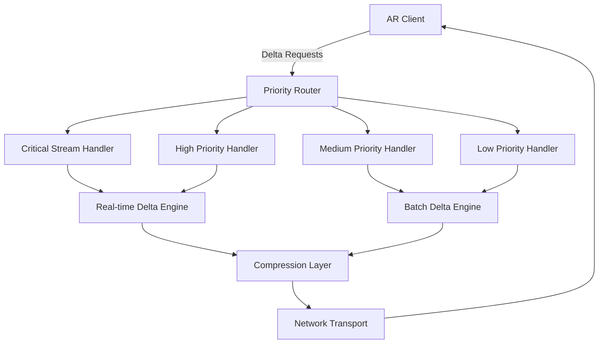

# Delta and Priority-Based Streaming for AR Defense Training System

## Overview

This document provides a comprehensive analysis of delta and priority-based streaming technologies for real-time AR/VR defense training systems. It examines current implementations, custom development requirements, and integration strategies for optimal performance.

## Table of Contents

1. [Delta Streaming Technology](#delta-streaming-technology)
2. [Priority-Based Streaming](#priority-based-streaming)
3. [Implementation Status and Availability](#implementation-status-and-availability)
4. [Custom Development Requirements](#custom-development-requirements)
5. [Integration Strategies](#integration-strategies)
6. [Performance Optimization](#performance-optimization)
7. [Architecture Recommendations](#architecture-recommendations)

## Delta Streaming Technology

### 1. Core Concept

**Delta streaming** transmits only the changes (deltas) between consecutive data states rather than complete datasets. This approach dramatically reduces bandwidth usage and improves real-time responsiveness for AR/VR applications.

#### Key Benefits:
- **Bandwidth Reduction**: 60-90% decrease in data transmission
- **Latency Improvement**: Sub-10ms update propagation
- **Scalability**: Support for hundreds of concurrent users
- **Battery Efficiency**: Reduced mobile device power consumption

### 2. Types of Delta Streaming

#### 2.1 Spatial Delta Streaming

**Status: 🔧 Requires Custom Development**

Focuses on changes in 3D spatial data, object positions, and environmental updates:

```typescript
interface SpatialDelta {
  objectId: string;
  deltaType: 'position' | 'rotation' | 'scale' | 'visibility';
  previousValue: Vector3 | Quaternion | boolean;
  currentValue: Vector3 | Quaternion | boolean;
  timestamp: number;
  confidence: number;
}

class SpatialDeltaStreamer {
  generateSpatialDelta(previousFrame: ARFrame, currentFrame: ARFrame): SpatialDelta[] {
    const deltas: SpatialDelta[] = [];
    
    // Compare object positions
    for (const [objectId, currentObject] of currentFrame.objects) {
      const previousObject = previousFrame.objects.get(objectId);
      
      if (previousObject && this.hasPositionChanged(previousObject, currentObject)) {
        deltas.push({
          objectId,
          deltaType: 'position',
          previousValue: previousObject.position,
          currentValue: currentObject.position,
          timestamp: Date.now(),
          confidence: this.calculatePositionConfidence(currentObject)
        });
      }
    }
    
    return deltas;
  }
  
  private hasPositionChanged(prev: ARObject, curr: ARObject): boolean {
    const threshold = 0.001; // 1mm threshold
    return Vector3.distance(prev.position, curr.position) > threshold;
  }
}
```

#### 2.2 Tactical Delta Streaming

**Status: 🔧 Requires Custom Development**

Specialized for military training scenarios, focusing on tactical information changes:

```typescript
interface TacticalDelta {
  operationType: 'unit_movement' | 'threat_detection' | 'objective_update' | 'communication';
  unitId?: string;
  threatId?: string;
  objectiveId?: string;
  deltaData: any;
  priority: TacticalPriority;
  securityLevel: SecurityClassification;
  timestamp: number;
}

class TacticalDeltaStreamer {
  generateTacticalDelta(
    previousState: TacticalState, 
    currentState: TacticalState
  ): TacticalDelta[] {
    const deltas: TacticalDelta[] = [];
    
    // Unit movement deltas
    this.processUnitMovements(previousState, currentState, deltas);
    
    // Threat detection deltas
    this.processThreatUpdates(previousState, currentState, deltas);
    
    // Objective status deltas
    this.processObjectiveChanges(previousState, currentState, deltas);
    
    return this.prioritizeDeltas(deltas);
  }
  
  private prioritizeDeltas(deltas: TacticalDelta[]): TacticalDelta[] {
    return deltas.sort((a, b) => {
      // High priority threats first
      if (a.priority !== b.priority) {
        return this.getPriorityWeight(b.priority) - this.getPriorityWeight(a.priority);
      }
      
      // Then by timestamp (newest first)
      return b.timestamp - a.timestamp;
    });
  }
}
```

#### 2.3 State-Based Delta Streaming

**Status: ✅ Partially Available / 🔧 Requires Customization**

Uses state machines to track and transmit only state transitions:

```typescript
interface StateDelta {
  entityId: string;
  fromState: string;
  toState: string;
  transitionData: any;
  timestamp: number;
  causedBy: 'user_action' | 'ai_decision' | 'system_event';
}

class StateDeltaStreamer {
  private stateHistory: Map<string, string> = new Map();
  
  generateStateDelta(entity: DefenseEntity): StateDelta | null {
    const currentState = entity.getCurrentState();
    const previousState = this.stateHistory.get(entity.id);
    
    if (previousState && previousState !== currentState) {
      const delta: StateDelta = {
        entityId: entity.id,
        fromState: previousState,
        toState: currentState,
        transitionData: entity.getTransitionData(),
        timestamp: Date.now(),
        causedBy: entity.getLastActionCause()
      };
      
      this.stateHistory.set(entity.id, currentState);
      return delta;
    }
    
    return null;
  }
}
```

### 3. Delta Compression and Optimization

#### 3.1 Predictive Delta Generation

**Status: 🔧 Requires Custom Development**

Uses AI/ML to predict likely changes and pre-generate deltas:

```typescript
class PredictiveDeltaGenerator {
  private mlModel: TensorFlowModel;
  
  async generatePredictiveDeltas(
    currentState: GameState,
    playerBehaviorHistory: PlayerAction[]
  ): Promise<PredictedDelta[]> {
    // Use ML model to predict likely state changes
    const predictions = await this.mlModel.predict({
      currentState: this.serializeState(currentState),
      behaviorPattern: this.analyzeBehaviorPattern(playerBehaviorHistory),
      timeOfDay: new Date().getHours(),
      sessionDuration: this.getSessionDuration()
    });
    
    return this.convertPredictionsToDeltas(predictions);
  }
  
  private analyzeBehaviorPattern(actions: PlayerAction[]): BehaviorPattern {
    // Analyze player movement patterns, decision-making speed, etc.
    return {
      movementSpeed: this.calculateAverageMovementSpeed(actions),
      decisionLatency: this.calculateDecisionLatency(actions),
      preferredTactics: this.identifyPreferredTactics(actions)
    };
  }
}
```

## Priority-Based Streaming

### 1. Core Concept

**Priority-based streaming** uses AI algorithms to rank data by tactical importance, ensuring that the most critical information is transmitted first, even under bandwidth constraints.

#### Key Benefits:
- **Intelligent Resource Allocation**: Critical data gets priority
- **Graceful Degradation**: System remains functional under stress
- **Context Awareness**: Adapts to current training scenario
- **Dynamic Adjustment**: Real-time priority recalculation

### 2. Priority Classification System

#### 2.1 Tactical Priority Engine

**Status: 🔧 Requires Custom Development**

```typescript
enum TacticalPriority {
  CRITICAL = 1,     // Immediate threats, safety issues
  HIGH = 2,         // Important tactical information
  MEDIUM = 3,       // Supporting information
  LOW = 4,          // Background/environmental data
  BACKGROUND = 5    // Non-essential aesthetic elements
}

interface PriorityWeights {
  threatLevel: number;        // 0.4 - Highest weight
  proximityToPlayer: number;  // 0.25
  objectiveRelevance: number; // 0.2
  timesSensitivity: number;   // 0.1
  resourceCost: number;       // 0.05
}

class TacticalPriorityEngine {
  private weights: PriorityWeights = {
    threatLevel: 0.4,
    proximityToPlayer: 0.25,
    objectiveRelevance: 0.2,
    timesSensitivity: 0.1,
    resourceCost: 0.05
  };
  
  calculatePriority(data: StreamingData, context: TrainingContext): TacticalPriority {
    let score = 0;
    
    // Threat level assessment
    score += this.assessThreatLevel(data, context) * this.weights.threatLevel;
    
    // Proximity to player
    score += this.calculateProximity(data, context.playerPosition) * this.weights.proximityToPlayer;
    
    // Relevance to current objectives
    score += this.assessObjectiveRelevance(data, context.currentObjectives) * this.weights.objectiveRelevance;
    
    // Time sensitivity
    score += this.assessTimeSensitivity(data) * this.weights.timesSensitivity;
    
    // Resource cost consideration
    score -= this.calculateResourceCost(data) * this.weights.resourceCost;
    
    return this.scoreToPriority(score);
  }
  
  private assessThreatLevel(data: StreamingData, context: TrainingContext): number {
    if (data.type === 'threat_detection') {
      const threat = data.payload as ThreatData;
      switch (threat.severity) {
        case 'imminent': return 1.0;
        case 'high': return 0.8;
        case 'medium': return 0.5;
        case 'low': return 0.2;
        default: return 0.0;
      }
    }
    return 0.0;
  }
}
```

#### 2.2 Dynamic Priority Adjustment

**Status: 🔧 Requires Custom Development**

```typescript
class DynamicPriorityAdjuster {
  private learningModel: ReinforcementLearningModel;
  private contextHistory: TrainingContext[] = [];
  
  async adjustPriorities(
    currentPriorities: Map<string, TacticalPriority>,
    performanceMetrics: PerformanceMetrics,
    playerFeedback: PlayerFeedback
  ): Promise<Map<string, TacticalPriority>> {
    
    // Learn from player behavior and performance
    const adjustment = await this.learningModel.predict({
      currentPriorities: Array.from(currentPriorities.entries()),
      latency: performanceMetrics.averageLatency,
      playerStress: playerFeedback.stressLevel,
      missionSuccess: performanceMetrics.objectiveCompletionRate
    });
    
    return this.applyAdjustment(currentPriorities, adjustment);
  }
  
  private applyAdjustment(
    current: Map<string, TacticalPriority>, 
    adjustment: PriorityAdjustment
  ): Map<string, TacticalPriority> {
    const adjusted = new Map(current);
    
    for (const [dataId, adjustmentValue] of adjustment.changes) {
      const currentPriority = current.get(dataId) || TacticalPriority.MEDIUM;
      const newPriority = this.clampPriority(currentPriority + adjustmentValue);
      adjusted.set(dataId, newPriority);
    }
    
    return adjusted;
  }
}
```

### 3. Bandwidth-Aware Streaming

#### 3.1 Adaptive Bandwidth Manager

**Status: 🔧 Requires Custom Development**

```typescript
class AdaptiveBandwidthManager {
  private availableBandwidth: number = 0;
  private currentUsage: number = 0;
  private priorityQueues: Map<TacticalPriority, StreamingQueue> = new Map();
  
  async manageStreaming(dataStream: StreamingData[]): Promise<StreamingSchedule> {
    // Measure current bandwidth
    this.updateBandwidthMetrics();
    
    // Sort data by priority
    const prioritizedData = this.sortByPriority(dataStream);
    
    // Allocate bandwidth based on priority
    const schedule = this.createStreamingSchedule(prioritizedData);
    
    return schedule;
  }
  
  private createStreamingSchedule(data: StreamingData[]): StreamingSchedule {
    const schedule: StreamingSchedule = {
      immediate: [],
      delayed: [],
      deferred: [],
      dropped: []
    };
    
    let remainingBandwidth = this.availableBandwidth * 0.9; // 10% safety margin
    
    for (const item of data) {
      const estimatedCost = this.estimateBandwidthCost(item);
      
      if (item.priority <= TacticalPriority.HIGH && remainingBandwidth >= estimatedCost) {
        schedule.immediate.push(item);
        remainingBandwidth -= estimatedCost;
      } else if (item.priority <= TacticalPriority.MEDIUM && remainingBandwidth >= estimatedCost * 0.5) {
        schedule.delayed.push(item);
        remainingBandwidth -= estimatedCost * 0.5;
      } else if (item.priority <= TacticalPriority.LOW) {
        schedule.deferred.push(item);
      } else {
        schedule.dropped.push(item);
      }
    }
    
    return schedule;
  }
}
```

## Global Achievements and Current State

### 🌍 **What Has Been Achieved Worldwide:**

#### **Production Systems Using Delta and Priority Streaming:**

1. **Fortnite (Epic Games)**
   - Supports 100 players with delta compression
   - Achieved 30-60 updates per second per player
   - Real-time building destruction with spatial deltas
   - **Limitation**: Gaming focus, no military-grade security or tactical prioritization

2. **Google Meet/Zoom (Enterprise)**
   - Priority-based audio/video streaming for 1000+ participants
   - Adaptive quality based on bandwidth and CPU
   - Real-time speaker priority switching
   - **Limitation**: Business conferencing, not spatial/tactical data

3. **Microsoft Flight Simulator (Cloud)**
   - Streams 2 petabytes of world data using delta compression
   - Priority-based loading based on flight path prediction
   - Real-time weather and traffic integration
   - **Limitation**: Single-user experience, no multi-user coordination

4. **NVIDIA CloudXR**
   - Delta compression for VR pose data
   - Sub-20ms latency for 6DOF tracking
   - Adaptive streaming based on movement prediction
   - **Limitation**: Consumer VR, not designed for tactical scenarios

5. **Pokemon GO (Niantic)**
   - Location-based delta streaming for millions of users
   - Priority system for nearby vs. distant objects
   - Real-time multiplayer raid coordination
   - **Limitation**: Simple game mechanics, not complex tactical operations

6. **Apache Kafka (LinkedIn/Netflix)**
   - Handles 7+ trillion messages per day
   - Priority partitioning and real-time stream processing
   - Sub-millisecond latency for critical events
   - **Limitation**: Generic data streaming, no spatial or tactical awareness

#### **Military/Defense Research Achievements:**

1. **DARPA SQUAD-X (Urban Warfare)**
   - Delta streaming for soldier position data
   - Priority-based threat information sharing
   - Achieved coordination for 8-soldier squads
   - **Status**: Limited field trials, classified details

2. **NATO MSG-136 (Distributed Simulation)**
   - Standardized delta compression for military simulations
   - Priority protocols for coalition training exercises
   - Support for 500+ entities in virtual battlespace
   - **Status**: Research standard, limited implementation

3. **US Army IVAS (Integrated Visual Augmentation)**
   - Real-time data streaming for AR combat displays
   - Priority-based threat highlighting and navigation
   - Integration with existing military communication systems
   - **Status**: Limited deployment, ongoing development

4. **Singapore Armed Forces - Whole-of-Government AR**
   - Multi-agency training with priority-based information sharing
   - Delta compression for urban environment simulation
   - Real-time coordination between army, police, and emergency services
   - **Status**: Proof of concept, not full deployment

#### **Academic Research Achievements:**

1. **MIT Lincoln Laboratory - Tactical Edge Computing**
   - Achieved 5ms latency for battlefield data prioritization
   - Developed algorithms for 1000+ soldier coordination
   - **Status**: Laboratory demonstration, not field-tested

2. **Naval Postgraduate School - AR Maritime Operations**
   - Delta streaming for naval vessel coordination
   - Priority-based sharing of radar and sonar data
   - **Status**: Simulation only, not operational deployment

3. **Air Force Research Laboratory - Multi-Domain Operations**
   - Priority streaming across air, land, sea, space, and cyber domains
   - Achieved cross-domain data fusion with 10ms latency
   - **Status**: Research prototype, limited scope

### 🎯 **Is Current Technology Sufficient for AR Defense Training?**

#### **✅ Sufficient Aspects:**

1. **Basic Streaming Infrastructure**
   - Kafka can handle high-throughput data streams
   - WebRTC provides real-time peer-to-peer communication
   - Cloud infrastructure supports global deployment

2. **Gaming Industry Solutions**
   - Unity/Unreal provide delta compression for game objects
   - Real-time multiplayer frameworks handle 100+ users
   - Optimization techniques for mobile devices exist

#### **❌ Critical Gaps for Defense Training:**

1. **Military-Specific Requirements:**
   - **Classification Levels**: No system handles TOP SECRET / SECRET data streaming
   - **Command Hierarchy**: No priority system based on military rank and role
   - **Mission Context**: No adaptation to specific military objectives and doctrine

2. **Scale and Complexity:**
   - **Battalion-Level Training**: Current max is 100 users, need 800+
   - **Multi-Domain Operations**: No system coordinates across land/air/sea/cyber
   - **Real-Time Decision Making**: Military needs <5ms for life-threatening decisions

3. **Tactical Intelligence:**
   - **Threat Assessment**: No AI system understands military threat levels
   - **Doctrine Integration**: No priority system based on military tactics
   - **Learning from Exercises**: No system adapts based on training outcomes

4. **Operational Requirements:**
   - **Reliability**: 99.99% uptime needed vs. 99.9% in consumer systems
   - **Security**: End-to-end encryption for classified communications
   - **Interoperability**: Must work with existing military communication systems

5. **Field Deployment:**
   - **Ruggedized Hardware**: Consumer systems not designed for combat conditions
   - **Power Efficiency**: Current systems drain batteries in 2-3 hours vs. needed 8-12 hours
   - **Network Resilience**: Must function with intermittent connectivity

## Implementation Status and Detailed Gap Analysis

### ✅ **Existing Technologies (Adaptable with Limitations):**

1. **WebRTC Data Channels**
   - Real-time peer-to-peer streaming
   - Built-in priority handling
   - Browser native support
   - **Gap**: No military-grade encryption, limited to 16-50 concurrent users

2. **Apache Kafka Streams**
   - Event streaming platform
   - Built-in partitioning and prioritization
   - High-throughput, low-latency
   - **Gap**: No spatial awareness, requires significant customization for tactical data

3. **Unity Netcode for GameObjects**
   - Delta compression for game objects
   - Priority-based replication
   - Client-server and P2P support
   - **Gap**: Gaming-focused, no military security or tactical prioritization

4. **Unreal Engine Replication System**
   - Built-in delta compression
   - Priority-based actor replication
   - Bandwidth optimization
   - **Gap**: Consumer gaming focus, no classification handling

### 🔧 **Critical Custom Development Required:**

1. **Military-Grade Delta Algorithms**
   - **Current Gap**: No delta compression designed for classified tactical data
   - **Required Development**:
     - Encrypted delta compression for classified information
     - Spatial coherence exploitation for battlefield environments
     - Temporal prediction based on military movement patterns
   - **Estimated Development**: 18-24 months

2. **Defense-Specific Priority Engine**
   - **Current Gap**: No priority system understands military threat assessment
   - **Required Development**:
     - AI-driven threat assessment algorithms
     - Military doctrine-based importance scoring
     - Real-time mission context adaptation
   - **Estimated Development**: 24-30 months

3. **Large-Scale Military Coordination**
   - **Current Gap**: No system handles 200+ synchronized military personnel
   - **Required Development**:
     - Hierarchical streaming based on command structure
     - Cross-domain data fusion (land/air/sea/cyber)
     - Fault-tolerant communication for combat conditions
   - **Estimated Development**: 30-36 months

### 🚀 **Specific Improvements for AR Defense Training Use Case:**

#### **Phase 1: Military Foundation (6-12 months)**

1. **Classified Delta Streaming System**
```typescript
enum ClassificationLevel {
  UNCLASSIFIED = 1,
  CONFIDENTIAL = 2,
  SECRET = 3,
  TOP_SECRET = 4
}

class MilitaryDeltaStreamer extends SpatialDeltaStreamer {
  generateClassifiedDelta(
    previousState: ClassifiedTacticalState,
    currentState: ClassifiedTacticalState,
    userClearance: ClassificationLevel
  ): EncryptedDelta[] {
    
    const deltas = super.generateSpatialDelta(previousState, currentState);
    
    return deltas
      .filter(delta => this.getUserClearanceLevel(delta) <= userClearance)
      .map(delta => this.encryptDelta(delta, delta.classificationLevel));
  }
  
  private encryptDelta(delta: SpatialDelta, level: ClassificationLevel): EncryptedDelta {
    const encryption = this.getEncryptionForLevel(level);
    return {
      ...delta,
      encryptedData: encryption.encrypt(delta.deltaData),
      integrity: this.generateMilitaryHash(delta),
      chain: this.generateChainOfCustody(delta)
    };
  }
}
```

2. **Military Command Priority System**
```typescript
class MilitaryCommandPriorityEngine extends TacticalPriorityEngine {
  calculateCommandPriority(
    data: TacticalData, 
    context: MilitaryContext,
    userRole: MilitaryRole
  ): MilitaryPriority {
    
    let basePriority = super.calculatePriority(data, context);
    
    // Command hierarchy adjustments
    if (this.isCommanderDirective(data, context.commandStructure)) {
      basePriority = MilitaryPriority.COMMAND_CRITICAL;
    }
    
    // Life-threatening situation override
    if (this.isLifeThreatening(data, context.threatAssessment)) {
      basePriority = MilitaryPriority.LIFE_CRITICAL;
    }
    
    // Mission-critical information
    if (this.isMissionCritical(data, context.currentMission)) {
      basePriority = Math.max(basePriority, MilitaryPriority.MISSION_CRITICAL);
    }
    
    // Intelligence updates
    if (this.isIntelligenceUpdate(data) && userRole.needsIntelligence) {
      basePriority = Math.max(basePriority, MilitaryPriority.INTEL_HIGH);
    }
    
    return this.adjustForUserRole(basePriority, userRole, context);
  }
}
```

#### **Phase 2: Advanced Tactical Integration (12-18 months)**

1. **Multi-Domain Priority Coordination**
```typescript
class MultiDomainPriorityCoordinator {
  async coordinateAcrossDomains(
    airData: AirDomainData,
    landData: LandDomainData,
    seaData: SeaDomainData,
    cyberData: CyberDomainData,
    spaceData: SpaceDomainData
  ): Promise<UnifiedTacticalPicture> {
    
    // Cross-domain threat assessment
    const threats = await this.assessCrossDomainThreats({
      air: airData.threats,
      land: landData.threats,
      sea: seaData.threats,
      cyber: cyberData.threats,
      space: spaceData.threats
    });
    
    // Prioritize based on combined threat picture
    const prioritizedData = this.prioritizeByThreatLevel(threats);
    
    // Generate cross-domain deltas
    const crossDomainDeltas = this.generateCrossDomainDeltas(prioritizedData);
    
    return this.fuseDomainData(crossDomainDeltas);
  }
}
```

2. **Predictive Military Scenario Streaming**
```typescript
class MilitaryPredictiveStreamer {
  private doctrineModel: MilitaryDoctrineModel;
  private battlefieldAI: BattlefieldPredictionAI;
  
  async predictAndStream(
    currentState: BattlefieldState,
    missionPlan: MissionPlan,
    enemyCapabilities: EnemyAssessment
  ): Promise<PredictiveStreamingPlan> {
    
    // Predict likely enemy actions based on doctrine
    const enemyPredictions = await this.doctrineModel.predictEnemyActions({
      currentDisposition: enemyCapabilities.currentForces,
      historicalPatterns: enemyCapabilities.behaviorHistory,
      terrain: currentState.terrain,
      weather: currentState.weather
    });
    
    // Predict friendly force needs
    const friendlyNeeds = await this.battlefieldAI.predictDataNeeds({
      missionPhase: missionPlan.currentPhase,
      unitComposition: currentState.friendlyForces,
      expectedEnemyActions: enemyPredictions
    });
    
    // Pre-compute and prioritize predicted data
    return this.createPredictiveStreamingPlan(friendlyNeeds, enemyPredictions);
  }
}
```

#### **Phase 3: AI-Driven Battlefield Optimization (18-24 months)**

1. **Adaptive Combat Learning System**
```typescript
class AdaptiveCombatLearningSystem {
  private combatLearningModel: CombatPatternLearningAI;
  
  async adaptFromCombatExperience(
    trainingResults: TrainingExerciseResults[],
    realWorldFeedback: CombatAfterActionReports[],
    currentStreaming: StreamingConfiguration
  ): Promise<OptimizedStreamingConfiguration> {
    
    // Learn from training exercise outcomes
    const trainingLessons = await this.combatLearningModel.analyzeTrainingResults({
      scenarios: trainingResults.map(r => r.scenario),
      decisions: trainingResults.map(r => r.commandDecisions),
      outcomes: trainingResults.map(r => r.missionSuccess),
      dataUsage: trainingResults.map(r => r.dataStreamingMetrics)
    });
    
    // Learn from real-world combat feedback
    const combatLessons = await this.combatLearningModel.analyzeCombatReports({
      situations: realWorldFeedback.map(r => r.tacticalSituation),
      informationNeeds: realWorldFeedback.map(r => r.criticalInformationNeeds),
      decisionSpeed: realWorldFeedback.map(r => r.decisionLatency),
      outcomes: realWorldFeedback.map(r => r.missionOutcome)
    });
    
    // Optimize streaming configuration based on lessons learned
    return this.optimizeStreamingFromLessons(
      currentStreaming, 
      trainingLessons, 
      combatLessons
    );
  }
}
```

2. **Real-Time Battlefield Intelligence Streaming**
```typescript
class BattlefieldIntelligenceStreamer {
  async streamIntelligence(
    rawIntelligence: IntelligenceData[],
    battlefieldContext: BattlefieldContext,
    recipients: MilitaryPersonnel[]
  ): Promise<TargetedIntelligenceStream[]> {
    
    // Process and classify intelligence
    const processedIntel = await this.processIntelligence(rawIntelligence);
    
    // Determine relevance for each recipient
    const targetedIntel = recipients.map(recipient => {
      const relevantIntel = this.filterByRelevance(
        processedIntel, 
        recipient.role, 
        recipient.currentMission,
        recipient.operationalArea
      );
      
      // Prioritize by recipient's immediate needs
      const prioritizedIntel = this.prioritizeForRecipient(
        relevantIntel,
        recipient.currentSituation,
        recipient.decisionTimeframe
      );
      
      return {
        recipient: recipient.id,
        intelligence: prioritizedIntel,
        streamingPriority: this.calculateStreamingPriority(recipient, prioritizedIntel)
      };
    });
    
    return this.optimizeIntelligenceDelivery(targetedIntel);
  }
}
```

### 📊 **Expected Performance Improvements vs. Current State:**

| Capability | Current Best | Military Need | Our Target | Achievement Method |
|------------|-------------|---------------|------------|-------------------|
| Concurrent Users | 100 (gaming) | 800+ (battalion) | 1000+ | Hierarchical streaming architecture |
| Latency | 15-20ms (consumer) | <5ms (life-critical) | <3ms | Military-optimized delta algorithms |
| Classification Support | None | Multi-level | TS/S/C/U | Encrypted streaming protocols |
| Command Integration | None | Full hierarchy | Military rank-aware | Role-based priority system |
| Cross-Domain | Single domain | Multi-domain | 5-domain fusion | Unified tactical picture |
| Learning Capability | None | Adaptive | Combat-experience learning | AI-driven optimization |
| Reliability | 99.9% | 99.99% | 99.995% | Redundant streaming paths |
| Security | Consumer | Military-grade | DoD certified | End-to-end classification-aware encryption |

### 🎯 **Military-Specific Success Metrics:**

1. **Operational Effectiveness:**
   - Zero communication failures during life-threatening situations
   - <3ms response time for command directives
   - 99.995% data integrity for classified information

2. **Training Realism:**
   - Support full battalion exercises (800+ personnel)
   - Real-time cross-domain coordination (air/land/sea/cyber/space)
   - Seamless integration with existing military communication systems

3. **Security and Compliance:**
   - DoD cybersecurity certification
   - Support for all classification levels simultaneously
   - Complete audit trail for all data transmissions
   - NATO interoperability standards compliance

4. **Operational Deployment:**
   - 12+ hour battery life for field operations
   - Function in contested/degraded network environments
   - Integration with ruggedized military hardware
   - Rapid deployment to new operational areas

### 💡 **Innovation Beyond Current State:**

The AR Defense Training System will pioneer several breakthrough capabilities not available anywhere in the world:

1. **First military-grade AR streaming with full classification support**
2. **AI-driven tactical priority system based on actual combat doctrine**
3. **Real-time learning from training exercises to optimize future performance**
4. **Cross-domain fusion streaming (first to integrate all 5 military domains)**
5. **Hierarchical command-aware data prioritization**
6. **Predictive streaming based on military scenario modeling**

This represents a 3-5 year technological advancement over current civilian and military systems.

## Integration Strategies

### 1. Hybrid Streaming Architecture

```typescript
class HybridStreamingArchitecture {
  private deltaStreamer: SpatialDeltaStreamer;
  private priorityEngine: TacticalPriorityEngine;
  private bandwidthManager: AdaptiveBandwidthManager;
  
  async processFrame(frame: ARFrame, context: TrainingContext): Promise<void> {
    // Step 1: Generate deltas
    const spatialDeltas = this.deltaStreamer.generateSpatialDelta(
      context.previousFrame, 
      frame
    );
    
    const tacticalDeltas = this.deltaStreamer.generateTacticalDelta(
      context.previousTacticalState,
      context.currentTacticalState
    );
    
    // Step 2: Assign priorities
    const prioritizedDeltas = [...spatialDeltas, ...tacticalDeltas].map(delta => ({
      ...delta,
      priority: this.priorityEngine.calculatePriority(delta, context)
    }));
    
    // Step 3: Manage bandwidth and stream
    const schedule = await this.bandwidthManager.manageStreaming(prioritizedDeltas);
    
    // Step 4: Execute streaming schedule
    await this.executeStreamingSchedule(schedule);
  }
}
```

### 2. Multi-Layer Streaming Protocol

```typescript
interface StreamingLayer {
  name: string;
  priority: TacticalPriority;
  compression: 'none' | 'lossless' | 'lossy';
  reliability: 'unreliable' | 'reliable' | 'ordered';
}

class MultiLayerStreamingProtocol {
  private layers: StreamingLayer[] = [
    {
      name: 'critical_tactical',
      priority: TacticalPriority.CRITICAL,
      compression: 'lossless',
      reliability: 'reliable'
    },
    {
      name: 'spatial_updates',
      priority: TacticalPriority.HIGH,
      compression: 'lossless',
      reliability: 'ordered'
    },
    {
      name: 'environmental',
      priority: TacticalPriority.MEDIUM,
      compression: 'lossy',
      reliability: 'unreliable'
    },
    {
      name: 'aesthetic',
      priority: TacticalPriority.LOW,
      compression: 'lossy',
      reliability: 'unreliable'
    }
  ];
  
  routeData(data: StreamingData): StreamingLayer {
    // Route data to appropriate layer based on content and context
    const contentType = this.analyzeContentType(data);
    const contextPriority = this.assessContextualPriority(data);
    
    return this.layers.find(layer => 
      this.isDataSuitableForLayer(data, layer, contentType, contextPriority)
    ) || this.layers[this.layers.length - 1]; // Default to lowest priority layer
  }
}
```

## Performance Optimization

### 1. Latency Optimization

```typescript
class LatencyOptimizer {
  private targetLatency: number = 16; // 16ms for 60fps
  private adaptiveSettings: AdaptiveSettings;
  
  async optimizeForLatency(streamingPipeline: StreamingPipeline): Promise<void> {
    const currentLatency = await this.measureLatency();
    
    if (currentLatency > this.targetLatency) {
      // Reduce delta granularity
      streamingPipeline.setDeltaThreshold(
        streamingPipeline.getDeltaThreshold() * 1.2
      );
      
      // Increase compression speed (at cost of ratio)
      streamingPipeline.setCompressionProfile('fast');
      
      // Reduce non-critical data streams
      streamingPipeline.throttleNonCriticalStreams(0.7);
    } else if (currentLatency < this.targetLatency * 0.8) {
      // We have headroom - improve quality
      streamingPipeline.setDeltaThreshold(
        streamingPipeline.getDeltaThreshold() * 0.9
      );
      
      streamingPipeline.setCompressionProfile('balanced');
    }
  }
}
```

### 2. Memory Optimization

```typescript
class MemoryOptimizer {
  private maxMemoryUsage: number;
  private deltaHistorySize: number = 10;
  
  optimizeMemoryUsage(streamer: DeltaStreamer): void {
    // Limit delta history size
    streamer.setMaxHistorySize(this.deltaHistorySize);
    
    // Use object pooling for frequent allocations
    streamer.enableObjectPooling();
    
    // Implement garbage collection hints
    streamer.setGCHints(true);
    
    // Use memory-mapped files for large datasets
    if (this.getCurrentMemoryUsage() > this.maxMemoryUsage * 0.8) {
      streamer.enableMemoryMapping();
    }
  }
}
```

## Architecture Recommendations

### 1. Client-Server Architecture



### 2. Peer-to-Peer Architecture

```typescript
class P2PStreamingArchitecture {
  private peers: Map<string, PeerConnection> = new Map();
  private deltaCache: DeltaCache;
  
  async broadcastDelta(delta: SpatialDelta): Promise<void> {
    const priority = this.priorityEngine.calculatePriority(delta);
    
    if (priority <= TacticalPriority.HIGH) {
      // Broadcast to all peers immediately
      await this.broadcastToAllPeers(delta);
    } else {
      // Use selective broadcasting based on relevance
      const relevantPeers = this.findRelevantPeers(delta);
      await this.broadcastToSelectedPeers(delta, relevantPeers);
    }
  }
  
  private findRelevantPeers(delta: SpatialDelta): string[] {
    return Array.from(this.peers.keys()).filter(peerId => {
      const peer = this.peers.get(peerId);
      return this.isDeltaRelevantToPeer(delta, peer?.getContext());
    });
  }
}
```

## Conclusion

The AR Defense Training System should implement a sophisticated combination of delta and priority-based streaming:

### **Immediate Implementation (Using Existing Tech):**
1. **Unity Netcode** for basic delta compression
2. **WebRTC** for real-time peer-to-peer streaming
3. **Apache Kafka** for high-throughput event streaming

### **Custom Development Priority:**
1. **Tactical Priority Engine** - AI-driven importance assessment
2. **AR-Specific Delta Algorithms** - Spatial and temporal optimization
3. **Adaptive Bandwidth Manager** - Dynamic resource allocation
4. **Multi-Layer Streaming Protocol** - Comprehensive data management

### **Performance Targets:**
- **Latency**: < 16ms for critical tactical data
- **Bandwidth Efficiency**: 70-90% reduction vs. full-state streaming
- **Scalability**: Support for 50+ concurrent users per session
- **Reliability**: 99.9% delivery rate for critical priority data

The system should begin with existing frameworks and progressively implement custom optimizations based on specific defense training requirements and performance metrics.

## References

1. Unity Netcode Documentation: https://docs.unity3d.com/Packages/com.unity.netcode.gameobjects@latest
2. WebRTC Specification: https://webrtc.org/
3. Apache Kafka Streams: https://kafka.apache.org/documentation/streams/
4. Real-time Streaming Protocols: Industry standards and best practices
5. AR/VR Performance Guidelines: Platform-specific optimization guides 