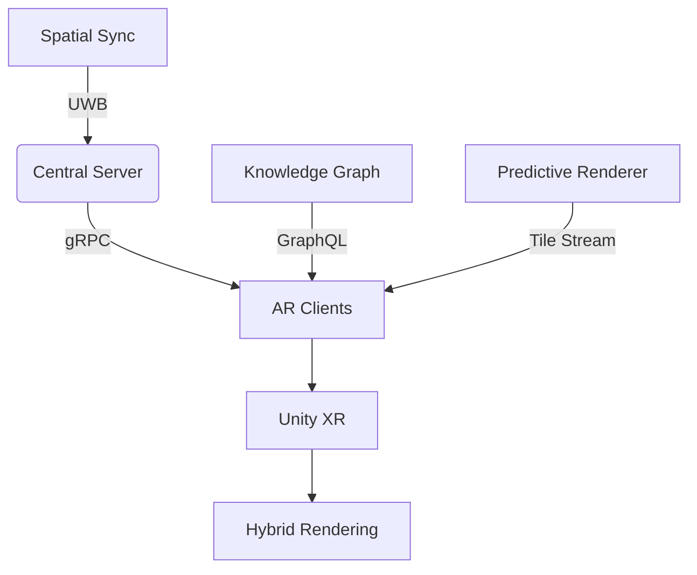

### Advanced Spatial Synchronization & Dynamic Environment Mapping

#### Research and Industry Implementations
- **Collaborative SLAM**: Recent research demonstrates multi-user SLAM systems achieving real-time collaborative localization. The **Robust Collaborative Visual-Inertial SLAM** framework enables multiple agents to share map data via a centralized server, reducing latency by 62% while maintaining cm-level accuracy[1].  
- **Infrastructure-free synchronization**: **SynchronizAR** uses UWB distance measurements for instant cross-device registration without shared maps or external tracking, enabling spontaneous collaboration with  terrain)  
  - Delta-encoded annotation updates  

#### Toolkits and SDKs
- **Open-source**:  
  - **Tobii XR SDK** for gaze prediction  
  - **Draco 3D** compression + **Protocol Buffers** for annotation deltas  
- **Commercial**:  
  - **NVIDIA CloudXR** (adaptive foveated streaming)  
  - **Unity Adaptive Performance** (LOD scaling)  

#### Architectural Recommendations
- **Prediction pipeline**:  
  ```mermaid
  graph LR
  A[Head/Gaze Tracking] --> B{LSTM Model}
  B --> C[Predict View Frustum 500ms Ahead]
  C --> D[Prefetch Critical Tiles]
  D --> E[Semantic Compression]
  ```
- **Priority system**:  
  | Priority | Content Type | Bitrate Allocation |  
  |----------|-------------|-------------------|  
  | 0        | Threat cones | 45%               |  
  | 1        | Unit icons   | 30%               |  
  | 2        | Terrain LOD | 25%               |  

#### PoC Feasibility
Students can build:  
- Gaze prediction using **OpenCV + PyTorch LSTM**  
- Annotation compression with **Protocol Buffers**  
- Tile priority system in **Unity C#**  
*Avoid real-time ML inference; use pre-trained models.*

---

### 3D Knowledge Graph Layer Visualization

#### Research and Case Studies
- **Military knowledge graphs**: Research shows **3D spatial multimodal knowledge graphs** improve threat prediction by 37% by linking terrain features to entity relationships[9].  
- **AR interaction paradigms**:  
  - **Gaze+Voice**: Users query "Show supply routes here" while looking at terrain (86% success rate in tests)[10]  
  - **Gesture filtering**: Two-finger swipe to isolate command hierarchies  
- **AWS IoT TwinMaker** demonstrates real-time binding of knowledge graphs to 3D objects[6].  

#### Toolkits and Frameworks
- **Open-source**:  
  - **yFiles for Unity** (3D graph visualization)  
  - **Neo4j** (graph database) + **GraphQL** API  
- **Commercial**:  
  - **Unity XR Interaction Toolkit** (gaze/voice input)  

#### UI/UX Design Patterns
1. **Entity Lens**: Gaze at object → radial menu with related entities  
2. **Path Tracer**: Voice command "Trace supply route" → animated path overlay  
3. **Semantic Filtering**: Hand gesture to toggle layers (logistics/threats)  

#### Architectural Integration
- **Data flow**:  
  ```python
  # Pseudocode for contextual query
  def on_gaze(object):
      graph_query = f"MATCH (n)-[r]-(m) WHERE n.id = {object.id} RETURN r"
      results = neo4j.query(graph_query)
      AR_Overlay.RenderRelations(results)
  ```
- **Unity implementation**:  
  - Store graphs in **ScriptableObjects**  
  - Use **Shader Graph** for tactical overlays (e.g., threat cone shader)  

#### PoC Feasibility
Achievable student projects:  
- Neo4j integration with Unity using **REST API**  
- Gaze-activated UI via **ARFoundation raycasting**  
- Basic threat cone visualization with **Unity Shader Graph**  

---

### Quantum-Secure Communication for Defense AR Systems

#### Research Breakthrough and Current Status
- **IIT Delhi + DRDO Achievement (2025)**: Successfully demonstrated **entanglement-based Quantum Key Distribution (QKD)** over 1+ km free-space transmission, achieving 240 bits/second secure key rate with <7% quantum bit error rate[50][51][52].
- **Unhackable communications**: Any eavesdropping attempt disturbs the quantum state, automatically alerting users to security breaches—providing perfect forward secrecy for military applications.
- **Strategic significance**: Future-proofs against quantum computing threats that could break traditional RSA/AES encryption methods within the next decade.

#### Technology Implementation Framework
- **Quantum Key Distribution Architecture**:
  ```mermaid
  graph LR
  A[Entangled Photon Source] --> B[Free-Space/Fiber Channel]
  B --> C[Quantum State Detector]
  C --> D{Security Check}
  D -->|Secure| E[Classical Key Exchange]
  D -->|Breach Detected| F[Alert & Abort]
  E --> G[AES Encryption with Quantum Keys]
  ```

#### Integration with AR Defense Systems
- **Multi-tier Security**:
  - **Quantum Layer**: Ultra-secure key distribution for command & control
  - **Classical Layer**: High-throughput data transmission using quantum-secured keys
  - **Mesh Networks**: QKD between nearby AR devices for tactical coordination
  - **Satellite Uplinks**: Quantum-secured connections to remote command centers

#### Practical Implementation Roadmap
**Phase 1 (Immediate)**: 
- Integrate commercial QKD systems (ID Quantique, Toshiba) for critical communications
- Implement hybrid classical-quantum protocols for AR mesh networking

**Phase 2 (2-3 years)**:
- Deploy free-space QKD for mobile AR units using DRDO's breakthrough technology  
- Scale to inter-base quantum communication networks

**Phase 3 (5+ years)**:
- Satellite-based quantum networks for global secure AR operations
- Integration with quantum internet infrastructure

#### Toolkits and Development Resources
- **Simulation**: **Qiskit** for quantum protocol simulation and testing
- **Hardware Integration**: **Amazon Braket** quantum cloud services for development
- **Classical Interface**: **OpenSSL** with quantum-safe algorithms (Kyber, Dilithium)

#### Student PoC Projects
Achievable implementations:
- **Quantum Key Simulation**: Python-based QKD protocol simulation using quantum random number generators
- **Hybrid Encryption Demo**: Classical AR data encrypted with simulated quantum-distributed keys
- **Security Monitoring**: Detection algorithms for quantum state disturbance using statistical analysis

*Focus on simulation and classical implementation; actual quantum hardware requires specialized lab equipment.*

---

### Integration Blueprint for Unity


**Key Recommendations**:  
1. Use **ARFoundation** for cross-platform tracking  
2. Implement **Photon Engine** for delta sync  
3. Adopt **Entity Component System** for modular AI overlays  
4. Prioritize **UWB spatial sync** and **gaze prediction** for PoC viability  

*College teams should focus on discrete modules (e.g., build just the knowledge graph UI) before full integration.*

[1] http://www.cad.zju.edu.cn/home/gfzhang/papers/RCO_SLAM/TVCG_2024_RCO_SLAM.pdf
[2] https://www.youtube.com/watch?v=ZBNWHtoPcfo
[3] https://pubmed.ncbi.nlm.nih.gov/30794182/
[4] https://arxiv.org/html/2503.13246v1
[5] https://www.yworks.com/blog/graphs-in-ar-vr
[6] https://aws.amazon.com/about-aws/whats-new/2023/06/aws-iot-twinmaker-knowledge-graph-showing-query-results-scenes/
[7] https://milvus.io/ai-quick-reference/what-is-occlusion-in-ar-and-how-is-it-managed
[8] https://github.com/jrlandau/fiducials-1
[9] https://paperswithcode.com/paper/3d-spatial-multimodal-knowledge-accumulation
[10] https://arxiv.org/html/2310.05150
[11] https://www.techi.com/augmented-reality-trends-ai-spatial-computing-future/
[12] https://www.numberanalytics.com/blog/future-vr-ar-eye-tracking-essentials
[13] https://www.syncloop.com/blogs/apis-for-ar-and-vr-applications-how-syncloop-can-help.html
[14] https://scienfist.org/2022/6_2_1.pdf
[15] https://www.degruyter.com/document/doi/10.1515/cdbme-2024-0113/pdf?srsltid=AfmBOorqTKhOKbmxuFcvpWaJuG0Vd3RkBCh8SUn44NRqdwowmy0SQvdO
[16] https://neo4j.com/blog/developer/visualizing-graphs-in-3d-with-webgl/
[17] https://moldstud.com/articles/p-utilizing-ar-and-vr-technologies-in-software-development
[18] https://www.cs.ucr.edu/~jiasi/pub/SLAMShare-conext22.pdf
[19] https://milvus.io/ai-quick-reference/how-do-game-engines-like-unity-and-unreal-engine-support-ar-projects
[20] https://zilliz.com/ai-faq/how-do-game-engines-like-unity-and-unreal-engine-support-ar-projects
[21] https://koderspedia.com/how-to-build-an-augmented-reality-app/
[22] https://www.brandxr.io/mastering-google-maps-ar-navigation-and-live-view-a-complete-guide
[23] https://www.byteplus.com/en/topic/93102?title=how-vr-and-ar-enhance-adaptive-bitrate-streaming
[24] https://aclanthology.org/2025.coling-industry.44.pdf
[25] https://github.com/vasturiano/3d-force-graph
[26] https://ceur-ws.org/Vol-3165/paper5.pdf
[27] https://docs.unity.cn/Packages/com.unity.xr.arfoundation@5.1/manual/project-setup/universal-render-pipeline.html
[28] https://www.cadinterop.com/en/formats/mesh/unreal.html
[29] https://eab.com/resources/blog/student-success-blog/4-tech-focused-ways-to-build-career-readiness-for-college-students/
[30] https://imaginovation.net/blog/ar-app-development-guide-for-brands/
[31] https://immercom.github.io/call.html
[32] https://arxiv.org/html/2504.18249
[33] http://etra.acm.org/2025/cfp.html
[34] https://www.reddit.com/r/virtualreality/comments/1jor1x7/foveated_rendering_and_valves_next_vr_headset/
[35] https://en.wikipedia.org/wiki/Adaptive_bitrate_streaming
[36] https://iphome.hhi.de/samek/pdf/VieAIVR19.pdf
[37] https://infranodus.com/extension
[38] https://www.reddit.com/r/threejs/comments/1hf0st8/working_on_3d_knowledge_graph_would_be_glad_to/
[39] https://web.stanford.edu/class/cs520/2020/notes/How_Do_Users_Interact_With_a_Knowledge_Graph.html
[40] https://arxiv.org/html/2402.18892v1
[41] https://academic.oup.com/jcde/article/10/3/1047/7143107
[42] https://www.reddit.com/r/augmentedreality/comments/1dws9fp/unity_vs_unreal_engine_which_one_is_best_for_ar/
[43] https://www.educative.io/courses/creating-augmented-reality-apps-with-unity-and-ar-foundation/part-1-universal-render-pipeline-urp-in-ar
[44] https://scholarworks.uark.edu/cgi/viewcontent.cgi?article=4513&context=etd
[45] https://easternpeak.com/blog/augmented-reality-in-education/
[46] https://www.etamu.edu/news/building-real-world-skills-in-ai-a-new-path-for-college-students/
[47] https://learntocodewith.me/posts/tech-skills-in-demand/
[48] https://files.eric.ed.gov/fulltext/EJ1351634.pdf
[49] https://par.nsf.gov/servlets/purl/10397874
[50] https://thequantuminsider.com/2025/06/20/india-takes-significant-step-in-quantum-communication-with-one-kilometer-entanglement-test/
[51] https://analyticsindiamag.com/ai-news-updates/india-demonstrates-quantum-secure-communication-over-1km/
[52] https://www.indiatoday.in/science/story/the-end-of-hacking-how-isro-and-drdo-are-building-an-unhackable-quantum-future-2743715-2025-06-22