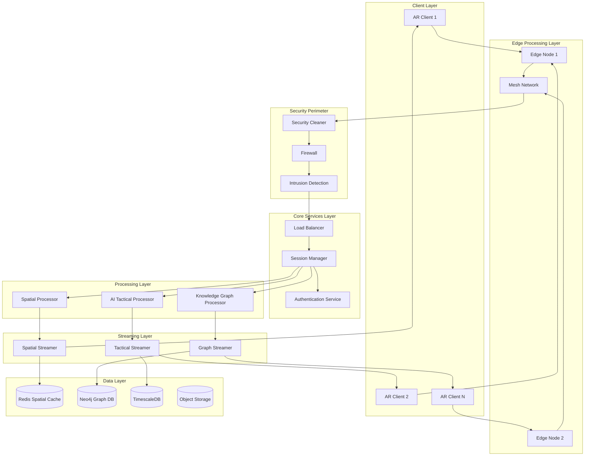
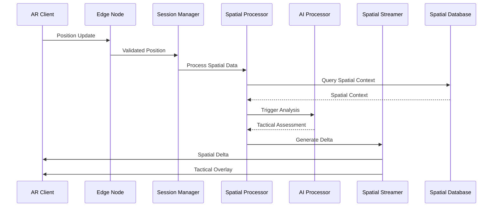

# AR Defense Training System
## Comprehensive Technical Documentation

---

# Table of Contents

1. [System Overview](#1-system-overview)
2. [Software Architecture](#2-software-architecture)
3. [Hardware Blueprint](#3-hardware-blueprint)
4. [Core Algorithms & Logic](#4-core-algorithms--logic)
5. [Component Specifications](#5-component-specifications)
6. [Integration Framework](#6-integration-framework)
7. [Interaction Design](#7-interaction-design)
8. [Performance Considerations](#8-performance-considerations)
9. [Deployment & Transport](#9-deployment--transport)
10. [Modular Extensions](#10-modular-extensions)
11. [Offline & Field Operations](#11-offline--field-operations)
12. [Security & Compliance](#12-security--compliance)

---

# 1. System Overview

## 1.1 Mission Statement

The AR Defense Training System is a **modular, scalable multi-user AR holographic terrain simulation platform** designed for defense training applications. It provides immersive, synchronized training environments that can operate with cm-level precision spatial mapping, support 20+ concurrent users, and maintain operational capability in network-denied environments.

## 1.2 Key Capabilities

### Core Features
- **Multi-User Spatial Synchronization**: <2cm accuracy across devices
- **AI-Powered Tactical Overlays**: Real-time threat analysis and strategic recommendations
- **Knowledge Graph Visualization**: 3D military doctrine and command structure representation
- **Multi-Modal Interaction**: Voice, gaze, gesture, and haptic input fusion
- **Offline Operations**: 4+ hours continuous operation without network
- **Quantum-Secure Communication**: Military-grade encryption with QKD integration

### Performance Targets
- **Latency**: <100ms spatial synchronization, <10ms for life-critical alerts
- **Frame Rate**: 60+ FPS sustained, 90+ FPS target
- **Scalability**: 200+ simultaneous trainees (battalion-level)
- **Compression**: 24x data reduction through semantic compression
- **Battery Life**: 6-8 hours continuous field operation
- **Reliability**: 99.99% uptime during training exercises

## 1.3 Military Applications

### Training Scenarios
- **Urban Combat Training**: City environment simulation with civilian interaction
- **Multi-Domain Operations**: Air, land, sea, space, and cyber coordination
- **Command & Control**: Strategic planning and tactical decision-making
- **Equipment Familiarization**: Virtual weapon and vehicle training
- **Medical Training**: Battlefield medical procedures and triage

### Operational Benefits
- **Cost Reduction**: 70% reduction in training costs vs. live exercises
- **Safety Enhancement**: Zero risk training for dangerous scenarios
- **Training Effectiveness**: 30% improvement over traditional methods
- **Scalability**: Train entire battalions simultaneously
- **Standardization**: Consistent training across all units

---

# 2. Software Architecture

## 2.1 Overall System Architecture



## 2.2 Microservices Architecture

### Core Services

#### Session Manager Service
```typescript
interface SessionManager {
  // Session lifecycle management
  createSession(request: CreateSessionRequest): SessionResponse;
  joinSession(sessionId: string, userId: string): JoinResponse;
  leaveSession(sessionId: string, userId: string): void;
  
  // Real-time coordination
  broadcastUpdate(sessionId: string, update: StateUpdate): void;
  handleUserInput(sessionId: string, input: UserInput): void;
  synchronizeState(sessionId: string): SessionState;
  
  // Resource management
  allocateResources(sessionId: string): ResourceAllocation;
  monitorPerformance(sessionId: string): PerformanceMetrics;
  scaleSession(sessionId: string, targetUsers: number): ScalingResponse;
}

class SessionManagerImpl implements SessionManager {
  private sessions: Map<string, Session> = new Map();
  private userSessions: Map<string, string> = new Map();
  private resourceAllocator: ResourceAllocator;
  private stateSync: StateSynchronizer;
  
  // Implementation details...
}
```

#### Spatial Processor Service
```typescript
interface SpatialProcessor {
  // Coordinate system management
  establishCoordinateSystem(anchors: SpatialAnchor[]): CoordinateSystem;
  synchronizeCoordinates(deviceStates: DeviceState[]): SyncResult;
  detectDrift(currentState: SpatialState, reference: SpatialState): DriftMetrics;
  correctDrift(drift: DriftMetrics): CorrectionVector;
  
  // Multi-user spatial coordination
  shareAnchor(anchor: SpatialAnchor, sessionId: string): AnchorShareResult;
  resolveAnchorConflicts(anchors: SpatialAnchor[]): ConflictResolution;
  updateSpatialState(update: SpatialUpdate): ProcessingResult;
  
  // SLAM processing
  processSLAM(slamData: SLAMData): ProcessedSLAMResult;
  mergePointClouds(clouds: PointCloud[]): MergedPointCloud;
  generateSpatialMap(slamResults: ProcessedSLAMResult[]): SpatialMap;
}
```

#### AI Tactical Processor Service
```typescript
interface AITacticalProcessor {
  // Threat analysis
  analyzeThreat(sensorData: SensorData, context: TacticalContext): ThreatAssessment;
  predictThreatMovement(threat: ThreatData, terrain: TerrainData): ThreatPrediction;
  assessRisk(situation: TacticalSituation): RiskAssessment;
  
  // Strategic recommendations
  generateRecommendations(state: BattlefieldState): TacticalRecommendation[];
  optimizeStrategy(objectives: MissionObjective[], resources: Resource[]): Strategy;
  calculatePathfinding(start: Position, end: Position, constraints: PathConstraint[]): OptimalPath;
  
  // Predictive analytics
  predictUserBehavior(history: UserAction[]): BehaviorPrediction;
  forecastResourceNeeds(scenario: TrainingScenario): ResourceForecast;
  adaptToUserPerformance(metrics: PerformanceMetrics): AdaptationStrategy;
}
```

#### Knowledge Graph Processor Service
```typescript
interface KnowledgeGraphProcessor {
  // Graph operations
  queryGraph(query: CypherQuery): GraphQueryResult;
  updateGraph(update: GraphUpdate): UpdateResult;
  traverseRelationships(start: NodeId, depth: number): TraversalResult;
  
  // Military domain operations
  getCommandHierarchy(unitId: string): CommandStructure;
  getEquipmentRelations(equipmentId: string): EquipmentGraph;
  getTacticalDoctrine(scenario: ScenarioType): DoctrineGraph;
  
  // Real-time graph updates
  subscribeToChanges(nodeTypes: NodeType[]): ChangeSubscription;
  broadcastGraphUpdate(update: GraphUpdate, sessionId: string): void;
  resolveGraphConflicts(conflicts: GraphConflict[]): ConflictResolution;
}
```

### Streaming Services

#### Spatial Streamer Service
```typescript
interface SpatialStreamer {
  // Real-time spatial streaming
  streamSpatialUpdates(sessionId: string): Observable<SpatialUpdate>;
  sendPositionUpdate(update: PositionUpdate): void;
  handleAnchorUpdate(anchor: SpatialAnchor): void;
  
  // Delta compression
  generateSpatialDelta(previous: SpatialState, current: SpatialState): SpatialDelta;
  compressSpatialData(data: SpatialData): CompressedSpatialData;
  optimizeBandwidth(networkConditions: NetworkMetrics): BandwidthOptimization;
  
  // Predictive loading
  predictMovement(currentVelocity: Vector3, acceleration: Vector3): MovementPrediction;
  preloadSpatialData(prediction: MovementPrediction): PreloadResult;
  manageCacheEviction(cacheMetrics: CacheMetrics): EvictionStrategy;
}
```

#### Tactical Streamer Service
```typescript
interface TacticalStreamer {
  // AI overlay streaming
  streamTacticalOverlays(sessionId: string): Observable<TacticalOverlay>;
  sendThreatUpdate(threat: ThreatUpdate): void;
  broadcastRecommendation(recommendation: TacticalRecommendation): void;
  
  // Semantic compression
  compressTacticalData(data: TacticalData): CompressedTacticalData;
  prioritizeInformation(data: TacticalData[], context: TacticalContext): PrioritizedData[];
  adaptQuality(networkConditions: NetworkMetrics): QualitySettings;
  
  // Intelligence distribution
  distributeIntelligence(intel: IntelligenceData, recipients: string[]): DistributionResult;
  filterBySecurityLevel(data: TacticalData, clearanceLevel: SecurityClearance): FilteredData;
  encryptTacticalData(data: TacticalData, encryptionLevel: EncryptionLevel): EncryptedData;
}
```

## 2.3 Data Flow Architecture

### Real-Time Data Pipeline


### Event-Driven Architecture
```typescript
interface EventBus {
  publish(event: SystemEvent): void;
  subscribe(eventType: EventType, handler: EventHandler): Subscription;
  unsubscribe(subscription: Subscription): void;
}

// Event types
enum EventType {
  USER_JOINED = 'user.joined',
  USER_LEFT = 'user.left',
  SPATIAL_UPDATE = 'spatial.update',
  THREAT_DETECTED = 'threat.detected',
  OBJECTIVE_COMPLETED = 'objective.completed',
  SYSTEM_ERROR = 'system.error',
  PERFORMANCE_ALERT = 'performance.alert'
}

// Event handling
class EventHandler {
  async handleUserJoined(event: UserJoinedEvent): Promise<void> {
    // Initialize user session
    // Assign spatial coordinates
    // Load user permissions
    // Send initial state
  }
  
  async handleThreatDetected(event: ThreatDetectedEvent): Promise<void> {
    // Analyze threat severity
    // Generate tactical recommendations
    // Broadcast to relevant users
    // Log security event
  }
}
```

---

# 3. Hardware Blueprint

## 3.1 Client Hardware Specifications

### Primary AR Devices

#### Microsoft HoloLens 2 (Primary Target)
```yaml
specifications:
  display:
    resolution: "2048x1080 per eye"
    refresh_rate: "60 Hz"
    field_of_view: "43° diagonal"
    see_through: true
  processing:
    cpu: "Qualcomm Snapdragon 850"
    memory: "4GB RAM"
    storage: "64GB UFS 2.1"
    holographic_processing_unit: "HPU 2.0"
  sensors:
    cameras: "4x visible light cameras"
    depth_sensor: "Time-of-Flight depth sensor"
    imu: "Accelerometer, gyroscope, magnetometer"
    microphones: "5-microphone array"
  connectivity:
    wifi: "802.11ac"
    bluetooth: "5.0"
    usb: "USB-C"
  power:
    battery_life: "2-3 hours typical use"
    charging: "USB-C fast charging"
  weight: "566 grams"
```

#### Magic Leap 2 (Secondary Target)
```yaml
specifications:
  display:
    resolution: "2048x2048 per eye"
    refresh_rate: "120 Hz"
    field_of_view: "45° diagonal"
    dimming: "Variable dimming"
  processing:
    cpu: "AMD Zen2 X86"
    memory: "16GB RAM"
    storage: "256GB"
    dedicated_ai_chip: "Custom AI accelerator"
  sensors:
    cameras: "6x visible light cameras"
    depth_sensor: "ToF depth sensor"
    eye_tracking: "Built-in eye tracking"
    hand_tracking: "Computer vision hand tracking"
  connectivity:
    wifi: "802.11ax (Wi-Fi 6)"
    bluetooth: "5.1"
    usb: "USB-C 3.1"
  power:
    battery_life: "3-4 hours"
    compute_pack: "External compute unit"
  weight: "260 grams (headset only)"
```

### Mobile AR Support

#### High-End Mobile Devices
```yaml
minimum_requirements:
  ios:
    device: "iPhone 12 Pro or newer"
    chipset: "A14 Bionic or newer"
    ram: "6GB minimum"
    storage: "128GB minimum"
    arkit: "ARKit 4.0+"
  android:
    chipset: "Snapdragon 888 or newer"
    ram: "8GB minimum"
    storage: "128GB minimum"
    arcore: "ARCore 1.20+"
  
recommended_specifications:
  display: "120Hz refresh rate"
  cameras: "Triple camera system with LiDAR"
  battery: "4000mAh minimum"
  cooling: "Vapor chamber cooling"
  connectivity: "5G capability"
```

## 3.2 Server Hardware Architecture

### Edge Computing Nodes
```yaml
edge_node_specifications:
  form_factor: "Ruggedized portable unit"
  dimensions: "40cm x 30cm x 15cm"
  weight: "8kg including batteries"
  
  processing:
    cpu: "Intel Xeon W-2295 (18 cores, 3.0GHz)"
    gpu: "NVIDIA RTX A6000 48GB"
    memory: "128GB ECC DDR4"
    storage: "2TB NVMe SSD + 8TB HDD"
  
  networking:
    ethernet: "10GbE ports x4"
    wifi: "802.11ax (Wi-Fi 6E)"
    cellular: "5G modem"
    mesh: "UWB mesh networking"
  
  environmental:
    operating_temp: "-20°C to +60°C"
    humidity: "10% to 95% non-condensing"
    vibration: "MIL-STD-810G"
    ingress_protection: "IP67"
  
  power:
    consumption: "800W maximum"
    battery: "4-hour UPS backup"
    charging: "Solar panel compatibility"
    efficiency: ">90% power efficiency"
```

### Cloud Infrastructure
```yaml
cloud_infrastructure:
  compute_instances:
    type: "GPU-optimized instances"
    specifications:
      cpu: "64 vCPUs (Intel Xeon Platinum)"
      gpu: "8x NVIDIA V100 32GB"
      memory: "512GB"
      storage: "10TB NVMe SSD"
      network: "100Gbps"
  
  database_servers:
    redis_cluster:
      nodes: 6
      memory_per_node: "256GB"
      storage_per_node: "1TB NVMe"
    
    neo4j_cluster:
      nodes: 3
      memory_per_node: "512GB"
      storage_per_node: "10TB NVMe"
    
    timescaledb_cluster:
      nodes: 5
      memory_per_node: "256GB"
      storage_per_node: "20TB NVMe"
  
  networking:
    load_balancers: "Application Load Balancer"
    cdn: "Global CDN with edge locations"
    bandwidth: "Multi-Gbps with auto-scaling"
    latency: "<50ms to major regions"
```

## 3.3 Network Infrastructure

### UWB Mesh Network
```yaml
uwb_network:
  technology: "IEEE 802.15.4z"
  frequency: "6-8.5 GHz"
  range: "10-200 meters"
  accuracy: "Sub-centimeter positioning"
  
  node_specifications:
    chipset: "Qorvo DW3000 series"
    antenna: "Omnidirectional, 6dBi gain"
    power: "5W transmission power"
    battery: "8-hour operation"
  
  network_topology:
    type: "Self-healing mesh"
    max_nodes: "100 per network"
    hop_limit: "5 hops maximum"
    synchronization: "Sub-nanosecond timing"
  
  security:
    encryption: "AES-128 minimum"
    authentication: "Device certificates"
    anti_jamming: "Frequency hopping"
```

### Satellite Communication
```yaml
satellite_connectivity:
  primary: "Starlink Enterprise"
  backup: "Iridium Certus"
  
  starlink_specifications:
    downlink: "100-500 Mbps"
    uplink: "20-40 Mbps"
    latency: "20-40ms"
    availability: ">99%"
  
  iridium_specifications:
    data_rate: "704 kbps"
    latency: "1.4 seconds"
    coverage: "Pole-to-pole"
    reliability: "99.9%"
```

## 3.4 Ruggedized Deployment Kit

### Portable Command Center
```yaml
deployment_kit:
  transport_case:
    dimensions: "100cm x 70cm x 40cm"
    weight: "50kg fully loaded"
    protection: "IP67 waterproof"
    shock_resistance: "MIL-STD-810G"
  
  contents:
    edge_server: "1x ruggedized edge node"
    ar_headsets: "12x HoloLens 2 units"
    uwb_nodes: "20x UWB mesh nodes"
    networking: "1x tactical router"
    power: "Solar panels + battery bank"
    tools: "Setup and maintenance tools"
  
  setup_time: "<30 minutes"
  operational_range: "5km radius"
  power_autonomy: "48 hours without external power"
```

---

# 4. Core Algorithms & Logic

## 4.1 Spatial Synchronization Algorithms

### Multi-Device SLAM Coordination

#### Cooperative Visual-Inertial Odometry
```cpp
class CooperativeVIO {
private:
    struct DeviceState {
        Matrix4d pose;
        Vector3d velocity;
        Vector3d bias_accel;
        Vector3d bias_gyro;
        double timestamp;
    };
    
    std::map<DeviceId, DeviceState> device_states_;
    KalmanFilter fusion_filter_;
    
public:
    /**
     * Fuses multiple device SLAM estimates using Kalman filtering
     */
    DeviceState fuseDeviceEstimates(
        const std::vector<DeviceEstimate>& estimates,
        const std::vector<UWBMeasurement>& uwb_measurements
    ) {
        // Initialize state vector: [pose, velocity, biases]
        VectorXd state_vector(15 * estimates.size());
        MatrixXd covariance_matrix = MatrixXd::Identity(15 * estimates.size(), 15 * estimates.size());
        
        // Predict step using IMU measurements
        for (size_t i = 0; i < estimates.size(); ++i) {
            predictState(estimates[i], state_vector, covariance_matrix, i);
        }
        
        // Update step using UWB distance measurements
        updateWithUWB(uwb_measurements, state_vector, covariance_matrix);
        
        // Update step using visual features
        updateWithVisualFeatures(estimates, state_vector, covariance_matrix);
        
        return extractDeviceState(state_vector, 0); // Return primary device state
    }
    
private:
    void predictState(
        const DeviceEstimate& estimate,
        VectorXd& state_vector,
        MatrixXd& covariance_matrix,
        size_t device_index
    ) {
        // IMU prediction model
        double dt = estimate.timestamp - device_states_[estimate.device_id].timestamp;
        
        // Position prediction: p = p + v*dt + 0.5*a*dt^2
        state_vector.segment<3>(device_index * 15) += 
            state_vector.segment<3>(device_index * 15 + 3) * dt +
            0.5 * estimate.acceleration * dt * dt;
        
        // Velocity prediction: v = v + a*dt
        state_vector.segment<3>(device_index * 15 + 3) += estimate.acceleration * dt;
        
        // Orientation prediction using quaternion integration
        Quaterniond current_orientation(state_vector.segment<4>(device_index * 15 + 6));
        Vector3d angular_velocity = estimate.angular_velocity - state_vector.segment<3>(device_index * 15 + 13);
        
        Quaterniond delta_rotation = Quaterniond(
            AngleAxisd(angular_velocity.norm() * dt, angular_velocity.normalized())
        );
        
        Quaterniond new_orientation = current_orientation * delta_rotation;
        state_vector.segment<4>(device_index * 15 + 6) = 
            Vector4d(new_orientation.w(), new_orientation.x(), new_orientation.y(), new_orientation.z());
        
        // Update process noise covariance
        updateProcessNoise(covariance_matrix, device_index, dt);
    }
    
    void updateWithUWB(
        const std::vector<UWBMeasurement>& measurements,
        VectorXd& state_vector,
        MatrixXd& covariance_matrix
    ) {
        for (const auto& measurement : measurements) {
            // UWB distance measurement model: d = ||p_i - p_j||
            size_t i = getDeviceIndex(measurement.device_i);
            size_t j = getDeviceIndex(measurement.device_j);
            
            Vector3d pos_i = state_vector.segment<3>(i * 15);
            Vector3d pos_j = state_vector.segment<3>(j * 15);
            
            double predicted_distance = (pos_i - pos_j).norm();
            double innovation = measurement.distance - predicted_distance;
            
            // Jacobian of distance measurement
            Vector3d direction = (pos_i - pos_j).normalized();
            VectorXd jacobian = VectorXd::Zero(15 * getDeviceCount());
            jacobian.segment<3>(i * 15) = direction;
            jacobian.segment<3>(j * 15) = -direction;
            
            // Kalman update
            double innovation_covariance = jacobian.transpose() * covariance_matrix * jacobian + 
                                         measurement.noise_variance;
            VectorXd kalman_gain = covariance_matrix * jacobian / innovation_covariance;
            
            state_vector += kalman_gain * innovation;
            covariance_matrix -= kalman_gain * jacobian.transpose() * covariance_matrix;
        }
    }
};
```

### Drift Correction Algorithm

#### Kalman Filter for Spatial Drift
```cpp
class SpatialDriftCorrector {
private:
    struct DriftState {
        Vector3d position_error;
        Vector3d velocity_error;
        Vector3d orientation_error;
        double scale_error;
    };
    
    KalmanFilter drift_filter_;
    std::deque<TimestampedPose> pose_history_;
    
public:
    /**
     * Detects and corrects spatial drift using multiple reference sources
     */
    CorrectionVector correctDrift(
        const SpatialState& current_state,
        const std::vector<ReferenceSource>& references
    ) {
        // Initialize drift state vector: [pos_error, vel_error, rot_error, scale_error]
        VectorXd drift_state(10);
        MatrixXd drift_covariance = MatrixXd::Identity(10, 10) * 0.01;
        
        // Predict drift evolution (random walk model)
        predictDriftEvolution(drift_state, drift_covariance);
        
        // Update with UWB reference measurements
        updateWithUWBReference(references, drift_state, drift_covariance);
        
        // Update with visual loop closures
        updateWithLoopClosures(current_state, drift_state, drift_covariance);
        
        // Update with external positioning systems (GPS when available)
        updateWithExternalPositioning(references, drift_state, drift_covariance);
        
        return generateCorrectionVector(drift_state);
    }
    
private:
    void updateWithUWBReference(
        const std::vector<ReferenceSource>& references,
        VectorXd& drift_state,
        MatrixXd& drift_covariance
    ) {
        for (const auto& ref : references) {
            if (ref.type == ReferenceType::UWB_ANCHOR) {
                // Distance measurement to known UWB anchor
                Vector3d estimated_position = getCurrentPosition() + drift_state.segment<3>(0);
                double predicted_distance = (estimated_position - ref.position).norm();
                double innovation = ref.measured_distance - predicted_distance;
                
                // Measurement Jacobian
                Vector3d direction = (estimated_position - ref.position).normalized();
                VectorXd jacobian = VectorXd::Zero(10);
                jacobian.segment<3>(0) = direction;
                
                // Kalman update
                performKalmanUpdate(drift_state, drift_covariance, jacobian, innovation, ref.noise_variance);
            }
        }
    }
    
    void updateWithLoopClosures(
        const SpatialState& current_state,
        VectorXd& drift_state,
        MatrixXd& drift_covariance
    ) {
        // Detect loop closures using visual feature matching
        auto loop_closures = detectLoopClosures(current_state);
        
        for (const auto& closure : loop_closures) {
            // Position constraint from loop closure
            Vector3d expected_position = closure.reference_pose.translation();
            Vector3d current_position = current_state.pose.translation() + drift_state.segment<3>(0);
            Vector3d position_innovation = expected_position - current_position;
            
            // Update position error estimate
            VectorXd jacobian = VectorXd::Zero(10);
            jacobian.segment<3>(0) = Vector3d::Identity();
            
            performKalmanUpdate(drift_state, drift_covariance, jacobian, 
                              position_innovation.norm(), closure.confidence);
        }
    }
    
    CorrectionVector generateCorrectionVector(const VectorXd& drift_state) {
        CorrectionVector correction;
        correction.position_correction = drift_state.segment<3>(0);
        correction.velocity_correction = drift_state.segment<3>(3);
        correction.orientation_correction = drift_state.segment<3>(6);
        correction.scale_correction = drift_state(9);
        correction.confidence = calculateCorrectionConfidence(drift_state);
        
        return correction;
    }
};
```

## 4.2 AI Tactical Analysis Algorithms

### Threat Assessment Engine

#### Multi-Objective Threat Evaluation
```python
class ThreatAssessmentEngine:
    def __init__(self):
        self.threat_model = self._load_threat_model()
        self.terrain_analyzer = TerrainAnalyzer()
        self.movement_predictor = MovementPredictor()
        
    def analyze_threat(self, sensor_data: SensorData, context: TacticalContext) -> ThreatAssessment:
        """
        Analyzes potential threats using multi-modal sensor fusion and AI prediction
        """
        # Extract features from multiple sensor modalities
        visual_features = self._extract_visual_features(sensor_data.camera_data)
        thermal_features = self._extract_thermal_features(sensor_data.thermal_data)
        audio_features = self._extract_audio_features(sensor_data.audio_data)
        radar_features = self._extract_radar_features(sensor_data.radar_data)
        
        # Fuse features using attention mechanism
        fused_features = self._fuse_multimodal_features([
            visual_features, thermal_features, audio_features, radar_features
        ])
        
        # Threat classification
        threat_classification = self.threat_model.predict(fused_features)
        
        # Threat localization
        threat_position = self._localize_threat(sensor_data, threat_classification)
        
        # Movement prediction
        predicted_trajectory = self.movement_predictor.predict(
            threat_position, context.terrain, context.historical_data
        )
        
        # Risk assessment
        risk_score = self._calculate_risk_score(
            threat_classification, threat_position, predicted_trajectory, context
        )
        
        return ThreatAssessment(
            threat_type=threat_classification.threat_type,
            confidence=threat_classification.confidence,
            position=threat_position,
            predicted_trajectory=predicted_trajectory,
            risk_score=risk_score,
            recommended_actions=self._generate_recommendations(risk_score, context)
        )
    
    def _fuse_multimodal_features(self, feature_sets: List[np.ndarray]) -> np.ndarray:
        """
        Fuses features from multiple modalities using attention mechanism
        """
        # Attention-based feature fusion
        attention_weights = []
        for features in feature_sets:
            # Calculate attention weights based on feature reliability
            reliability = self._calculate_modality_reliability(features)
            attention_weights.append(reliability)
        
        # Normalize attention weights
        attention_weights = np.array(attention_weights)
        attention_weights = attention_weights / np.sum(attention_weights)
        
        # Weighted feature concatenation
        fused_features = np.concatenate([
            weight * features for weight, features in zip(attention_weights, feature_sets)
        ])
        
        return fused_features
    
    def _calculate_risk_score(
        self, 
        threat_classification: ThreatClassification,
        threat_position: Position3D,
        predicted_trajectory: Trajectory,
        context: TacticalContext
    ) -> RiskScore:
        """
        Calculates comprehensive risk score using multiple factors
        """
        # Base threat severity
        base_severity = threat_classification.severity_score
        
        # Distance factor (closer = higher risk)
        distance_to_friendlies = self._calculate_min_distance_to_friendlies(
            threat_position, context.friendly_positions
        )
        distance_factor = np.exp(-distance_to_friendlies / 100.0)  # 100m characteristic distance
        
        # Trajectory intersection with friendly forces
        intersection_risk = self._calculate_trajectory_intersection_risk(
            predicted_trajectory, context.friendly_positions, context.friendly_trajectories
        )
        
        # Terrain advantage factor
        terrain_factor = self.terrain_analyzer.calculate_terrain_advantage(
            threat_position, context.friendly_positions, context.terrain
        )
        
        # Time criticality (how quickly action is needed)
        time_to_impact = self._calculate_time_to_impact(predicted_trajectory, context)
        time_criticality = 1.0 / (1.0 + time_to_impact)  # Higher urgency = higher score
        
        # Compound risk calculation
        risk_score = (
            base_severity * 0.3 +
            distance_factor * 0.25 +
            intersection_risk * 0.25 +
            terrain_factor * 0.1 +
            time_criticality * 0.1
        )
        
        return RiskScore(
            overall_risk=risk_score,
            severity_component=base_severity,
            proximity_component=distance_factor,
            trajectory_component=intersection_risk,
            terrain_component=terrain_factor,
            time_component=time_criticality
        )
```

### Strategic Pathfinding Algorithm

#### Multi-Objective Route Optimization
```python
class StrategicPathfinder:
    def __init__(self):
        self.graph_builder = TerrainGraphBuilder()
        self.threat_map = ThreatMap()
        self.objective_planner = ObjectivePlanner()
    
    def find_optimal_path(
        self, 
        start: Position3D, 
        end: Position3D, 
        constraints: PathConstraints,
        context: TacticalContext
    ) -> OptimalPath:
        """
        Finds optimal path considering multiple objectives:
        - Minimize exposure to threats
        - Minimize travel time
        - Maximize terrain advantage
        - Maintain communication links
        """
        # Build terrain graph with tactical considerations
        terrain_graph = self.graph_builder.build_tactical_graph(
            context.terrain, context.threat_positions, constraints
        )
        
        # Multi-objective optimization using NSGA-II
        pareto_paths = self._find_pareto_optimal_paths(
            terrain_graph, start, end, constraints, context
        )
        
        # Select best path based on mission priorities
        optimal_path = self._select_path_by_priorities(
            pareto_paths, constraints.mission_priorities
        )
        
        return optimal_path
    
    def _find_pareto_optimal_paths(
        self,
        graph: TerrainGraph,
        start: Position3D,
        end: Position3D,
        constraints: PathConstraints,
        context: TacticalContext
    ) -> List[TacticalPath]:
        """
        Uses NSGA-II to find Pareto-optimal paths
        """
        # Initialize population of random paths
        population = self._generate_initial_population(graph, start, end, 100)
        
        for generation in range(50):  # 50 generations
            # Evaluate objectives for each path
            objective_values = []
            for path in population:
                objectives = self._evaluate_path_objectives(path, constraints, context)
                objective_values.append(objectives)
            
            # Non-dominated sorting
            fronts = self._non_dominated_sort(objective_values)
            
            # Selection for next generation
            new_population = []
            for front in fronts:
                if len(new_population) + len(front) <= 100:
                    new_population.extend([population[i] for i in front])
                else:
                    # Crowding distance selection
                    crowding_distances = self._calculate_crowding_distance(
                        [objective_values[i] for i in front]
                    )
                    sorted_front = sorted(
                        front, 
                        key=lambda i: crowding_distances[front.index(i)], 
                        reverse=True
                    )
                    remaining_slots = 100 - len(new_population)
                    new_population.extend([population[i] for i in sorted_front[:remaining_slots]])
                    break
            
            # Crossover and mutation
            population = self._evolve_population(new_population, graph)
        
        # Return Pareto front
        final_objectives = [self._evaluate_path_objectives(path, constraints, context) 
                          for path in population]
        pareto_front_indices = self._non_dominated_sort(final_objectives)[0]
        
        return [population[i] for i in pareto_front_indices]
    
    def _evaluate_path_objectives(
        self, 
        path: TacticalPath, 
        constraints: PathConstraints,
        context: TacticalContext
    ) -> ObjectiveValues:
        """
        Evaluates multiple objectives for a given path
        """
        # Objective 1: Minimize threat exposure
        threat_exposure = self._calculate_threat_exposure(path, context.threat_positions)
        
        # Objective 2: Minimize travel time
        travel_time = self._calculate_travel_time(path, context.terrain)
        
        # Objective 3: Maximize terrain advantage
        terrain_advantage = self._calculate_terrain_advantage(path, context.terrain)
        
        # Objective 4: Maintain communication connectivity
        comm_connectivity = self._calculate_communication_score(path, context.comm_network)
        
        # Objective 5: Minimize energy consumption
        energy_consumption = self._calculate_energy_consumption(path, context.terrain)
        
        return ObjectiveValues(
            threat_exposure=threat_exposure,
            travel_time=travel_time,
            terrain_advantage=terrain_advantage,  # Maximize (negate for minimization)
            comm_connectivity=comm_connectivity,  # Maximize (negate for minimization)
            energy_consumption=energy_consumption
        )
```

## 4.3 Semantic Compression Algorithms

### Knowledge Graph Compression

#### Graph Neural Network Compression
```python
class SemanticGraphCompressor:
    def __init__(self):
        self.encoder = GraphEncoder()
        self.decoder = GraphDecoder()
        self.semantic_embedder = SemanticEmbedder()
        
    def compress_knowledge_graph(
        self, 
        graph: KnowledgeGraph, 
        compression_ratio: float = 24.0
    ) -> CompressedGraph:
        """
        Compresses knowledge graph using semantic understanding and GNN embeddings
        """
        # Generate semantic embeddings for all nodes
        node_embeddings = self._generate_node_embeddings(graph)
        
        # Extract structural features
        structural_features = self._extract_structural_features(graph)
        
        # Identify semantic clusters
        semantic_clusters = self._cluster_semantically_similar_nodes(
            node_embeddings, graph
        )
        
        # Compress based on semantic importance
        compressed_representation = self._semantic_compression(
            graph, semantic_clusters, compression_ratio
        )
        
        # Validate compression quality
        quality_metrics = self._validate_compression_quality(
            graph, compressed_representation
        )
        
        return CompressedGraph(
            compressed_data=compressed_representation,
            compression_ratio=compression_ratio,
            quality_metrics=quality_metrics,
            reconstruction_info=self._generate_reconstruction_info(graph, compressed_representation)
        )
    
    def _generate_node_embeddings(self, graph: KnowledgeGraph) -> Dict[str, np.ndarray]:
        """
        Generates rich semantic embeddings for graph nodes using transformer models
        """
        embeddings = {}
        
        for node_id, node in graph.nodes.items():
            # Text-based semantic embedding
            text_features = [
                node.label,
                node.description,
                " ".join(node.properties.values())
            ]
            text_embedding = self.semantic_embedder.encode(" ".join(text_features))
            
            # Structural embedding using node2vec
            structural_embedding = self._calculate_structural_embedding(
                node_id, graph
            )
            
            # Combine embeddings
            combined_embedding = np.concatenate([
                text_embedding, structural_embedding
            ])
            
            embeddings[node_id] = combined_embedding
        
        return embeddings
    
    def _semantic_compression(
        self, 
        graph: KnowledgeGraph,
        semantic_clusters: List[SemanticCluster],
        compression_ratio: float
    ) -> CompressedRepresentation:
        """
        Performs semantic-aware compression prioritizing important military knowledge
        """
        # Calculate importance scores for each node
        importance_scores = self._calculate_military_importance(graph)
        
        # Determine compression budget
        target_size = len(graph.nodes) / compression_ratio
        
        # Priority-based node selection
        selected_nodes = self._select_nodes_by_importance(
            importance_scores, target_size
        )
        
        # Compress node representations
        compressed_nodes = {}
        for node_id in selected_nodes:
            original_node = graph.nodes[node_id]
            compressed_node = self._compress_node_semantically(
                original_node, semantic_clusters
            )
            compressed_nodes[node_id] = compressed_node
        
        # Compress edge representations
        compressed_edges = self._compress_edges_semantically(
            graph, selected_nodes, semantic_clusters
        )
        
        # Generate summary representation for excluded nodes
        excluded_summary = self._generate_excluded_nodes_summary(
            graph, selected_nodes, semantic_clusters
        )
        
        return CompressedRepresentation(
            compressed_nodes=compressed_nodes,
            compressed_edges=compressed_edges,
            excluded_summary=excluded_summary,
            semantic_index=self._build_semantic_index(semantic_clusters)
        )
    
    def _calculate_military_importance(self, graph: KnowledgeGraph) -> Dict[str, float]:
        """
        Calculates importance scores based on military domain knowledge
        """
        importance_scores = {}
        
        for node_id, node in graph.nodes.items():
            score = 0.0
            
            # Command hierarchy importance
            if node.type in ['COMMANDER', 'UNIT_LEADER']:
                score += 0.4
            
            # Critical equipment importance
            if node.type in ['WEAPON_SYSTEM', 'COMMUNICATION_EQUIPMENT']:
                score += 0.3
            
            # Strategic location importance
            if node.type in ['OBJECTIVE', 'CHOKEPOINT', 'HIGH_GROUND']:
                score += 0.35
            
            # Threat assessment importance
            if node.type in ['THREAT', 'ENEMY_POSITION']:
                score += 0.45
            
            # Mission criticality
            if 'mission_critical' in node.properties:
                score += 0.2
            
            # Connectivity importance (PageRank-style)
            connectivity_score = len(graph.get_neighbors(node_id)) / len(graph.nodes)
            score += connectivity_score * 0.1
            
            # Temporal relevance
            if self._is_temporally_relevant(node):
                score += 0.15
            
            importance_scores[node_id] = min(score, 1.0)  # Cap at 1.0
        
        return importance_scores
```

### Real-Time Delta Compression

#### Predictive Delta Generation
```cpp
class PredictiveDeltaCompressor {
private:
    struct PredictionModel {
        std::unique_ptr<LSTMNetwork> movement_predictor;
        std::unique_ptr<GRUNetwork> state_predictor;
        std::unique_ptr<AttentionModel> importance_ranker;
    };
    
    PredictionModel prediction_model_;
    CompressionHistory compression_history_;
    
public:
    /**
     * Generates delta updates with predictive pre-compression
     */
    CompressedDelta generatePredictiveDelta(
        const GameState& previous_state,
        const GameState& current_state,
        const PredictionContext& context
    ) {
        // Predict likely future states
        auto future_predictions = predictFutureStates(current_state, context);
        
        // Generate standard delta
        auto standard_delta = generateStandardDelta(previous_state, current_state);
        
        // Identify predictable changes
        auto predictable_changes = identifyPredictableChanges(
            standard_delta, future_predictions
        );
        
        // Compress predictable patterns
        auto compressed_predictable = compressPredictablePatterns(predictable_changes);
        
        // Handle unpredictable changes with lossless compression
        auto unpredictable_changes = extractUnpredictableChanges(
            standard_delta, predictable_changes
        );
        auto compressed_unpredictable = compressLossless(unpredictable_changes);
        
        // Combine and optimize
        return combineCompressionStreams(
            compressed_predictable, compressed_unpredictable, context
        );
    }
    
private:
    std::vector<PredictedState> predictFutureStates(
        const GameState& current_state,
        const PredictionContext& context
    ) {
        std::vector<PredictedState> predictions;
        
        // Predict movement patterns using LSTM
        for (const auto& entity : current_state.entities) {
            auto movement_history = getMovementHistory(entity.id);
            auto predicted_movement = prediction_model_.movement_predictor->predict(
                movement_history, context.time_horizon
            );
            
            predictions.push_back(PredictedState{
                entity.id,
                predicted_movement,
                calculatePredictionConfidence(movement_history, predicted_movement)
            });
        }
        
        // Predict state changes using GRU
        auto state_sequence = getStateSequence(current_state);
        auto predicted_state_changes = prediction_model_.state_predictor->predict(
            state_sequence, context.prediction_depth
        );
        
        // Rank predictions by importance
        auto importance_ranking = prediction_model_.importance_ranker->rank(
            predictions, context.tactical_priorities
        );
        
        // Filter by confidence threshold
        std::vector<PredictedState> filtered_predictions;
        for (const auto& prediction : predictions) {
            if (prediction.confidence > context.confidence_threshold) {
                filtered_predictions.push_back(prediction);
            }
        }
        
        return filtered_predictions;
    }
    
    CompressedData compressPredictablePatterns(
        const std::vector<PredictableChange>& changes
    ) {
        CompressedData compressed;
        
        for (const auto& change : changes) {
            switch (change.pattern_type) {
                case PatternType::LINEAR_MOVEMENT:
                    compressed.addLinearMovementCompression(change);
                    break;
                    
                case PatternType::PERIODIC_STATE:
                    compressed.addPeriodicStateCompression(change);
                    break;
                    
                case PatternType::HIERARCHICAL_DEPENDENCY:
                    compressed.addHierarchicalCompression(change);
                    break;
                    
                default:
                    // Fall back to standard compression
                    compressed.addStandardCompression(change);
                    break;
            }
        }
        
        return compressed;
    }
    
    CompressedDelta combineCompressionStreams(
        const CompressedData& predictable,
        const CompressedData& unpredictable,
        const PredictionContext& context
    ) {
        CompressedDelta result;
        
        // Prioritize unpredictable changes (likely more important)
        result.high_priority_data = unpredictable;
        result.low_priority_data = predictable;
        
        // Add prediction metadata for reconstruction
        result.prediction_metadata = PredictionMetadata{
            context.time_horizon,
            context.confidence_threshold,
            calculateCompressionRatio(predictable, unpredictable)
        };
        
        // Optimize for network transmission
        if (context.network_conditions.bandwidth_limited) {
            result = optimizeForBandwidth(result);
        }
        
        if (context.network_conditions.latency_critical) {
            result = optimizeForLatency(result);
        }
        
        return result;
    }
};
```

## 4.4 Multi-Modal Input Fusion

### Voice, Gaze, and Gesture Integration

#### Multimodal Command Processing
```python
class MultiModalCommandProcessor:
    def __init__(self):
        self.voice_processor = VoiceCommandProcessor()
        self.gaze_tracker = GazeTracker()
        self.gesture_recognizer = GestureRecognizer()
        self.context_analyzer = ContextAnalyzer()
        self.fusion_network = MultiModalFusionNetwork()
        
    def process_multimodal_input(
        self, 
        voice_input: AudioData,
        gaze_data: GazeData,
        gesture_data: GestureData,
        ar_context: ARContext
    ) -> ProcessedCommand:
        """
        Processes and fuses multiple input modalities for robust command recognition
        """
        # Process individual modalities
        voice_result = self.voice_processor.process(voice_input)
        gaze_result = self.gaze_tracker.process(gaze_data, ar_context)
        gesture_result = self.gesture_recognizer.process(gesture_data)
        
        # Extract contextual information
        spatial_context = self.context_analyzer.analyze_spatial_context(ar_context)
        temporal_context = self.context_analyzer.analyze_temporal_context()
        tactical_context = self.context_analyzer.analyze_tactical_context(ar_context)
        
        # Multimodal fusion
        fused_result = self.fusion_network.fuse_modalities(
            voice_result, gaze_result, gesture_result,
            spatial_context, temporal_context, tactical_context
        )
        
        # Command validation and disambiguation
        validated_command = self._validate_and_disambiguate(
            fused_result, ar_context
        )
        
        return validated_command
    
    def _validate_and_disambiguate(
        self, 
        fused_result: FusedInput,
        ar_context: ARContext
    ) -> ProcessedCommand:
        """
        Validates the fused command and resolves ambiguities
        """
        # Check for pronoun disambiguation
        if fused_result.has_pronouns():
            resolved_pronouns = self._resolve_pronouns(
                fused_result, ar_context.gazed_objects
            )
            fused_result = fused_result.replace_pronouns(resolved_pronouns)
        
        # Validate command feasibility
        feasibility_check = self._check_command_feasibility(
            fused_result, ar_context
        )
        
        if not feasibility_check.is_feasible:
            # Suggest alternative commands
            alternatives = self._suggest_alternatives(
                fused_result, feasibility_check.constraints
            )
            return ProcessedCommand(
                command=fused_result,
                status=CommandStatus.INFEASIBLE,
                alternatives=alternatives,
                confidence=fused_result.confidence * 0.5
            )
        
        # Check security permissions
        security_check = self._check_security_permissions(
            fused_result, ar_context.user_clearance
        )
        
        if not security_check.is_authorized:
            return ProcessedCommand(
                command=fused_result,
                status=CommandStatus.UNAUTHORIZED,
                security_violation=security_check.violation_details,
                confidence=0.0
            )
        
        return ProcessedCommand(
            command=fused_result,
            status=CommandStatus.VALID,
            confidence=fused_result.confidence,
            execution_plan=self._generate_execution_plan(fused_result, ar_context)
        )

class MultiModalFusionNetwork:
    def __init__(self):
        self.attention_mechanism = AttentionMechanism()
        self.temporal_fusion = TemporalFusionTransformer()
        self.spatial_fusion = SpatialFusionNetwork()
        
    def fuse_modalities(
        self,
        voice_result: VoiceResult,
        gaze_result: GazeResult,
        gesture_result: GestureResult,
        spatial_context: SpatialContext,
        temporal_context: TemporalContext,
        tactical_context: TacticalContext
    ) -> FusedInput:
        """
        Advanced multimodal fusion using attention and transformer mechanisms
        """
        # Encode each modality into feature vectors
        voice_features = self._encode_voice_features(voice_result)
        gaze_features = self._encode_gaze_features(gaze_result, spatial_context)
        gesture_features = self._encode_gesture_features(gesture_result)
        
        # Calculate cross-modal attention weights
        attention_weights = self.attention_mechanism.calculate_weights([
            voice_features, gaze_features, gesture_features
        ])
        
        # Temporal fusion for time-synchronized inputs
        temporal_features = self.temporal_fusion.fuse_temporal_sequence([
            (voice_features, voice_result.timestamp),
            (gaze_features, gaze_result.timestamp),
            (gesture_features, gesture_result.timestamp)
        ])
        
        # Spatial fusion for spatially-aware commands
        spatial_features = self.spatial_fusion.fuse_spatial_information(
            temporal_features, spatial_context
        )
        
        # Command interpretation
        interpreted_command = self._interpret_fused_features(
            spatial_features, tactical_context
        )
        
        # Confidence estimation
        confidence = self._estimate_fusion_confidence(
            attention_weights, temporal_features, spatial_features
        )
        
        return FusedInput(
            interpreted_command=interpreted_command,
            confidence=confidence,
            contributing_modalities=self._identify_contributing_modalities(attention_weights),
            spatial_references=self._extract_spatial_references(gaze_result, spatial_context),
            temporal_constraints=self._extract_temporal_constraints(voice_result)
        )
```

---

# 5. Component Specifications

## 5.1 AR Client Components

### Unity AR Application Architecture

#### Core Application Manager
```csharp
namespace ARDefenseTraining.Core
{
    public class ApplicationManager : MonoBehaviour
    {
        [Header("Component References")]
        public ARManager arManager;
        public NetworkClient networkClient;
        public InputManager inputManager;
        public PerformanceManager performanceManager;
        public DataManager dataManager;
        
        [Header("Application Settings")]
        public ApplicationConfig config;
        public SecurityConfig securityConfig;
        
        private ApplicationState currentState;
        private StateMachine<ApplicationState> stateMachine;
        
        private void Awake()
        {
            InitializeComponents();
            SetupStateMachine();
            RegisterEventHandlers();
        }
        
        private void InitializeComponents()
        {
            // Initialize performance monitoring first
            performanceManager.Initialize(config.performanceSettings);
            
            // Initialize security framework
            SecurityManager.Initialize(securityConfig);
            
            // Initialize data management
            dataManager.Initialize(config.dataSettings);
            
            // Initialize networking
            networkClient.Initialize(config.networkSettings);
            
            // Initialize AR subsystem
            arManager.Initialize(config.arSettings);
            
            // Initialize input processing
            inputManager.Initialize(config.inputSettings);
        }
        
        private void SetupStateMachine()
        {
            stateMachine = new StateMachine<ApplicationState>();
            
            // Define states
            stateMachine.AddState(ApplicationState.Initializing, OnInitializingEnter, OnInitializingUpdate, OnInitializingExit);
            stateMachine.AddState(ApplicationState.Authenticating, OnAuthenticatingEnter, OnAuthenticatingUpdate, OnAuthenticatingExit);
            stateMachine.AddState(ApplicationState.Connecting, OnConnectingEnter, OnConnectingUpdate, OnConnectingExit);
            stateMachine.AddState(ApplicationState.JoiningSession, OnJoiningSessionEnter, OnJoiningSessionUpdate, OnJoiningSessionExit);
            stateMachine.AddState(ApplicationState.ActiveTraining, OnActiveTrainingEnter, OnActiveTrainingUpdate, OnActiveTrainingExit);
            stateMachine.AddState(ApplicationState.OfflineMode, OnOfflineModeEnter, OnOfflineModeUpdate, OnOfflineModeExit);
            stateMachine.AddState(ApplicationState.Error, OnErrorEnter, OnErrorUpdate, OnErrorExit);
            
            // Define transitions
            stateMachine.AddTransition(ApplicationState.Initializing, ApplicationState.Authenticating, 
                () => arManager.IsInitialized && networkClient.IsInitialized);
            
            stateMachine.AddTransition(ApplicationState.Authenticating, ApplicationState.Connecting,
                () => SecurityManager.IsAuthenticated);
            
            stateMachine.AddTransition(ApplicationState.Connecting, ApplicationState.JoiningSession,
                () => networkClient.IsConnected);
            
            stateMachine.AddTransition(ApplicationState.JoiningSession, ApplicationState.ActiveTraining,
                () => networkClient.IsSessionJoined);
            
            // Fallback to offline mode
            stateMachine.AddTransition(ApplicationState.Connecting, ApplicationState.OfflineMode,
                () => !networkClient.HasNetworkConnectivity && dataManager.HasOfflineCapability);
            
            stateMachine.Start(ApplicationState.Initializing);
        }
        
        #region State Handlers
        
        private void OnActiveTrainingEnter()
        {
            // Enable all AR features
            arManager.EnableSpatialMapping();
            arManager.EnableObjectTracking();
            
            // Start performance monitoring
            performanceManager.StartContinuousMonitoring();
            
            // Enable multi-modal input
            inputManager.EnableAllInputModes();
            
            // Start data synchronization
            dataManager.StartSynchronization();
        }
        
        private void OnActiveTrainingUpdate()
        {
            // Monitor system health
            var health = performanceManager.GetSystemHealth();
            if (health.criticalIssue)
            {
                HandleCriticalPerformanceIssue(health);
            }
            
            // Handle offline transition
            if (!networkClient.HasNetworkConnectivity && 
                DateTime.Now - networkClient.LastConnectionTime > TimeSpan.FromSeconds(30))
            {
                stateMachine.ChangeState(ApplicationState.OfflineMode);
            }
        }
        
        private void OnOfflineModeEnter()
        {
            // Switch to offline capabilities
            dataManager.SwitchToOfflineMode();
            
            // Reduce AR features to essential only
            arManager.EnableOfflineMode();
            
            // Limit input processing
            inputManager.EnableOfflineInputModes();
            
            Logger.Log("Switched to offline mode", LogLevel.Warning);
        }
        
        #endregion
    }
}
```

#### AR Manager Component
```csharp
namespace ARDefenseTraining.AR
{
    public class ARManager : MonoBehaviour
    {
        [Header("AR Session")]
        public ARSession arSession;
        public ARSessionOrigin sessionOrigin;
        public Camera arCamera;
        
        [Header("Tracking")]
        public ARPlaneManager planeManager;
        public ARAnchorManager anchorManager;
        public ARPointCloudManager pointCloudManager;
        
        [Header("Collaboration")]
        public CollaborationSync collaborationSync;
        public SpatialTracker spatialTracker;
        
        private SpatialCoordinateSystem coordinateSystem;
        private Dictionary<string, SharedAnchor> sharedAnchors;
        private PerformanceMetrics arPerformance;
        
        public event Action<SpatialAnchor> OnAnchorCreated;
        public event Action<TrackingState> OnTrackingStateChanged;
        
        public void Initialize(ARSettings settings)
        {
            InitializeARFoundation();
            SetupSpatialTracking();
            ConfigureCollaboration();
            StartPerformanceMonitoring();
        }
        
        private void InitializeARFoundation()
        {
            // Configure AR session for optimal performance
            var sessionConfig = arSession.subsystem.requestedConfigurations[0];
            sessionConfig.planeFindingMode = PlaneFindingMode.Horizontal | PlaneFindingMode.Vertical;
            sessionConfig.lightEstimationMode = LightEstimationMode.AmbientIntensity;
            sessionConfig.enableFaceTracking = false; // Disable to save performance
            
            // Enable plane detection
            planeManager.enabled = true;
            planeManager.requestedDetectionMode = PlaneDetectionMode.Horizontal | PlaneDetectionMode.Vertical;
            
            // Configure point cloud for SLAM
            pointCloudManager.enabled = true;
            pointCloudManager.pointCloudPrefab = Resources.Load<GameObject>("PointCloudPrefab");
        }
        
        private void SetupSpatialTracking()
        {
            spatialTracker = new SpatialTracker();
            spatialTracker.Initialize(sessionOrigin.trackablesParent);
            
            // Setup coordinate system
            coordinateSystem = new SpatialCoordinateSystem();
            coordinateSystem.SetOrigin(sessionOrigin.transform);
            
            // Initialize shared anchors dictionary
            sharedAnchors = new Dictionary<string, SharedAnchor>();
        }
        
        public void CreateSharedAnchor(Vector3 position, Quaternion rotation)
        {
            var anchorId = Guid.NewGuid().ToString();
            var pose = new Pose(position, rotation);
            
            // Create local anchor
            var anchorGO = anchorManager.CreateAnchor(pose);
            if (anchorGO != null)
            {
                var sharedAnchor = new SharedAnchor
                {
                    id = anchorId,
                    localAnchor = anchorGO.GetComponent<ARAnchor>(),
                    worldPose = pose,
                    timestamp = DateTime.UtcNow
                };
                
                sharedAnchors[anchorId] = sharedAnchor;
                
                // Notify collaboration system
                collaborationSync.ShareAnchor(sharedAnchor);
                
                OnAnchorCreated?.Invoke(sharedAnchor);
            }
        }
        
        public void HandleRemoteAnchor(SharedAnchor remoteAnchor)
        {
            // Apply coordinate transformation
            var localPose = coordinateSystem.TransformToLocal(remoteAnchor.worldPose);
            
            // Create local representation
            var anchorGO = anchorManager.CreateAnchor(localPose);
            if (anchorGO != null)
            {
                remoteAnchor.localAnchor = anchorGO.GetComponent<ARAnchor>();
                sharedAnchors[remoteAnchor.id] = remoteAnchor;
                
                // Verify anchor accuracy
                StartCoroutine(VerifyAnchorAccuracy(remoteAnchor));
            }
        }
        
        private IEnumerator VerifyAnchorAccuracy(SharedAnchor anchor)
        {
            yield return new WaitForSeconds(1.0f); // Allow tracking to stabilize
            
            // Check if anchor is still tracking accurately
            if (anchor.localAnchor.trackingState == TrackingState.Tracking)
            {
                var currentPose = anchor.localAnchor.transform.GetPose();
                var expectedPose = coordinateSystem.TransformToLocal(anchor.worldPose);
                var positionError = Vector3.Distance(currentPose.position, expectedPose.position);
                var rotationError = Quaternion.Angle(currentPose.rotation, expectedPose.rotation);
                
                if (positionError > 0.02f || rotationError > 2.0f) // 2cm position, 2 degree rotation threshold
                {
                    // Request anchor correction
                    collaborationSync.RequestAnchorCorrection(anchor.id, currentPose);
                }
            }
        }
        
        public void EnableOfflineMode()
        {
            // Disable cloud anchors
            collaborationSync.enabled = false;
            
            // Switch to local-only SLAM
            spatialTracker.EnableOfflineMode();
            
            // Reduce tracking frequency to save battery
            arSession.subsystem.requestedTrackingMode = TrackingMode.PositionAndRotation;
            pointCloudManager.pointsPerSecond = 500; // Reduce from default 1000
        }
    }
}
```

#### Input Manager Component
```csharp
namespace ARDefenseTraining.Input
{
    public class InputManager : MonoBehaviour
    {
        [Header("Input Components")]
        public VoiceInputProcessor voiceProcessor;
        public GazeInputProcessor gazeProcessor;
        public GestureInputProcessor gestureProcessor;
        public TouchInputProcessor touchProcessor;
        
        [Header("Fusion Settings")]
        public MultiModalFusionConfig fusionConfig;
        
        private InputFusionEngine fusionEngine;
        private CommandQueue commandQueue;
        private Dictionary<InputModality, bool> modalityStatus;
        
        public event Action<ProcessedCommand> OnCommandProcessed;
        public event Action<InputModality, bool> OnModalityStatusChanged;
        
        public void Initialize(InputSettings settings)
        {
            InitializeInputProcessors(settings);
            SetupFusionEngine();
            StartInputProcessing();
        }
        
        private void InitializeInputProcessors(InputSettings settings)
        {
            // Voice input initialization
            voiceProcessor.Initialize(settings.voiceSettings);
            voiceProcessor.OnVoiceCommandDetected += HandleVoiceInput;
            
            // Gaze tracking initialization
            if (HasEyeTrackingSupport())
            {
                gazeProcessor.Initialize(settings.gazeSettings);
                gazeProcessor.OnGazeTargetChanged += HandleGazeInput;
                modalityStatus[InputModality.Gaze] = true;
            }
            else
            {
                modalityStatus[InputModality.Gaze] = false;
                Logger.Log("Eye tracking not supported on this device", LogLevel.Warning);
            }
            
            // Gesture recognition initialization
            gestureProcessor.Initialize(settings.gestureSettings);
            gestureProcessor.OnGestureRecognized += HandleGestureInput;
            
            // Touch input (fallback for mobile devices)
            touchProcessor.Initialize(settings.touchSettings);
            touchProcessor.OnTouchCommand += HandleTouchInput;
            
            modalityStatus[InputModality.Voice] = true;
            modalityStatus[InputModality.Gesture] = true;
            modalityStatus[InputModality.Touch] = true;
        }
        
        private void SetupFusionEngine()
        {
            fusionEngine = new InputFusionEngine();
            fusionEngine.Initialize(fusionConfig);
            
            commandQueue = new CommandQueue();
            commandQueue.maxQueueSize = 10;
            commandQueue.processingTimeoutMs = 5000;
        }
        
        private void HandleVoiceInput(VoiceInputData voiceData)
        {
            var inputEvent = new InputEvent
            {
                modality = InputModality.Voice,
                timestamp = Time.time,
                data = voiceData,
                confidence = voiceData.confidence
            };
            
            commandQueue.Enqueue(inputEvent);
            ProcessPendingCommands();
        }
        
        private void HandleGazeInput(GazeInputData gazeData)
        {
            var inputEvent = new InputEvent
            {
                modality = InputModality.Gaze,
                timestamp = Time.time,
                data = gazeData,
                confidence = gazeData.confidence
            };
            
            commandQueue.Enqueue(inputEvent);
            ProcessPendingCommands();
        }
        
        private void ProcessPendingCommands()
        {
            var timeWindow = 0.5f; // 500ms fusion window
            var events = commandQueue.GetEventsInTimeWindow(timeWindow);
            
            if (events.Count > 0)
            {
                var fusedCommand = fusionEngine.FuseInputEvents(events);
                if (fusedCommand.confidence > fusionConfig.minimumConfidence)
                {
                    OnCommandProcessed?.Invoke(fusedCommand);
                }
            }
        }
    }
    
    public class VoiceInputProcessor : MonoBehaviour
    {
        [Header("Voice Recognition")]
        public MicrophoneInput microphoneInput;
        public VoiceRecognitionEngine recognitionEngine;
        
        [Header("Command Processing")]
        public MilitaryCommandLibrary commandLibrary;
        public NaturalLanguageProcessor nlpProcessor;
        
        private AudioClip recordedClip;
        private bool isListening;
        private float silenceThreshold = 0.01f;
        private float silenceTimer = 0f;
        private float maxSilenceDuration = 2.0f;
        
        public event Action<VoiceInputData> OnVoiceCommandDetected;
        
        public void Initialize(VoiceSettings settings)
        {
            SetupMicrophone(settings);
            InitializeRecognitionEngine(settings);
            LoadMilitaryCommands();
        }
        
        private void SetupMicrophone(VoiceSettings settings)
        {
            microphoneInput.sampleRate = settings.sampleRate;
            microphoneInput.recordingLength = settings.maxRecordingLength;
            microphoneInput.autoGain = settings.enableAutoGain;
            
            // Start continuous listening with voice activity detection
            StartListening();
        }
        
        private void StartListening()
        {
            if (Microphone.devices.Length > 0)
            {
                string micDevice = Microphone.devices[0];
                recordedClip = Microphone.Start(micDevice, true, 10, 16000);
                isListening = true;
                
                StartCoroutine(ProcessAudioStream());
            }
        }
        
        private IEnumerator ProcessAudioStream()
        {
            int lastSample = 0;
            
            while (isListening)
            {
                int currentSample = Microphone.GetPosition(null);
                
                if (currentSample > lastSample)
                {
                    // Extract audio segment
                    float[] audioData = new float[currentSample - lastSample];
                    recordedClip.GetData(audioData, lastSample);
                    
                    // Voice activity detection
                    float audioLevel = CalculateAudioLevel(audioData);
                    
                    if (audioLevel > silenceThreshold)
                    {
                        silenceTimer = 0f;
                        ProcessAudioSegment(audioData);
                    }
                    else
                    {
                        silenceTimer += Time.deltaTime;
                        if (silenceTimer > maxSilenceDuration)
                        {
                            // End of speech detected, process accumulated audio
                            ProcessCompleteUtterance();
                        }
                    }
                    
                    lastSample = currentSample;
                }
                
                yield return null;
            }
        }
        
        private void ProcessAudioSegment(float[] audioData)
        {
            // Real-time speech recognition
            var recognitionResult = recognitionEngine.ProcessAudioSegment(audioData);
            
            if (recognitionResult.confidence > 0.7f)
            {
                // Parse military commands
                var parsedCommand = commandLibrary.ParseCommand(recognitionResult.text);
                
                if (parsedCommand.isValid)
                {
                    var voiceData = new VoiceInputData
                    {
                        recognizedText = recognitionResult.text,
                        parsedCommand = parsedCommand,
                        confidence = recognitionResult.confidence,
                        timestamp = Time.time,
                        audioLevel = CalculateAudioLevel(audioData)
                    };
                    
                    OnVoiceCommandDetected?.Invoke(voiceData);
                }
            }
        }
    }
}
```

### Performance Manager Component
```csharp
namespace ARDefenseTraining.Performance
{
    public class PerformanceManager : MonoBehaviour
    {
        [Header("Monitoring Settings")]
        public float monitoringInterval = 0.1f;
        public int performanceHistorySize = 100;
        
        [Header("Performance Thresholds")]
        public PerformanceThresholds thresholds;
        
        private PerformanceMetrics currentMetrics;
        private Queue<PerformanceMetrics> performanceHistory;
        private BatteryMonitor batteryMonitor;
        private ThermalMonitor thermalMonitor;
        private MemoryMonitor memoryMonitor;
        private NetworkMonitor networkMonitor;
        
        public event Action<PerformanceAlert> OnPerformanceAlert;
        public event Action<SystemHealth> OnSystemHealthChanged;
        
        public void Initialize(PerformanceSettings settings)
        {
            InitializeMonitors(settings);
            SetupMetricsCollection();
            StartContinuousMonitoring();
        }
        
        private void InitializeMonitors(PerformanceSettings settings)
        {
            batteryMonitor = new BatteryMonitor();
            batteryMonitor.Initialize(settings.batterySettings);
            
            thermalMonitor = new ThermalMonitor();
            thermalMonitor.Initialize(settings.thermalSettings);
            
            memoryMonitor = new MemoryMonitor();
            memoryMonitor.Initialize(settings.memorySettings);
            
            networkMonitor = new NetworkMonitor();
            networkMonitor.Initialize(settings.networkSettings);
            
            performanceHistory = new Queue<PerformanceMetrics>();
        }
        
        public void StartContinuousMonitoring()
        {
            InvokeRepeating(nameof(CollectMetrics), 0f, monitoringInterval);
        }
        
        private void CollectMetrics()
        {
            currentMetrics = new PerformanceMetrics
            {
                timestamp = Time.time,
                frameRate = 1.0f / Time.deltaTime,
                frameTime = Time.deltaTime * 1000f, // ms
                cpuUsage = GetCPUUsage(),
                memoryUsage = memoryMonitor.GetMemoryUsage(),
                batteryLevel = batteryMonitor.GetBatteryLevel(),
                batteryTemperature = batteryMonitor.GetTemperature(),
                thermalState = thermalMonitor.GetThermalState(),
                networkLatency = networkMonitor.GetLatency(),
                networkBandwidth = networkMonitor.GetBandwidth(),
                renderingMetrics = GetRenderingMetrics()
            };
            
            // Add to history
            performanceHistory.Enqueue(currentMetrics);
            if (performanceHistory.Count > performanceHistorySize)
            {
                performanceHistory.Dequeue();
            }
            
            // Check for performance issues
            AnalyzePerformance(currentMetrics);
            
            // Update system health
            var systemHealth = CalculateSystemHealth(currentMetrics);
            OnSystemHealthChanged?.Invoke(systemHealth);
        }
        
        private void AnalyzePerformance(PerformanceMetrics metrics)
        {
            // Frame rate monitoring
            if (metrics.frameRate < thresholds.minimumFrameRate)
            {
                var alert = new PerformanceAlert
                {
                    type = AlertType.LowFrameRate,
                    severity = metrics.frameRate < thresholds.criticalFrameRate ? 
                              AlertSeverity.Critical : AlertSeverity.Warning,
                    message = $"Frame rate dropped to {metrics.frameRate:F1} FPS",
                    suggestedActions = GetFrameRateOptimizations(),
                    timestamp = Time.time
                };
                
                OnPerformanceAlert?.Invoke(alert);
            }
            
            // Battery level monitoring
            if (metrics.batteryLevel < thresholds.lowBatteryThreshold)
            {
                var alert = new PerformanceAlert
                {
                    type = AlertType.LowBattery,
                    severity = metrics.batteryLevel < thresholds.criticalBatteryThreshold ? 
                              AlertSeverity.Critical : AlertSeverity.Warning,
                    message = $"Battery level at {metrics.batteryLevel:F0}%",
                    suggestedActions = GetBatteryOptimizations(),
                    timestamp = Time.time
                };
                
                OnPerformanceAlert?.Invoke(alert);
            }
            
            // Thermal monitoring
            if (metrics.thermalState >= ThermalState.Serious)
            {
                var alert = new PerformanceAlert
                {
                    type = AlertType.Overheating,
                    severity = metrics.thermalState >= ThermalState.Critical ? 
                              AlertSeverity.Critical : AlertSeverity.Warning,
                    message = $"Device overheating: {metrics.thermalState}",
                    suggestedActions = GetThermalOptimizations(),
                    timestamp = Time.time
                };
                
                OnPerformanceAlert?.Invoke(alert);
            }
            
            // Memory monitoring
            if (metrics.memoryUsage.percentage > thresholds.highMemoryThreshold)
            {
                var alert = new PerformanceAlert
                {
                    type = AlertType.HighMemoryUsage,
                    severity = metrics.memoryUsage.percentage > thresholds.criticalMemoryThreshold ? 
                              AlertSeverity.Critical : AlertSeverity.Warning,
                    message = $"Memory usage at {metrics.memoryUsage.percentage:F1}%",
                    suggestedActions = GetMemoryOptimizations(),
                    timestamp = Time.time
                };
                
                OnPerformanceAlert?.Invoke(alert);
            }
        }
        
        private List<OptimizationAction> GetFrameRateOptimizations()
        {
            var actions = new List<OptimizationAction>();
            
            // Reduce rendering quality
            actions.Add(new OptimizationAction
            {
                type = OptimizationType.ReduceRenderingQuality,
                description = "Reduce LOD quality and shadow resolution",
                expectedImpact = "5-10 FPS improvement",
                implementationMethod = () => {
                    QualitySettings.SetQualityLevel(QualitySettings.GetQualityLevel() - 1, true);
                }
            });
            
            // Reduce particle effects
            actions.Add(new OptimizationAction
            {
                type = OptimizationType.ReduceEffects,
                description = "Disable non-essential particle effects",
                expectedImpact = "3-5 FPS improvement",
                implementationMethod = () => {
                    var particleSystems = FindObjectsOfType<ParticleSystem>();
                    foreach (var ps in particleSystems)
                    {
                        if (!ps.gameObject.CompareTag("Essential"))
                        {
                            ps.gameObject.SetActive(false);
                        }
                    }
                }
            });
            
            return actions;
        }
        
        public SystemHealth GetSystemHealth()
        {
            return CalculateSystemHealth(currentMetrics);
        }
        
        private SystemHealth CalculateSystemHealth(PerformanceMetrics metrics)
        {
            var health = new SystemHealth();
            
            // Calculate component health scores (0-1 scale)
            health.performanceScore = CalculatePerformanceScore(metrics);
            health.batteryScore = metrics.batteryLevel / 100f;
            health.thermalScore = CalculateThermalScore(metrics.thermalState);
            health.memoryScore = 1f - (metrics.memoryUsage.percentage / 100f);
            health.networkScore = CalculateNetworkScore(metrics);
            
            // Overall health is weighted average
            health.overallScore = (
                health.performanceScore * 0.3f +
                health.batteryScore * 0.25f +
                health.thermalScore * 0.2f +
                health.memoryScore * 0.15f +
                health.networkScore * 0.1f
            );
            
            // Determine if there are critical issues
            health.criticalIssue = (
                metrics.frameRate < thresholds.criticalFrameRate ||
                metrics.batteryLevel < thresholds.criticalBatteryThreshold ||
                metrics.thermalState >= ThermalState.Critical ||
                metrics.memoryUsage.percentage > thresholds.criticalMemoryThreshold
            );
            
            return health;
        }
    }
}
```

## 5.2 Server Components

### Session Manager Service
```typescript
import { Injectable, Logger } from '@nestjs/common';
import { WebSocketGateway, WebSocketServer } from '@nestjs/websockets';
import { Server, Socket } from 'socket.io';

@Injectable()
@WebSocketGateway({
  cors: { origin: '*' },
  transports: ['websocket', 'polling']
})
export class SessionManager {
  @WebSocketServer()
  server: Server;
  
  private readonly logger = new Logger(SessionManager.name);
  private sessions: Map<string, TrainingSession> = new Map();
  private userSessions: Map<string, string> = new Map();
  private sessionMetrics: Map<string, SessionMetrics> = new Map();
  
  constructor(
    private spatialProcessor: SpatialProcessor,
    private aiProcessor: AITacticalProcessor,
    private knowledgeGraphProcessor: KnowledgeGraphProcessor,
    private performanceMonitor: PerformanceMonitor,
    private securityService: SecurityService
  ) {}
  
  async createSession(request: CreateSessionRequest): Promise<SessionResponse> {
    // Validate request
    const validationResult = await this.validateSessionRequest(request);
    if (!validationResult.isValid) {
      throw new BadRequestException(validationResult.errors);
    }
    
    // Generate session ID
    const sessionId = this.generateSessionId();
    
    // Create session configuration
    const sessionConfig = await this.buildSessionConfiguration(request);
    
    // Initialize spatial coordinate system
    const coordinateSystem = await this.spatialProcessor.initializeCoordinateSystem(
      sessionConfig.spatialSettings
    );
    
    // Setup AI tactical context
    const tacticalContext = await this.aiProcessor.initializeTacticalContext(
      sessionConfig.scenario
    );
    
    // Initialize knowledge graph context
    const knowledgeContext = await this.knowledgeGraphProcessor.initializeContext(
      sessionConfig.militaryDomain
    );
    
    // Create session
    const session = new TrainingSession({
      id: sessionId,
      config: sessionConfig,
      coordinateSystem,
      tacticalContext,
      knowledgeContext,
      participants: new Map(),
      state: SessionState.Created,
      createdAt: new Date(),
      createdBy: request.creatorId
    });
    
    // Store session
    this.sessions.set(sessionId, session);
    
    // Initialize metrics tracking
    this.sessionMetrics.set(sessionId, new SessionMetrics(sessionId));
    
    // Log session creation
    this.logger.log(`Session created: ${sessionId} by user ${request.creatorId}`);
    
    return {
      sessionId,
      status: 'created',
      coordinateSystemId: coordinateSystem.id,
      maxParticipants: sessionConfig.maxParticipants,
      expiresAt: session.expiresAt
    };
  }
  
  async joinSession(sessionId: string, userId: string, deviceInfo: DeviceInfo): Promise<JoinResponse> {
    const session = this.sessions.get(sessionId);
    if (!session) {
      throw new NotFoundException(`Session ${sessionId} not found`);
    }
    
    // Check session capacity
    if (session.participants.size >= session.config.maxParticipants) {
      throw new BadRequestException('Session is at maximum capacity');
    }
    
    // Validate user permissions
    const permissionCheck = await this.securityService.validateUserPermissions(
      userId, session.config.securityLevel
    );
    if (!permissionCheck.hasAccess) {
      throw new ForbiddenException('Insufficient permissions for this session');
    }
    
    // Create participant
    const participant = new SessionParticipant({
      userId,
      deviceInfo,
      role: this.determineUserRole(userId, session),
      joinedAt: new Date(),
      spatialState: new SpatialState(),
      permissions: permissionCheck.permissions
    });
    
    // Add to session
    session.participants.set(userId, participant);
    this.userSessions.set(userId, sessionId);
    
    // Initialize spatial tracking for participant
    await this.spatialProcessor.initializeParticipant(
      sessionId, userId, participant.spatialState
    );
    
    // Setup AI context for participant
    await this.aiProcessor.initializeParticipantContext(
      sessionId, userId, participant.role
    );
    
    // Notify other participants
    this.server.to(sessionId).emit('participant-joined', {
      userId,
      role: participant.role,
      timestamp: participant.joinedAt
    });
    
    // Update session metrics
    const metrics = this.sessionMetrics.get(sessionId);
    metrics.participantJoined(userId);
    
    this.logger.log(`User ${userId} joined session ${sessionId}`);
    
    return {
      sessionId,
      participantId: userId,
      role: participant.role,
      spatialOrigin: session.coordinateSystem.origin,
      initialState: await this.buildInitialSessionState(session, participant)
    };
  }
  
  async handleSpatialUpdate(sessionId: string, userId: string, update: SpatialUpdate): Promise<void> {
    const session = this.sessions.get(sessionId);
    if (!session) return;
    
    const participant = session.participants.get(userId);
    if (!participant) return;
    
    // Process spatial update
    const processedUpdate = await this.spatialProcessor.processSpatialUpdate(
      sessionId, userId, update
    );
    
    // Update participant state
    participant.spatialState.update(processedUpdate);
    
    // Generate delta for other participants
    const spatialDelta = await this.spatialProcessor.generateSpatialDelta(
      sessionId, userId, processedUpdate
    );
    
    // Broadcast to other participants
    this.server.to(sessionId).except(userId).emit('spatial-update', spatialDelta);
    
    // Trigger AI analysis if needed
    if (this.shouldTriggerAIAnalysis(update)) {
      this.triggerAIAnalysis(sessionId, userId, processedUpdate);
    }
    
    // Update metrics
    const metrics = this.sessionMetrics.get(sessionId);
    metrics.spatialUpdateReceived(userId);
  }
  
  private async triggerAIAnalysis(
    sessionId: string, 
    userId: string, 
    spatialUpdate: ProcessedSpatialUpdate
  ): Promise<void> {
    try {
      // Get current tactical context
      const session = this.sessions.get(sessionId);
      const tacticalContext = await this.buildTacticalContext(session, userId);
      
      // Run AI analysis
      const analysis = await this.aiProcessor.analyzeTacticalSituation(
        tacticalContext, spatialUpdate
      );
      
      // If significant findings, broadcast to relevant participants
      if (analysis.significance > 0.7) {
        const relevantParticipants = this.determineRelevantParticipants(
          session, analysis
        );
        
        for (const participantId of relevantParticipants) {
          this.server.to(participantId).emit('ai-analysis', {
            type: analysis.type,
            recommendations: analysis.recommendations,
            confidence: analysis.confidence,
            timestamp: new Date()
          });
        }
      }
    } catch (error) {
      this.logger.error(`AI analysis failed for session ${sessionId}:`, error);
    }
  }
  
  async handleUserInput(sessionId: string, userId: string, input: UserInput): Promise<void> {
    const session = this.sessions.get(sessionId);
    if (!session) return;
    
    // Validate input permissions
    const participant = session.participants.get(userId);
    if (!this.validateInputPermissions(participant, input)) {
      this.logger.warn(`Unauthorized input from user ${userId} in session ${sessionId}`);
      return;
    }
    
    // Process input based on type
    switch (input.type) {
      case InputType.Voice:
        await this.handleVoiceInput(sessionId, userId, input as VoiceInput);
        break;
        
      case InputType.Gesture:
        await this.handleGestureInput(sessionId, userId, input as GestureInput);
        break;
        
      case InputType.MultiModal:
        await this.handleMultiModalInput(sessionId, userId, input as MultiModalInput);
        break;
        
      default:
        this.logger.warn(`Unknown input type: ${input.type}`);
    }
    
    // Update metrics
    const metrics = this.sessionMetrics.get(sessionId);
    metrics.inputReceived(userId, input.type);
  }
  
  private async handleMultiModalInput(
    sessionId: string, 
    userId: string, 
    input: MultiModalInput
  ): Promise<void> {
    // Process multimodal input fusion
    const fusedCommand = await this.processMultiModalFusion(input);
    
    if (fusedCommand.confidence > 0.8) {
      // Execute command
      await this.executeCommand(sessionId, userId, fusedCommand);
      
      // Broadcast command execution to relevant participants
      const session = this.sessions.get(sessionId);
      const relevantParticipants = this.determineCommandRelevantParticipants(
        session, fusedCommand
      );
      
      for (const participantId of relevantParticipants) {
        this.server.to(participantId).emit('command-executed', {
          executedBy: userId,
          command: fusedCommand,
          timestamp: new Date()
        });
      }
    }
  }
  
  async synchronizeState(sessionId: string): Promise<SessionState> {
    const session = this.sessions.get(sessionId);
    if (!session) {
      throw new NotFoundException(`Session ${sessionId} not found`);
    }
    
    // Collect state from all processors
    const spatialState = await this.spatialProcessor.getSessionState(sessionId);
    const aiState = await this.aiProcessor.getSessionState(sessionId);
    const knowledgeState = await this.knowledgeGraphProcessor.getSessionState(sessionId);
    
    // Build synchronized state
    const synchronizedState = new SessionState({
      sessionId,
      participants: Array.from(session.participants.values()),
      spatialState,
      aiState,
      knowledgeState,
      timestamp: new Date()
    });
    
    // Update session
    session.lastSynchronization = new Date();
    session.state = synchronizedState;
    
    return synchronizedState;
  }
  
  getSessionMetrics(sessionId: string): SessionMetrics {
    return this.sessionMetrics.get(sessionId);
  }
  
  async terminateSession(sessionId: string, reason: string): Promise<void> {
    const session = this.sessions.get(sessionId);
    if (!session) return;
    
    // Notify all participants
    this.server.to(sessionId).emit('session-terminated', {
      reason,
      timestamp: new Date()
    });
    
    // Clean up processors
    await this.spatialProcessor.cleanupSession(sessionId);
    await this.aiProcessor.cleanupSession(sessionId);
    await this.knowledgeGraphProcessor.cleanupSession(sessionId);
    
    // Remove user mappings
    for (const userId of session.participants.keys()) {
      this.userSessions.delete(userId);
    }
    
    // Archive session data
    await this.archiveSessionData(session);
    
    // Remove from active sessions
    this.sessions.delete(sessionId);
    this.sessionMetrics.delete(sessionId);
    
    this.logger.log(`Session ${sessionId} terminated: ${reason}`);
  }
}

interface TrainingSession {
  id: string;
  config: SessionConfiguration;
  coordinateSystem: SpatialCoordinateSystem;
  tacticalContext: TacticalContext;
  knowledgeContext: KnowledgeGraphContext;
  participants: Map<string, SessionParticipant>;
  state: SessionState;
  createdAt: Date;
  createdBy: string;
  expiresAt: Date;
  lastSynchronization?: Date;
}

class SessionMetrics {
  constructor(private sessionId: string) {
    this.startTime = new Date();
    this.participantCount = 0;
    this.spatialUpdates = 0;
    this.aiAnalyses = 0;
    this.inputEvents = 0;
    this.errors = 0;
  }
  
  participantJoined(userId: string): void {
    this.participantCount++;
    this.participantJoinTimes.set(userId, new Date());
  }
  
  spatialUpdateReceived(userId: string): void {
    this.spatialUpdates++;
    this.lastSpatialUpdate = new Date();
  }
  
  inputReceived(userId: string, inputType: InputType): void {
    this.inputEvents++;
    this.inputsByType.set(inputType, (this.inputsByType.get(inputType) || 0) + 1);
  }
  
  getPerformanceMetrics(): PerformanceMetrics {
    const duration = Date.now() - this.startTime.getTime();
    return {
      sessionDuration: duration,
      averageSpatialUpdatesPerSecond: this.spatialUpdates / (duration / 1000),
      averageInputEventsPerSecond: this.inputEvents / (duration / 1000),
      participantCount: this.participantCount,
      errorRate: this.errors / (this.spatialUpdates + this.inputEvents),
      lastActivity: this.lastSpatialUpdate || this.startTime
    };
  }
}
```

## 5.3 Data Layer Components

### Spatial Database Querier
```typescript
import { Injectable, Logger } from '@nestjs/common';
import { Redis } from 'ioredis';
import { ConfigService } from '@nestjs/config';

@Injectable()
export class SpatialDBQuerier {
  private readonly logger = new Logger(SpatialDBQuerier.name);
  private redisClient: Redis;
  private redisCluster: Redis.Cluster;
  private connectionPool: Map<string, Redis> = new Map();
  
  constructor(private configService: ConfigService) {
    this.initializeRedisConnections();
  }
  
  private async initializeRedisConnections(): Promise<void> {
    const redisConfig = this.configService.get('redis');
    
    if (redisConfig.cluster.enabled) {
      // Initialize Redis Cluster for high availability
      this.redisCluster = new Redis.Cluster(redisConfig.cluster.nodes, {
        redisOptions: {
          password: redisConfig.password,
          retryDelayOnFailover: 100,
          enableOfflineQueue: false,
          maxRetriesPerRequest: 3
        },
        scaleReads: 'slave',
        enableReadyCheck: true,
        redisOptions: {
          connectTimeout: 60000,
          commandTimeout: 5000
        }
      });
      
      this.redisCluster.on('connect', () => {
        this.logger.log('Connected to Redis Cluster');
      });
      
      this.redisCluster.on('error', (error) => {
        this.logger.error('Redis Cluster error:', error);
      });
    } else {
      // Single Redis instance
      this.redisClient = new Redis({
        host: redisConfig.host,
        port: redisConfig.port,
        password: redisConfig.password,
        retryDelayOnFailover: 100,
        enableOfflineQueue: false,
        maxRetriesPerRequest: 3
      });
    }
  }
  
  private getRedisClient(): Redis | Redis.Cluster {
    return this.redisCluster || this.redisClient;
  }
  
  async storeSpatialAnchor(anchor: SpatialAnchor): Promise<void> {
    const client = this.getRedisClient();
    const key = `anchor:${anchor.sessionId}:${anchor.id}`;
    
    const anchorData = {
      id: anchor.id,
      sessionId: anchor.sessionId,
      position: JSON.stringify(anchor.position),
      rotation: JSON.stringify(anchor.rotation),
      confidence: anchor.confidence,
      timestamp: anchor.timestamp.toISOString(),
      createdBy: anchor.createdBy,
      metadata: JSON.stringify(anchor.metadata)
    };
    
    // Store anchor data
    await client.hset(key, anchorData);
    
    // Add to spatial index using Redis geospatial commands
    const geoKey = `spatial:${anchor.sessionId}`;
    await client.geoadd(
      geoKey,
      anchor.position.longitude,
      anchor.position.latitude,
      anchor.id
    );
    
    // Add to session anchor list
    const sessionKey = `session:${anchor.sessionId}:anchors`;
    await client.sadd(sessionKey, anchor.id);
    
    // Set TTL based on session duration
    const ttl = this.calculateAnchorTTL(anchor);
    await client.expire(key, ttl);
    await client.expire(geoKey, ttl);
    await client.expire(sessionKey, ttl);
    
    this.logger.debug(`Stored spatial anchor ${anchor.id} for session ${anchor.sessionId}`);
  }
  
  async updateUserPosition(
    sessionId: string,
    userId: string,
    position: Position3D,
    timestamp: Date
  ): Promise<void> {
    const client = this.getRedisClient();
    
    // Store current position
    const positionKey = `position:${sessionId}:${userId}`;
    const positionData = {
      x: position.x,
      y: position.y,
      z: position.z,
      timestamp: timestamp.toISOString(),
      sessionId,
      userId
    };
    
    await client.hset(positionKey, positionData);
    
    // Update geospatial index (using x,z as lon,lat for 2D spatial queries)
    const geoKey = `positions:${sessionId}`;
    await client.geoadd(geoKey, position.x, position.z, userId);
    
    // Store in position history (limited size)
    const historyKey = `history:${sessionId}:${userId}`;
    const historyEntry = JSON.stringify({
      position,
      timestamp: timestamp.toISOString()
    });
    
    await client.lpush(historyKey, historyEntry);
    await client.ltrim(historyKey, 0, 99); // Keep last 100 positions
    
    // Set TTL
    const ttl = 3600; // 1 hour
    await client.expire(positionKey, ttl);
    await client.expire(historyKey, ttl);
    
    this.logger.debug(`Updated position for user ${userId} in session ${sessionId}`);
  }
  
  async getNearbyAnchors(
    sessionId: string,
    position: Position3D,
    radius: number
  ): Promise<SpatialAnchor[]> {
    const client = this.getRedisClient();
    const geoKey = `spatial:${sessionId}`;
    
    // Query nearby anchors using Redis GEORADIUS
    const nearbyIds = await client.georadius(
      geoKey,
      position.longitude,
      position.latitude,
      radius,
      'm', // meters
      'WITHDIST',
      'WITHCOORD',
      'ASC' // sorted by distance
    );
    
    const anchors: SpatialAnchor[] = [];
    
    for (const [anchorId, distance, coordinates] of nearbyIds) {
      const anchorKey = `anchor:${sessionId}:${anchorId}`;
      const anchorData = await client.hgetall(anchorKey);
      
      if (anchorData && anchorData.id) {
        const anchor = new SpatialAnchor({
          id: anchorData.id,
          sessionId: anchorData.sessionId,
          position: JSON.parse(anchorData.position),
          rotation: JSON.parse(anchorData.rotation),
          confidence: parseFloat(anchorData.confidence),
          timestamp: new Date(anchorData.timestamp),
          createdBy: anchorData.createdBy,
          metadata: JSON.parse(anchorData.metadata || '{}'),
          distance: parseFloat(distance)
        });
        
        anchors.push(anchor);
      }
    }
    
    return anchors;
  }
  
  async getNearbyUsers(
    sessionId: string,
    position: Position3D,
    radius: number
  ): Promise<UserPosition[]> {
    const client = this.getRedisClient();
    const geoKey = `positions:${sessionId}`;
    
    // Query nearby users
    const nearbyUsers = await client.georadius(
      geoKey,
      position.x,
      position.z,
      radius,
      'm',
      'WITHDIST',
      'ASC'
    );
    
    const userPositions: UserPosition[] = [];
    
    for (const [userId, distance] of nearbyUsers) {
      const positionKey = `position:${sessionId}:${userId}`;
      const positionData = await client.hgetall(positionKey);
      
      if (positionData && positionData.userId) {
        const userPosition = new UserPosition({
          userId: positionData.userId,
          sessionId: positionData.sessionId,
          position: {
            x: parseFloat(positionData.x),
            y: parseFloat(positionData.y),
            z: parseFloat(positionData.z)
          },
          timestamp: new Date(positionData.timestamp),
          distance: parseFloat(distance)
        });
        
        userPositions.push(userPosition);
      }
    }
    
    return userPositions;
  }
  
  async getPositionHistory(
    sessionId: string,
    userId: string,
    limit: number = 50
  ): Promise<PositionHistoryEntry[]> {
    const client = this.getRedisClient();
    const historyKey = `history:${sessionId}:${userId}`;
    
    const historyEntries = await client.lrange(historyKey, 0, limit - 1);
    
    return historyEntries.map(entry => {
      const parsed = JSON.parse(entry);
      return new PositionHistoryEntry({
        position: parsed.position,
        timestamp: new Date(parsed.timestamp)
      });
    });
  }
  
  async performSpatialQuery(query: SpatialQuery): Promise<SpatialQueryResult[]> {
    const client = this.getRedisClient();
    
    switch (query.type) {
      case SpatialQueryType.WithinRadius:
        return this.handleRadiusQuery(client, query);
        
      case SpatialQueryType.WithinBounds:
        return this.handleBoundsQuery(client, query);
        
      case SpatialQueryType.NearestNeighbors:
        return this.handleNearestNeighborsQuery(client, query);
        
      default:
        throw new Error(`Unsupported spatial query type: ${query.type}`);
    }
  }
  
  private async handleRadiusQuery(
    client: Redis | Redis.Cluster,
    query: SpatialQuery
  ): Promise<SpatialQueryResult[]> {
    const geoKey = `spatial:${query.sessionId}`;
    
    const results = await client.georadius(
      geoKey,
      query.center.longitude,
      query.center.latitude,
      query.radius,
      'm',
      'WITHDIST',
      'WITHCOORD',
      'ASC',
      'COUNT',
      query.limit || 100
    );
    
    return results.map(([id, distance, coordinates]) => ({
      id,
      distance: parseFloat(distance),
      coordinates: {
        longitude: parseFloat(coordinates[0]),
        latitude: parseFloat(coordinates[1])
      }
    }));
  }
  
  async optimizeForPerformance(): Promise<void> {
    const client = this.getRedisClient();
    
    // Run Redis optimization commands
    try {
      // Force background save
      await client.bgsave();
      
      // Optimize memory usage
      await client.memory('purge');
      
      // Compact unused memory
      if (client instanceof Redis) {
        await client.debug('restart');
      }
      
      this.logger.log('Redis performance optimization completed');
    } catch (error) {
      this.logger.error('Redis optimization failed:', error);
    }
  }
  
  async getConnectionHealth(): Promise<ConnectionHealth> {
    const client = this.getRedisClient();
    
    try {
      const info = await client.info();
      const memory = await client.info('memory');
      const stats = await client.info('stats');
      
      return {
        connected: true,
        latency: await this.measureLatency(client),
        memoryUsage: this.parseMemoryInfo(memory),
        connectionCount: this.parseConnectionCount(stats),
        uptime: this.parseUptime(info)
      };
    } catch (error) {
      return {
        connected: false,
        error: error.message,
        latency: -1,
        memoryUsage: null,
        connectionCount: 0,
        uptime: 0
      };
    }
  }
  
  private async measureLatency(client: Redis | Redis.Cluster): Promise<number> {
    const start = Date.now();
    await client.ping();
    return Date.now() - start;
  }
}
```

### Knowledge Graph Querier
```typescript
import { Injectable, Logger } from '@nestjs/common';
import * as neo4j from 'neo4j-driver';
import { ConfigService } from '@nestjs/config';

@Injectable()
export class GraphDBQuerier {
  private readonly logger = new Logger(GraphDBQuerier.name);
  private driver: neo4j.Driver;
  private connectionPool: Map<string, neo4j.Session> = new Map();
  private queryCache: Map<string, GraphQueryResult> = new Map();
  
  constructor(private configService: ConfigService) {
    this.initializeNeo4jConnection();
  }
  
  private initializeNeo4jConnection(): void {
    const neo4jConfig = this.configService.get('neo4j');
    
    this.driver = neo4j.driver(
      neo4jConfig.uri,
      neo4j.auth.basic(neo4jConfig.username, neo4jConfig.password),
      {
        maxConnectionPoolSize: 50,
        connectionTimeout: 20000,
        maxTransactionRetryTime: 15000,
        encrypted: neo4jConfig.encrypted || false,
        logging: {
          level: 'info',
          logger: (level, message) => this.logger.log(`Neo4j ${level}: ${message}`)
        }
      }
    );
    
    // Verify connectivity
    this.verifyConnectivity();
  }
  
  private async verifyConnectivity(): Promise<void> {
    const session = this.driver.session();
    try {
      await session.run('RETURN 1');
      this.logger.log('Neo4j connection established successfully');
    } catch (error) {
      this.logger.error('Failed to connect to Neo4j:', error);
      throw error;
    } finally {
      await session.close();
    }
  }
  
  async queryCommandHierarchy(unitId: string): Promise<CommandStructure> {
    const session = this.getSession();
    
    try {
      const query = `
        MATCH (unit:Unit {id: $unitId})
        OPTIONAL MATCH (unit)-[:COMMANDS*1..5]->(subordinate:Unit)
        OPTIONAL MATCH (commander:Unit)-[:COMMANDS*1..5]->(unit)
        RETURN 
          unit,
          collect(DISTINCT subordinate) as subordinates,
          collect(DISTINCT commander) as commanders
      `;
      
      const result = await session.run(query, { unitId });
      
      if (result.records.length === 0) {
        throw new NotFoundException(`Unit ${unitId} not found`);
      }
      
      const record = result.records[0];
      const unit = record.get('unit').properties;
      const subordinates = record.get('subordinates').map(sub => sub.properties);
      const commanders = record.get('commanders').map(cmd => cmd.properties);
      
      return new CommandStructure({
        unit,
        subordinates,
        commanders,
        queryTimestamp: new Date()
      });
      
    } catch (error) {
      this.logger.error(`Command hierarchy query failed for unit ${unitId}:`, error);
      throw error;
    } finally {
      await session.close();
    }
  }
  
  async queryEquipmentRelations(equipmentId: string): Promise<EquipmentGraph> {
    const cacheKey = `equipment:${equipmentId}`;
    
    // Check cache first
    if (this.queryCache.has(cacheKey)) {
      const cached = this.queryCache.get(cacheKey);
      if (Date.now() - cached.timestamp < 300000) { // 5 minute cache
        return cached.data as EquipmentGraph;
      }
    }
    
    const session = this.getSession();
    
    try {
      const query = `
        MATCH (equipment:Equipment {id: $equipmentId})
        OPTIONAL MATCH (equipment)-[rel:REQUIRES|COMPATIBLE_WITH|ATTACHED_TO*1..3]-(related)
        OPTIONAL MATCH (unit:Unit)-[:OPERATES]->(equipment)
        OPTIONAL MATCH (equipment)-[:LOCATED_AT]->(location:Location)
        RETURN 
          equipment,
          collect(DISTINCT {
            node: related, 
            relationship: type(rel),
            distance: length(rel)
          }) as relations,
          collect(DISTINCT unit) as operators,
          location
      `;
      
      const result = await session.run(query, { equipmentId });
      
      if (result.records.length === 0) {
        throw new NotFoundException(`Equipment ${equipmentId} not found`);
      }
      
      const record = result.records[0];
      const equipment = record.get('equipment').properties;
      const relations = record.get('relations');
      const operators = record.get('operators').map(op => op?.properties).filter(Boolean);
      const location = record.get('location')?.properties;
      
      const equipmentGraph = new EquipmentGraph({
        equipment,
        relations: relations.map(rel => ({
          equipment: rel.node?.properties,
          relationshipType: rel.relationship,
          distance: rel.distance
        })),
        operators,
        location,
        queryTimestamp: new Date()
      });
      
      // Cache result
      this.queryCache.set(cacheKey, {
        data: equipmentGraph,
        timestamp: Date.now()
      });
      
      return equipmentGraph;
      
    } catch (error) {
      this.logger.error(`Equipment relations query failed for ${equipmentId}:`, error);
      throw error;
    } finally {
      await session.close();
    }
  }
  
  async queryTacticalDoctrine(scenario: ScenarioType): Promise<DoctrineGraph> {
    const session = this.getSession();
    
    try {
      const query = `
        MATCH (doctrine:Doctrine)-[:APPLIES_TO]->(scenarioType:ScenarioType {type: $scenarioType})
        OPTIONAL MATCH (doctrine)-[:PRESCRIBES]->(tactic:Tactic)
        OPTIONAL MATCH (tactic)-[:REQUIRES]->(resource:Resource)
        OPTIONAL MATCH (doctrine)-[:BASED_ON]->(principle:Principle)
        RETURN 
          doctrine,
          collect(DISTINCT {
            tactic: tactic,
            resources: collect(DISTINCT resource)
          }) as tactics,
          collect(DISTINCT principle) as principles
      `;
      
      const result = await session.run(query, { scenarioType: scenario });
      
      const doctrines = result.records.map(record => ({
        doctrine: record.get('doctrine').properties,
        tactics: record.get('tactics').map(t => ({
          tactic: t.tactic?.properties,
          resources: t.resources.map(r => r?.properties).filter(Boolean)
        })),
        principles: record.get('principles').map(p => p?.properties).filter(Boolean)
      }));
      
      return new DoctrineGraph({
        scenario,
        doctrines,
        queryTimestamp: new Date()
      });
      
    } catch (error) {
      this.logger.error(`Tactical doctrine query failed for scenario ${scenario}:`, error);
      throw error;
    } finally {
      await session.close();
    }
  }
  
  async updateGraphNode(update: GraphNodeUpdate): Promise<UpdateResult> {
    const session = this.getSession();
    
    try {
      const tx = session.beginTransaction();
      
      let query: string;
      let parameters: any;
      
      switch (update.operation) {
        case GraphOperation.CREATE:
          query = `
            CREATE (n:${update.label} $properties)
            RETURN n
          `;
          parameters = { properties: update.properties };
          break;
          
        case GraphOperation.UPDATE:
          query = `
            MATCH (n:${update.label} {id: $nodeId})
            SET n += $properties
            RETURN n
          `;
          parameters = { 
            nodeId: update.nodeId,
            properties: update.properties 
          };
          break;
          
        case GraphOperation.DELETE:
          query = `
            MATCH (n:${update.label} {id: $nodeId})
            DETACH DELETE n
            RETURN count(n) as deletedCount
          `;
          parameters = { nodeId: update.nodeId };
          break;
          
        default:
          throw new Error(`Unsupported graph operation: ${update.operation}`);
      }
      
      const result = await tx.run(query, parameters);
      await tx.commit();
      
      // Invalidate relevant cache entries
      this.invalidateCache(update.label, update.nodeId);
      
      return {
        success: true,
        operation: update.operation,
        affectedNodes: result.records.length,
        timestamp: new Date()
      };
      
    } catch (error) {
      this.logger.error(`Graph update failed:`, error);
      throw error;
    } finally {
      await session.close();
    }
  }
  
  async createRelationship(relationship: GraphRelationship): Promise<RelationshipResult> {
    const session = this.getSession();
    
    try {
      const query = `
        MATCH (from {id: $fromId}), (to {id: $toId})
        CREATE (from)-[r:${relationship.type} $properties]->(to)
        RETURN r
      `;
      
      const result = await session.run(query, {
        fromId: relationship.fromNodeId,
        toId: relationship.toNodeId,
        properties: relationship.properties || {}
      });
      
      if (result.records.length === 0) {
        throw new Error('Failed to create relationship - nodes not found');
      }
      
      return {
        success: true,
        relationshipId: result.records[0].get('r').identity.toString(),
        type: relationship.type,
        timestamp: new Date()
      };
      
    } catch (error) {
      this.logger.error(`Relationship creation failed:`, error);
      throw error;
    } finally {
      await session.close();
    }
  }
  
  async performComplexQuery(cypherQuery: string, parameters: any = {}): Promise<GraphQueryResult> {
    const session = this.getSession();
    
    try {
      // Add query timeout
      const result = await session.run(cypherQuery, parameters, {
        timeout: 30000 // 30 seconds
      });
      
      const nodes = new Map();
      const relationships = [];
      const data = [];
      
      result.records.forEach(record => {
        const recordData = {};
        
        record.keys.forEach(key => {
          const value = record.get(key);
          recordData[key] = value;
          
          // Extract nodes and relationships for graph visualization
          if (neo4j.isNode(value)) {
            nodes.set(value.identity.toString(), {
              id: value.identity.toString(),
              labels: value.labels,
              properties: value.properties
            });
          } else if (neo4j.isRelationship(value)) {
            relationships.push({
              id: value.identity.toString(),
              startNodeId: value.start.toString(),
              endNodeId: value.end.toString(),
              type: value.type,
              properties: value.properties
            });
          }
        });
        
        data.push(recordData);
      });
      
      return {
        data,
        nodes: Array.from(nodes.values()),
        relationships,
        summary: result.summary,
        queryTime: result.summary.resultAvailableAfter.toNumber(),
        timestamp: new Date()
      };
      
    } catch (error) {
      this.logger.error(`Complex query failed:`, error);
      throw error;
    } finally {
      await session.close();
    }
  }
  
  async getGraphStatistics(): Promise<GraphStatistics> {
    const session = this.getSession();
    
    try {
      const queries = [
        'MATCH (n) RETURN count(n) as nodeCount',
        'MATCH ()-[r]->() RETURN count(r) as relationshipCount',
        'MATCH (n) RETURN DISTINCT labels(n) as labels',
        'MATCH ()-[r]->() RETURN DISTINCT type(r) as relationshipTypes'
      ];
      
      const results = await Promise.all(
        queries.map(query => session.run(query))
      );
      
      const nodeCount = results[0].records[0].get('nodeCount').toNumber();
      const relationshipCount = results[1].records[0].get('relationshipCount').toNumber();
      const labels = results[2].records.flatMap(r => r.get('labels'));
      const relationshipTypes = results[3].records.map(r => r.get('relationshipTypes'));
      
      return {
        nodeCount,
        relationshipCount,
        labels: Array.from(new Set(labels.flat())),
        relationshipTypes: Array.from(new Set(relationshipTypes)),
        timestamp: new Date()
      };
      
    } catch (error) {
      this.logger.error('Failed to get graph statistics:', error);
      throw error;
    } finally {
      await session.close();
    }
  }
  
  private getSession(): neo4j.Session {
    return this.driver.session({
      defaultAccessMode: neo4j.session.READ,
      bookmarks: [],
      database: 'neo4j'
    });
  }
  
  private invalidateCache(label: string, nodeId?: string): void {
    // Simple cache invalidation - remove entries that might be affected
    const keysToRemove = [];
    
    for (const [key, value] of this.queryCache.entries()) {
      if (key.includes(label) || (nodeId && key.includes(nodeId))) {
        keysToRemove.push(key);
      }
    }
    
    keysToRemove.forEach(key => this.queryCache.delete(key));
  }
  
  async closeConnections(): Promise<void> {
    try {
      await this.driver.close();
      this.logger.log('Neo4j connections closed');
    } catch (error) {
      this.logger.error('Error closing Neo4j connections:', error);
    }
  }
}
```

---

# 6. Integration Framework

## 6.1 Service Communication Architecture

### gRPC Service Definitions
```protobuf
// spatial_service.proto
syntax = "proto3";

package ar_defense.spatial;

import "google/protobuf/timestamp.proto";
import "google/protobuf/empty.proto";

service SpatialService {
  // Session management
  rpc InitializeSession(InitializeSessionRequest) returns (InitializeSessionResponse);
  rpc JoinSession(JoinSessionRequest) returns (JoinSessionResponse);
  rpc LeaveSession(LeaveSessionRequest) returns (google.protobuf.Empty);
  
  // Spatial operations
  rpc UpdatePosition(UpdatePositionRequest) returns (UpdatePositionResponse);
  rpc CreateAnchor(CreateAnchorRequest) returns (CreateAnchorResponse);
  rpc ShareAnchor(ShareAnchorRequest) returns (ShareAnchorResponse);
  rpc GetNearbyAnchors(GetNearbyAnchorsRequest) returns (GetNearbyAnchorsResponse);
  
  // Streaming
  rpc StreamSpatialUpdates(StreamSpatialUpdatesRequest) returns (stream SpatialUpdate);
  rpc StreamDriftCorrections(StreamDriftCorrectionsRequest) returns (stream DriftCorrection);
}

message Position3D {
  double x = 1;
  double y = 2;
  double z = 3;
}

message Quaternion {
  double x = 1;
  double y = 2;
  double z = 3;
  double w = 4;
}

message SpatialAnchor {
  string id = 1;
  string session_id = 2;
  Position3D position = 3;
  Quaternion rotation = 4;
  double confidence = 5;
  google.protobuf.Timestamp timestamp = 6;
  string created_by = 7;
  map<string, string> metadata = 8;
}

message SpatialUpdate {
  string user_id = 1;
  string session_id = 2;
  Position3D position = 3;
  Quaternion rotation = 4;
  Position3D velocity = 5;
  double confidence = 6;
  google.protobuf.Timestamp timestamp = 7;
  UpdateType update_type = 8;
}

enum UpdateType {
  POSITION_ONLY = 0;
  POSITION_AND_ROTATION = 1;
  FULL_STATE = 2;
  DRIFT_CORRECTION = 3;
}

message UpdatePositionRequest {
  string session_id = 1;
  string user_id = 2;
  Position3D position = 3;
  Quaternion rotation = 4;
  Position3D velocity = 5;
  google.protobuf.Timestamp timestamp = 6;
}

message UpdatePositionResponse {
  bool success = 1;
  string error_message = 2;
  DriftCorrection drift_correction = 3;
}

message DriftCorrection {
  string user_id = 1;
  Position3D position_correction = 2;
  Quaternion rotation_correction = 3;
  double confidence = 4;
  google.protobuf.Timestamp timestamp = 5;
}
```

```protobuf
// ai_tactical_service.proto
syntax = "proto3";

package ar_defense.ai_tactical;

import "google/protobuf/timestamp.proto";
import "spatial_service.proto";

service AITacticalService {
  // Analysis operations
  rpc AnalyzeTacticalSituation(AnalyzeTacticalSituationRequest) returns (AnalyzeTacticalSituationResponse);
  rpc GenerateRecommendations(GenerateRecommendationsRequest) returns (GenerateRecommendationsResponse);
  rpc PredictThreatMovement(PredictThreatMovementRequest) returns (PredictThreatMovementResponse);
  rpc CalculateOptimalPath(CalculateOptimalPathRequest) returns (CalculateOptimalPathResponse);
  
  // Streaming
  rpc StreamTacticalUpdates(StreamTacticalUpdatesRequest) returns (stream TacticalUpdate);
  rpc StreamThreatAnalysis(StreamThreatAnalysisRequest) returns (stream ThreatAnalysis);
}

message TacticalContext {
  string session_id = 1;
  repeated UserPosition friendly_positions = 2;
  repeated ThreatPosition threat_positions = 3;
  TerrainData terrain = 4;
  MissionObjective objective = 5;
  SecurityLevel security_level = 6;
  google.protobuf.Timestamp timestamp = 7;
}

message ThreatAnalysis {
  string threat_id = 1;
  ThreatType threat_type = 2;
  ar_defense.spatial.Position3D position = 3;
  double confidence = 4;
  SeverityLevel severity = 5;
  repeated TacticalRecommendation recommendations = 6;
  google.protobuf.Timestamp timestamp = 7;
}

enum ThreatType {
  UNKNOWN = 0;
  INFANTRY = 1;
  VEHICLE = 2;
  AIRCRAFT = 3;
  SNIPER = 4;
  EXPLOSIVE_DEVICE = 5;
  CYBER_THREAT = 6;
}

enum SeverityLevel {
  LOW = 0;
  MEDIUM = 1;
  HIGH = 2;
  CRITICAL = 3;
  IMMINENT = 4;
}

enum SecurityLevel {
  UNCLASSIFIED = 0;
  CONFIDENTIAL = 1;
  SECRET = 2;
  TOP_SECRET = 3;
}

message TacticalRecommendation {
  string id = 1;
  RecommendationType type = 2;
  string description = 3;
  double confidence = 4;
  Priority priority = 5;
  repeated string affected_users = 6;
  google.protobuf.Timestamp expires_at = 7;
}

enum RecommendationType {
  MOVE_TO_COVER = 0;
  CHANGE_ROUTE = 1;
  ESTABLISH_OVERWATCH = 2;
  CALL_FOR_SUPPORT = 3;
  EVACUATE_AREA = 4;
  ENGAGE_TARGET = 5;
  MAINTAIN_POSITION = 6;
}

enum Priority {
  LOW_PRIORITY = 0;
  MEDIUM_PRIORITY = 1;
  HIGH_PRIORITY = 2;
  URGENT = 3;
  IMMEDIATE = 4;
}
```

### Event Bus Implementation
```typescript
import { Injectable, Logger } from '@nestjs/common';
import { EventEmitter2 } from '@nestjs/event-emitter';
import { Redis } from 'ioredis';

@Injectable()
export class EventBusService {
  private readonly logger = new Logger(EventBusService.name);
  private localEventEmitter: EventEmitter2;
  private redisPublisher: Redis;
  private redisSubscriber: Redis;
  private eventHandlers: Map<string, EventHandler[]> = new Map();
  
  constructor() {
    this.initializeEventBus();
  }
  
  private initializeEventBus(): void {
    this.localEventEmitter = new EventEmitter2({
      wildcard: true,
      delimiter: '.',
      newListener: false,
      maxListeners: 100
    });
    
    // Initialize Redis for distributed events
    this.redisPublisher = new Redis({
      host: process.env.REDIS_HOST,
      port: parseInt(process.env.REDIS_PORT),
      retryDelayOnFailover: 100
    });
    
    this.redisSubscriber = new Redis({
      host: process.env.REDIS_HOST,
      port: parseInt(process.env.REDIS_PORT),
      retryDelayOnFailover: 100
    });
    
    // Setup Redis event forwarding
    this.setupRedisEventForwarding();
  }
  
  private setupRedisEventForwarding(): void {
    this.redisSubscriber.psubscribe('ar_defense.*');
    
    this.redisSubscriber.on('pmessage', (pattern, channel, message) => {
      try {
        const event = JSON.parse(message);
        const eventType = channel.replace('ar_defense.', '');
        
        // Forward to local event emitter
        this.localEventEmitter.emit(eventType, event);
        
        this.logger.debug(`Received distributed event: ${eventType}`);
      } catch (error) {
        this.logger.error('Failed to parse distributed event:', error);
      }
    });
  }
  
  async publishEvent(eventType: string, eventData: any, options: EventOptions = {}): Promise<void> {
    const event = {
      id: this.generateEventId(),
      type: eventType,
      data: eventData,
      timestamp: new Date().toISOString(),
      source: process.env.SERVICE_NAME || 'unknown',
      sessionId: options.sessionId,
      userId: options.userId,
      metadata: options.metadata || {}
    };
    
    // Publish locally
    this.localEventEmitter.emit(eventType, event);
    
    // Publish to distributed event bus if specified
    if (options.distributed !== false) {
      const channel = `ar_defense.${eventType}`;
      await this.redisPublisher.publish(channel, JSON.stringify(event));
    }
    
    this.logger.debug(`Published event: ${eventType}`);
  }
  
  subscribeToEvent(eventType: string, handler: EventHandler, options: SubscriptionOptions = {}): EventSubscription {
    const wrappedHandler = async (event: SystemEvent) => {
      try {
        // Apply filters if specified
        if (options.filter && !options.filter(event)) {
          return;
        }
        
        // Apply rate limiting if specified
        if (options.rateLimit && !this.checkRateLimit(eventType, options.rateLimit)) {
          this.logger.warn(`Rate limit exceeded for event type: ${eventType}`);
          return;
        }
        
        await handler(event);
      } catch (error) {
        this.logger.error(`Event handler failed for ${eventType}:`, error);
        
        // Publish error event
        await this.publishEvent('system.event_handler_error', {
          originalEvent: event,
          error: error.message,
          handlerName: handler.constructor.name
        });
      }
    };
    
    this.localEventEmitter.on(eventType, wrappedHandler);
    
    // Store handler for management
    if (!this.eventHandlers.has(eventType)) {
      this.eventHandlers.set(eventType, []);
    }
    this.eventHandlers.get(eventType).push({ handler, wrappedHandler, options });
    
    return new EventSubscription(eventType, wrappedHandler, this.localEventEmitter);
  }
  
  private generateEventId(): string {
    return `${Date.now()}-${Math.random().toString(36).substr(2, 9)}`;
  }
  
  private checkRateLimit(eventType: string, rateLimit: RateLimit): boolean {
    // Simple in-memory rate limiting - would use Redis in production
    const key = `rate_limit:${eventType}`;
    const now = Date.now();
    
    // Implementation would track event timestamps and apply rate limiting logic
    return true; // Simplified for example
  }
}

// Event type definitions
interface SystemEvent {
  id: string;
  type: string;
  data: any;
  timestamp: string;
  source: string;
  sessionId?: string;
  userId?: string;
  metadata: Record<string, any>;
}

interface EventOptions {
  distributed?: boolean;
  sessionId?: string;
  userId?: string;
  metadata?: Record<string, any>;
}

interface SubscriptionOptions {
  filter?: (event: SystemEvent) => boolean;
  rateLimit?: RateLimit;
}

interface RateLimit {
  maxEvents: number;
  windowMs: number;
}

type EventHandler = (event: SystemEvent) => Promise<void> | void;

class EventSubscription {
  constructor(
    private eventType: string,
    private handler: Function,
    private emitter: EventEmitter2
  ) {}
  
  unsubscribe(): void {
    this.emitter.removeListener(this.eventType, this.handler);
  }
}
```

## 6.2 Data Flow Coordination

### Real-Time Pipeline Orchestrator
```typescript
@Injectable()
export class PipelineOrchestrator {
  private readonly logger = new Logger(PipelineOrchestrator.name);
  private activePipelines: Map<string, DataPipeline> = new Map();
  private pipelineMetrics: Map<string, PipelineMetrics> = new Map();
  
  constructor(
    private spatialProcessor: SpatialProcessor,
    private aiProcessor: AITacticalProcessor,
    private knowledgeGraphProcessor: KnowledgeGraphProcessor,
    private spatialStreamer: SpatialStreamer,
    private tacticalStreamer: TacticalStreamer,
    private graphStreamer: GraphStreamer,
    private eventBus: EventBusService,
    private performanceMonitor: PerformanceMonitor
  ) {
    this.setupEventHandlers();
  }
  
  private setupEventHandlers(): void {
    // Handle user input events
    this.eventBus.subscribeToEvent('user.input', this.handleUserInput.bind(this));
    this.eventBus.subscribeToEvent('user.position_update', this.handlePositionUpdate.bind(this));
    this.eventBus.subscribeToEvent('user.joined', this.handleUserJoined.bind(this));
    this.eventBus.subscribeToEvent('user.left', this.handleUserLeft.bind(this));
    
    // Handle system events
    this.eventBus.subscribeToEvent('system.performance_alert', this.handlePerformanceAlert.bind(this));
    this.eventBus.subscribeToEvent('system.error', this.handleSystemError.bind(this));
  }
  
  async createDataPipeline(sessionId: string, config: PipelineConfig): Promise<DataPipeline> {
    const pipeline = new DataPipeline({
      sessionId,
      config,
      stages: this.buildPipelineStages(config),
      metrics: new PipelineMetrics(sessionId)
    });
    
    // Initialize pipeline stages
    await this.initializePipelineStages(pipeline);
    
    // Start pipeline
    await pipeline.start();
    
    // Store pipeline
    this.activePipelines.set(sessionId, pipeline);
    this.pipelineMetrics.set(sessionId, pipeline.metrics);
    
    this.logger.log(`Created data pipeline for session ${sessionId}`);
    
    return pipeline;
  }
  
  private buildPipelineStages(config: PipelineConfig): PipelineStage[] {
    const stages: PipelineStage[] = [];
    
    // Input validation stage
    stages.push(new InputValidationStage({
      name: 'input_validation',
      processor: this.createInputValidator(config.validationRules)
    }));
    
    // Spatial processing stage
    if (config.enableSpatialProcessing) {
      stages.push(new SpatialProcessingStage({
        name: 'spatial_processing',
        processor: this.spatialProcessor,
        parallelism: config.spatialProcessingParallelism || 1
      }));
    }
    
    // AI tactical analysis stage
    if (config.enableAIProcessing) {
      stages.push(new AIProcessingStage({
        name: 'ai_processing',
        processor: this.aiProcessor,
        batchSize: config.aiBatchSize || 10,
        timeout: config.aiTimeout || 5000
      }));
    }
    
    // Knowledge graph processing stage
    if (config.enableKnowledgeGraph) {
      stages.push(new KnowledgeGraphStage({
        name: 'knowledge_graph',
        processor: this.knowledgeGraphProcessor,
        cacheEnabled: config.enableGraphCache
      }));
    }
    
    // Compression stage
    stages.push(new CompressionStage({
      name: 'compression',
      compressionType: config.compressionType || 'semantic',
      compressionRatio: config.compressionRatio || 24
    }));
    
    // Output streaming stage
    stages.push(new StreamingStage({
      name: 'streaming',
      streamers: {
        spatial: this.spatialStreamer,
        tactical: this.tacticalStreamer,
        graph: this.graphStreamer
      },
      prioritization: config.streamPrioritization
    }));
    
    return stages;
  }
  
  private async handleUserInput(event: SystemEvent): Promise<void> {
    const { sessionId, userId, inputData } = event.data;
    const pipeline = this.activePipelines.get(sessionId);
    
    if (!pipeline) {
      this.logger.warn(`No pipeline found for session ${sessionId}`);
      return;
    }
    
    try {
      // Create processing context
      const context = new ProcessingContext({
        sessionId,
        userId,
        timestamp: new Date(event.timestamp),
        inputType: inputData.type,
        metadata: event.metadata
      });
      
      // Process through pipeline
      const result = await pipeline.process(inputData, context);
      
      // Update metrics
      pipeline.metrics.inputProcessed(inputData.type);
      
      this.logger.debug(`Processed input for user ${userId} in session ${sessionId}`);
      
    } catch (error) {
      this.logger.error(`Failed to process user input:`, error);
      
      await this.eventBus.publishEvent('system.processing_error', {
        sessionId,
        userId,
        error: error.message,
        inputType: inputData.type
      });
    }
  }
  
  private async handlePositionUpdate(event: SystemEvent): Promise<void> {
    const { sessionId, userId, position, rotation, velocity } = event.data;
    const pipeline = this.activePipelines.get(sessionId);
    
    if (!pipeline) return;
    
    try {
      // Create spatial update data
      const spatialUpdate = new SpatialUpdateData({
        userId,
        position,
        rotation,
        velocity,
        timestamp: new Date(event.timestamp),
        confidence: event.data.confidence || 1.0
      });
      
      // Process through spatial stages only (optimization)
      const spatialStages = pipeline.stages.filter(stage => 
        stage.name === 'spatial_processing' || 
        stage.name === 'compression' || 
        stage.name === 'streaming'
      );
      
      const context = new ProcessingContext({
        sessionId,
        userId,
        timestamp: new Date(event.timestamp),
        inputType: 'spatial_update',
        fastTrack: true // Skip non-essential stages
      });
      
      // Fast-track spatial processing
      let data: any = spatialUpdate;
      for (const stage of spatialStages) {
        data = await stage.process(data, context);
      }
      
      pipeline.metrics.spatialUpdateProcessed();
      
    } catch (error) {
      this.logger.error(`Failed to process position update:`, error);
    }
  }
  
  private async handlePerformanceAlert(event: SystemEvent): Promise<void> {
    const { alertType, severity, sessionId } = event.data;
    const pipeline = this.activePipelines.get(sessionId);
    
    if (!pipeline) return;
    
    switch (alertType) {
      case 'high_latency':
        await this.optimizeForLatency(pipeline);
        break;
        
      case 'high_cpu_usage':
        await this.reduceCPULoad(pipeline);
        break;
        
      case 'memory_pressure':
        await this.optimizeMemoryUsage(pipeline);
        break;
        
      case 'network_congestion':
        await this.optimizeNetworkUsage(pipeline);
        break;
    }
  }
  
  private async optimizeForLatency(pipeline: DataPipeline): Promise<void> {
    // Reduce AI processing batch size
    const aiStage = pipeline.getStage('ai_processing') as AIProcessingStage;
    if (aiStage) {
      aiStage.reduceBatchSize();
    }
    
    // Enable fast-track for critical data
    pipeline.enableFastTrack(['spatial_update', 'threat_detection']);
    
    // Reduce compression ratio for faster processing
    const compressionStage = pipeline.getStage('compression') as CompressionStage;
    if (compressionStage) {
      compressionStage.setCompressionRatio(12); // Reduce from 24x to 12x
    }
    
    this.logger.log(`Optimized pipeline ${pipeline.sessionId} for latency`);
  }
  
  private async reduceCPULoad(pipeline: DataPipeline): Promise<void> {
    // Reduce AI processing frequency
    const aiStage = pipeline.getStage('ai_processing') as AIProcessingStage;
    if (aiStage) {
      aiStage.setProcessingInterval(2000); // Increase from 1000ms to 2000ms
    }
    
    // Disable non-essential knowledge graph queries
    const kgStage = pipeline.getStage('knowledge_graph') as KnowledgeGraphStage;
    if (kgStage) {
      kgStage.disableNonEssentialQueries();
    }
    
    this.logger.log(`Reduced CPU load for pipeline ${pipeline.sessionId}`);
  }
  
  async getPipelineMetrics(sessionId: string): Promise<PipelineMetrics> {
    return this.pipelineMetrics.get(sessionId);
  }
  
  async getAllPipelineMetrics(): Promise<Map<string, PipelineMetrics>> {
    return new Map(this.pipelineMetrics);
  }
  
  async terminatePipeline(sessionId: string): Promise<void> {
    const pipeline = this.activePipelines.get(sessionId);
    if (!pipeline) return;
    
    // Stop pipeline processing
    await pipeline.stop();
    
    // Clean up resources
    await pipeline.cleanup();
    
    // Remove from active pipelines
    this.activePipelines.delete(sessionId);
    
    // Archive metrics
    const metrics = this.pipelineMetrics.get(sessionId);
    if (metrics) {
      await this.archivePipelineMetrics(sessionId, metrics);
      this.pipelineMetrics.delete(sessionId);
    }
    
    this.logger.log(`Terminated pipeline for session ${sessionId}`);
  }
}

class DataPipeline {
  public readonly sessionId: string;
  public readonly config: PipelineConfig;
  public readonly stages: PipelineStage[];
  public readonly metrics: PipelineMetrics;
  private isRunning: boolean = false;
  private processingQueue: AsyncQueue<ProcessingTask>;
  
  constructor(options: {
    sessionId: string;
    config: PipelineConfig;
    stages: PipelineStage[];
    metrics: PipelineMetrics;
  }) {
    this.sessionId = options.sessionId;
    this.config = options.config;
    this.stages = options.stages;
    this.metrics = options.metrics;
    
    this.processingQueue = new AsyncQueue<ProcessingTask>({
      concurrency: options.config.concurrency || 5,
      timeout: options.config.timeout || 10000
    });
  }
  
  async start(): Promise<void> {
    this.isRunning = true;
    
    // Initialize all stages
    for (const stage of this.stages) {
      await stage.initialize();
    }
    
    // Start processing queue
    this.processingQueue.start();
  }
  
  async process(data: any, context: ProcessingContext): Promise<any> {
    if (!this.isRunning) {
      throw new Error('Pipeline is not running');
    }
    
    return new Promise((resolve, reject) => {
      const task = new ProcessingTask({
        data,
        context,
        stages: context.fastTrack ? this.getFastTrackStages(context) : this.stages,
        resolve,
        reject
      });
      
      this.processingQueue.add(task);
    });
  }
  
  private getFastTrackStages(context: ProcessingContext): PipelineStage[] {
    // Return only essential stages for fast-track processing
    return this.stages.filter(stage => 
      stage.name === 'input_validation' ||
      stage.name === 'spatial_processing' ||
      stage.name === 'streaming'
    );
  }
  
  getStage(name: string): PipelineStage | undefined {
    return this.stages.find(stage => stage.name === name);
  }
  
  async stop(): Promise<void> {
    this.isRunning = false;
    
    // Stop processing queue
    await this.processingQueue.stop();
    
    // Stop all stages
    for (const stage of this.stages) {
      await stage.stop();
    }
  }
  
  async cleanup(): Promise<void> {
    // Cleanup all stages
    for (const stage of this.stages) {
      await stage.cleanup();
    }
  }
  
  enableFastTrack(inputTypes: string[]): void {
    this.config.fastTrackInputTypes = inputTypes;
  }
}

abstract class PipelineStage {
  public readonly name: string;
  protected isInitialized: boolean = false;
  protected metrics: StageMetrics;
  
  constructor(name: string) {
    this.name = name;
    this.metrics = new StageMetrics(name);
  }
  
  async initialize(): Promise<void> {
    if (this.isInitialized) return;
    
    await this.onInitialize();
    this.isInitialized = true;
  }
  
  async process(data: any, context: ProcessingContext): Promise<any> {
    if (!this.isInitialized) {
      throw new Error(`Stage ${this.name} is not initialized`);
    }
    
    const startTime = Date.now();
    
    try {
      const result = await this.onProcess(data, context);
      
      // Update metrics
      this.metrics.processCompleted(Date.now() - startTime);
      
      return result;
    } catch (error) {
      this.metrics.processErrored();
      throw error;
    }
  }
  
  async stop(): Promise<void> {
    await this.onStop();
  }
  
  async cleanup(): Promise<void> {
    await this.onCleanup();
    this.isInitialized = false;
  }
  
  protected abstract onInitialize(): Promise<void>;
  protected abstract onProcess(data: any, context: ProcessingContext): Promise<any>;
  protected abstract onStop(): Promise<void>;
  protected abstract onCleanup(): Promise<void>;
}

class SpatialProcessingStage extends PipelineStage {
  constructor(
    private options: {
      name: string;
      processor: SpatialProcessor;
      parallelism?: number;
    }
  ) {
    super(options.name);
  }
  
  protected async onInitialize(): Promise<void> {
    // Initialize spatial processor if needed
  }
  
  protected async onProcess(data: any, context: ProcessingContext): Promise<any> {
    if (data.type === 'spatial_update') {
      return await this.options.processor.processSpatialUpdate(
        context.sessionId,
        context.userId,
        data
      );
    }
    
    // Pass through non-spatial data
    return data;
  }
  
  protected async onStop(): Promise<void> {
    // Stop spatial processing
  }
  
  protected async onCleanup(): Promise<void> {
    // Cleanup spatial resources
  }
}
```

## 6.3 Error Handling & Recovery

### Circuit Breaker Pattern Implementation
```typescript
@Injectable()
export class CircuitBreakerService {
  private readonly logger = new Logger(CircuitBreakerService.name);
  private circuitBreakers: Map<string, CircuitBreaker> = new Map();
  
  createCircuitBreaker(name: string, config: CircuitBreakerConfig): CircuitBreaker {
    const circuitBreaker = new CircuitBreaker(name, config);
    this.circuitBreakers.set(name, circuitBreaker);
    
    // Setup monitoring
    circuitBreaker.on('open', () => {
      this.logger.warn(`Circuit breaker ${name} opened`);
    });
    
    circuitBreaker.on('halfOpen', () => {
      this.logger.log(`Circuit breaker ${name} half-opened`);
    });
    
    circuitBreaker.on('close', () => {
      this.logger.log(`Circuit breaker ${name} closed`);
    });
    
    return circuitBreaker;
  }
  
  getCircuitBreaker(name: string): CircuitBreaker | undefined {
    return this.circuitBreakers.get(name);
  }
  
  getAllCircuitBreakers(): CircuitBreaker[] {
    return Array.from(this.circuitBreakers.values());
  }
}

class CircuitBreaker {
  private state: CircuitBreakerState = CircuitBreakerState.CLOSED;
  private failures: number = 0;
  private lastFailureTime: number = 0;
  private nextAttempt: number = 0;
  private eventEmitter = new EventEmitter();
  
  constructor(
    private name: string,
    private config: CircuitBreakerConfig
  ) {}
  
  async execute<T>(operation: () => Promise<T>): Promise<T> {
    if (this.state === CircuitBreakerState.OPEN) {
      if (Date.now() < this.nextAttempt) {
        throw new CircuitBreakerOpenError(`Circuit breaker ${this.name} is open`);
      }
      
      // Move to half-open state
      this.state = CircuitBreakerState.HALF_OPEN;
      this.eventEmitter.emit('halfOpen');
    }
    
    try {
      const result = await this.executeWithTimeout(operation);
      
      // Success - reset if we were half-open or close if needed
      if (this.state === CircuitBreakerState.HALF_OPEN) {
        this.reset();
      } else {
        // Reset failure count on success
        this.failures = Math.max(0, this.failures - 1);
      }
      
      return result;
      
    } catch (error) {
      this.recordFailure();
      throw error;
    }
  }
  
  private async executeWithTimeout<T>(operation: () => Promise<T>): Promise<T> {
    return new Promise<T>((resolve, reject) => {
      const timeout = setTimeout(() => {
        reject(new TimeoutError(`Operation timed out after ${this.config.timeout}ms`));
      }, this.config.timeout);
      
      operation()
        .then(result => {
          clearTimeout(timeout);
          resolve(result);
        })
        .catch(error => {
          clearTimeout(timeout);
          reject(error);
        });
    });
  }
  
  private recordFailure(): void {
    this.failures++;
    this.lastFailureTime = Date.now();
    
    if (this.failures >= this.config.failureThreshold) {
      this.open();
    }
  }
  
  private open(): void {
    this.state = CircuitBreakerState.OPEN;
    this.nextAttempt = Date.now() + this.config.openTimeout;
    this.eventEmitter.emit('open');
  }
  
  private reset(): void {
    this.state = CircuitBreakerState.CLOSED;
    this.failures = 0;
    this.lastFailureTime = 0;
    this.nextAttempt = 0;
    this.eventEmitter.emit('close');
  }
  
  on(event: string, listener: () => void): void {
    this.eventEmitter.on(event, listener);
  }
  
  getState(): CircuitBreakerState {
    return this.state;
  }
  
  getMetrics(): CircuitBreakerMetrics {
    return {
      name: this.name,
      state: this.state,
      failures: this.failures,
      lastFailureTime: this.lastFailureTime,
      nextAttempt: this.nextAttempt
    };
  }
}

enum CircuitBreakerState {
  CLOSED = 'CLOSED',
  OPEN = 'OPEN',
  HALF_OPEN = 'HALF_OPEN'
}

interface CircuitBreakerConfig {
  failureThreshold: number;
  openTimeout: number;
  timeout: number;
}

class CircuitBreakerOpenError extends Error {
  constructor(message: string) {
    super(message);
    this.name = 'CircuitBreakerOpenError';
  }
}

class TimeoutError extends Error {
  constructor(message: string) {
    super(message);
    this.name = 'TimeoutError';
  }
}
```

### Retry Mechanism with Exponential Backoff
```typescript
@Injectable()
export class RetryService {
  private readonly logger = new Logger(RetryService.name);
  
  async executeWithRetry<T>(
    operation: () => Promise<T>,
    config: RetryConfig = {}
  ): Promise<T> {
    const {
      maxAttempts = 3,
      baseDelay = 1000,
      maxDelay = 30000,
      backoffMultiplier = 2,
      jitter = true,
      retryCondition = this.defaultRetryCondition
    } = config;
    
    let lastError: Error;
    
    for (let attempt = 1; attempt <= maxAttempts; attempt++) {
      try {
        return await operation();
      } catch (error) {
        lastError = error;
        
        // Check if we should retry
        if (!retryCondition(error, attempt)) {
          throw error;
        }
        
        // Don't delay on the last attempt
        if (attempt === maxAttempts) {
          break;
        }
        
        // Calculate delay with exponential backoff
        const delay = this.calculateDelay(
          baseDelay,
          attempt,
          backoffMultiplier,
          maxDelay,
          jitter
        );
        
        this.logger.warn(
          `Attempt ${attempt} failed, retrying in ${delay}ms: ${error.message}`
        );
        
        await this.delay(delay);
      }
    }
    
    throw lastError;
  }
  
  private calculateDelay(
    baseDelay: number,
    attempt: number,
    multiplier: number,
    maxDelay: number,
    jitter: boolean
  ): number {
    // Exponential backoff
    let delay = baseDelay * Math.pow(multiplier, attempt - 1);
    
    // Apply maximum delay
    delay = Math.min(delay, maxDelay);
    
    // Add jitter to avoid thundering herd
    if (jitter) {
      delay = delay * (0.5 + Math.random() * 0.5);
    }
    
    return Math.floor(delay);
  }
  
  private defaultRetryCondition(error: Error, attempt: number): boolean {
    // Retry on network errors, timeouts, and temporary failures
    return (
      error instanceof TimeoutError ||
      error instanceof NetworkError ||
      error instanceof TemporaryFailureError ||
      (error.message && error.message.includes('ECONNRESET')) ||
      (error.message && error.message.includes('ETIMEDOUT'))
    );
  }
  
  private delay(ms: number): Promise<void> {
    return new Promise(resolve => setTimeout(resolve, ms));
  }
}

interface RetryConfig {
  maxAttempts?: number;
  baseDelay?: number;
  maxDelay?: number;
  backoffMultiplier?: number;
  jitter?: boolean;
  retryCondition?: (error: Error, attempt: number) => boolean;
}
```

---

# 7. Interaction Design

## 7.1 Multi-Modal Input System

### Voice Command Processing
```typescript
export class VoiceCommandProcessor {
  private speechRecognition: SpeechRecognitionEngine;
  private naturalLanguageProcessor: NaturalLanguageProcessor;
  private militaryCommandLibrary: MilitaryCommandLibrary;
  private contextAnalyzer: ContextAnalyzer;
  
  constructor() {
    this.initializeComponents();
  }
  
  private initializeComponents(): void {
    this.speechRecognition = new SpeechRecognitionEngine({
      language: 'en-US',
      continuousMode: true,
      interimResults: true,
      noiseReduction: true,
      adaptiveGain: true
    });
    
    this.naturalLanguageProcessor = new NaturalLanguageProcessor({
      model: 'military-domain-nlp-v2',
      confidence_threshold: 0.8
    });
    
    this.militaryCommandLibrary = new MilitaryCommandLibrary();
    this.contextAnalyzer = new ContextAnalyzer();
  }
  
  async processVoiceInput(
    audioData: AudioBuffer,
    context: VoiceContext
  ): Promise<ProcessedVoiceCommand> {
    // Step 1: Speech Recognition
    const recognitionResult = await this.speechRecognition.recognize(audioData);
    
    if (recognitionResult.confidence < 0.7) {
      return new ProcessedVoiceCommand({
        status: CommandStatus.LOW_CONFIDENCE,
        confidence: recognitionResult.confidence,
        rawText: recognitionResult.text,
        suggestedRetry: true
      });
    }
    
    // Step 2: Natural Language Processing
    const nlpResult = await this.naturalLanguageProcessor.process(
      recognitionResult.text,
      context
    );
    
    // Step 3: Military Command Classification
    const commandClassification = await this.militaryCommandLibrary.classify(
      nlpResult.intent,
      nlpResult.entities,
      context
    );
    
    // Step 4: Context Analysis
    const contextAnalysis = await this.contextAnalyzer.analyze(
      commandClassification,
      context.spatialContext,
      context.tacticalContext
    );
    
    // Step 5: Command Validation
    const validationResult = this.validateCommand(
      commandClassification,
      contextAnalysis,
      context.userPermissions
    );
    
    return new ProcessedVoiceCommand({
      status: validationResult.isValid ? CommandStatus.VALID : CommandStatus.INVALID,
      confidence: Math.min(recognitionResult.confidence, nlpResult.confidence),
      rawText: recognitionResult.text,
      intent: nlpResult.intent,
      entities: nlpResult.entities,
      command: commandClassification,
      contextualMeaning: contextAnalysis.meaning,
      executionPlan: validationResult.isValid ? this.createExecutionPlan(commandClassification, contextAnalysis) : null,
      validationErrors: validationResult.errors
    });
  }
  
  private validateCommand(
    command: MilitaryCommand,
    context: ContextAnalysis,
    permissions: UserPermissions
  ): ValidationResult {
    const errors: string[] = [];
    
    // Check user permissions
    if (!permissions.canExecuteCommand(command.type)) {
      errors.push(`Insufficient permissions for command type: ${command.type}`);
    }
    
    // Check tactical feasibility
    if (context.tacticalFeasibility < 0.5) {
      errors.push(`Command not tactically feasible in current context`);
    }
    
    // Check safety constraints
    if (context.safetyRisk > 0.7) {
      errors.push(`Command poses safety risk: ${context.safetyRiskDetails}`);
    }
    
    // Check resource availability
    if (command.requiredResources && !this.checkResourceAvailability(command.requiredResources)) {
      errors.push(`Required resources not available`);
    }
    
    return {
      isValid: errors.length === 0,
      errors
    };
  }
}

export class MilitaryCommandLibrary {
  private commandTemplates: Map<string, CommandTemplate> = new Map();
  private phrasePatterns: Map<string, RegExp> = new Map();
  
  constructor() {
    this.initializeCommandTemplates();
    this.initializePhrasePatterns();
  }
  
  private initializeCommandTemplates(): void {
    // Movement commands
    this.commandTemplates.set('MOVE_TO_POSITION', new CommandTemplate({
      type: 'MOVE_TO_POSITION',
      requiredEntities: ['TARGET_LOCATION'],
      optionalEntities: ['FORMATION', 'SPEED', 'ROUTE'],
      requiredPermissions: ['UNIT_MOVEMENT'],
      examples: [
        'Move to grid {TARGET_LOCATION}',
        'Advance to {TARGET_LOCATION} in {FORMATION} formation',
        'Relocate squad to {TARGET_LOCATION}'
      ]
    }));
    
    // Engagement commands
    this.commandTemplates.set('ENGAGE_TARGET', new CommandTemplate({
      type: 'ENGAGE_TARGET',
      requiredEntities: ['TARGET'],
      optionalEntities: ['WEAPON_TYPE', 'ENGAGEMENT_RANGE'],
      requiredPermissions: ['WEAPONS_AUTHORIZATION'],
      examples: [
        'Engage {TARGET}',
        'Fire on {TARGET} with {WEAPON_TYPE}',
        'Neutralize {TARGET} at {ENGAGEMENT_RANGE}'
      ]
    }));
    
    // Communication commands
    this.commandTemplates.set('SEND_MESSAGE', new CommandTemplate({
      type: 'SEND_MESSAGE',
      requiredEntities: ['RECIPIENT', 'MESSAGE'],
      optionalEntities: ['PRIORITY', 'CLASSIFICATION'],
      requiredPermissions: ['COMMUNICATION'],
      examples: [
        'Send message to {RECIPIENT}: {MESSAGE}',
        'Relay {PRIORITY} message to {RECIPIENT}',
        'Communicate with {RECIPIENT} regarding {MESSAGE}'
      ]
    }));
    
    // Reconnaissance commands
    this.commandTemplates.set('OBSERVE_AREA', new CommandTemplate({
      type: 'OBSERVE_AREA',
      requiredEntities: ['AREA'],
      optionalEntities: ['OBSERVATION_TYPE', 'DURATION'],
      requiredPermissions: ['RECONNAISSANCE'],
      examples: [
        'Observe {AREA}',
        'Conduct {OBSERVATION_TYPE} surveillance of {AREA}',
        'Monitor {AREA} for {DURATION}'
      ]
    }));
  }
  
  private initializePhrasePatterns(): void {
    // Movement patterns
    this.phrasePatterns.set('MOVE_TO_POSITION', new RegExp(
      /(?:move|advance|proceed|relocate|deploy)\s+(?:to|towards?)\s+(.+)/i
    ));
    
    // Engagement patterns
    this.phrasePatterns.set('ENGAGE_TARGET', new RegExp(
      /(?:engage|fire\s+(?:on|at)|attack|neutralize|eliminate)\s+(.+)/i
    ));
    
    // Observation patterns
    this.phrasePatterns.set('OBSERVE_AREA', new RegExp(
      /(?:observe|watch|monitor|surveillance)\s+(.+)/i
    ));
    
    // Communication patterns
    this.phrasePatterns.set('SEND_MESSAGE', new RegExp(
      /(?:send|relay|transmit|communicate)\s+(?:message\s+)?(?:to\s+)?(.+?)(?::|about|regarding)\s*(.+)/i
    ));
  }
  
  async classify(
    intent: string,
    entities: Entity[],
    context: VoiceContext
  ): Promise<MilitaryCommand> {
    // Try exact intent match first
    if (this.commandTemplates.has(intent)) {
      return this.buildCommandFromTemplate(intent, entities, context);
    }
    
    // Try pattern matching
    for (const [commandType, pattern] of this.phrasePatterns.entries()) {
      const match = context.originalText.match(pattern);
      if (match) {
        return this.buildCommandFromPattern(commandType, match, entities, context);
      }
    }
    
    // Fuzzy matching for partial commands
    const fuzzyMatch = this.findFuzzyMatch(intent, context.originalText);
    if (fuzzyMatch.confidence > 0.6) {
      return this.buildCommandFromTemplate(fuzzyMatch.commandType, entities, context);
    }
    
    throw new UnrecognizedCommandError(`Could not classify command: ${context.originalText}`);
  }
  
  private buildCommandFromTemplate(
    commandType: string,
    entities: Entity[],
    context: VoiceContext
  ): MilitaryCommand {
    const template = this.commandTemplates.get(commandType);
    if (!template) {
      throw new Error(`Command template not found: ${commandType}`);
    }
    
    // Extract required entities
    const commandEntities = new Map<string, any>();
    for (const requiredEntity of template.requiredEntities) {
      const entity = entities.find(e => e.type === requiredEntity);
      if (!entity) {
        throw new IncompleteCommandError(`Missing required entity: ${requiredEntity}`);
      }
      commandEntities.set(requiredEntity, entity.value);
    }
    
    // Extract optional entities
    for (const optionalEntity of template.optionalEntities) {
      const entity = entities.find(e => e.type === optionalEntity);
      if (entity) {
        commandEntities.set(optionalEntity, entity.value);
      }
    }
    
    return new MilitaryCommand({
      type: commandType,
      entities: commandEntities,
      template: template,
      confidence: this.calculateCommandConfidence(template, entities, context),
      timestamp: new Date(),
      context: context
    });
  }
}
```

### Gaze Tracking Integration
```typescript
export class GazeTrackingProcessor {
  private eyeTracker: EyeTracker;
  private gazePredictor: GazePredictionModel;
  private objectDetector: ObjectDetector;
  private spatialMapper: SpatialMapper;
  
  constructor() {
    this.initializeComponents();
  }
  
  private initializeComponents(): void {
    this.eyeTracker = new EyeTracker({
      samplingRate: 120, // Hz
      calibrationPoints: 9,
      smoothingWindow: 5,
      confidenceThreshold: 0.8
    });
    
    this.gazePredictor = new GazePredictionModel({
      predictionHorizon: 500, // ms
      modelType: 'LSTM',
      windowSize: 30
    });
    
    this.objectDetector = new ObjectDetector({
      detectionModel: 'military-objects-v3',
      confidenceThreshold: 0.7
    });
    
    this.spatialMapper = new SpatialMapper();
  }
  
  async processGazeData(
    rawGazeData: RawGazeData,
    arContext: ARContext
  ): Promise<ProcessedGazeData> {
    // Step 1: Validate and filter gaze data
    const validatedGaze = this.validateGazeData(rawGazeData);
    if (!validatedGaze.isValid) {
      return new ProcessedGazeData({
        status: GazeStatus.INVALID,
        confidence: 0,
        error: validatedGaze.error
      });
    }
    
    // Step 2: Smooth gaze trajectory
    const smoothedGaze = this.smoothGazeData(validatedGaze.gazePoint);
    
    // Step 3: Map gaze to 3D world coordinates
    const worldGazeRay = this.mapGazeTo3D(smoothedGaze, arContext.cameraTransform);
    
    // Step 4: Detect gazed objects
    const gazedObjects = await this.detectGazedObjects(worldGazeRay, arContext);
    
    // Step 5: Predict future gaze
    const gazePrediction = await this.predictGaze(smoothedGaze, arContext);
    
    // Step 6: Calculate attention metrics
    const attentionMetrics = this.calculateAttentionMetrics(
      smoothedGaze,
      gazedObjects,
      arContext.previousGazeData
    );
    
    return new ProcessedGazeData({
      status: GazeStatus.VALID,
      gazePoint: smoothedGaze,
      worldGazeRay: worldGazeRay,
      gazedObjects: gazedObjects,
      prediction: gazePrediction,
      attentionMetrics: attentionMetrics,
      confidence: validatedGaze.confidence,
      timestamp: rawGazeData.timestamp
    });
  }
  
  private async detectGazedObjects(
    gazeRay: Ray3D,
    arContext: ARContext
  ): Promise<GazedObject[]> {
    const gazedObjects: GazedObject[] = [];
    
    // Raycast against all objects in the scene
    const intersections = this.spatialMapper.raycastAll(gazeRay, arContext.sceneObjects);
    
    for (const intersection of intersections) {
      const object = intersection.object;
      const distance = intersection.distance;
      
      // Calculate gaze confidence based on distance and object size
      const gazeConfidence = this.calculateGazeConfidence(intersection, object);
      
      if (gazeConfidence > 0.5) {
        // Classify object using military object detection
        const objectClassification = await this.objectDetector.classify(object);
        
        gazedObjects.push(new GazedObject({
          objectId: object.id,
          objectType: objectClassification.type,
          classification: objectClassification,
          intersection: intersection,
          gazeConfidence: gazeConfidence,
          militaryRelevance: this.calculateMilitaryRelevance(objectClassification),
          tacticalImportance: this.calculateTacticalImportance(object, arContext.tacticalContext)
        }));
      }
    }
    
    // Sort by tactical importance and gaze confidence
    return gazedObjects.sort((a, b) => {
      const scoreA = a.tacticalImportance * a.gazeConfidence;
      const scoreB = b.tacticalImportance * b.gazeConfidence;
      return scoreB - scoreA;
    });
  }
  
  private async predictGaze(
    currentGaze: GazePoint,
    arContext: ARContext
  ): Promise<GazePrediction> {
    // Prepare input features for prediction model
    const features = this.preparePredictionFeatures(currentGaze, arContext);
    
    // Generate prediction
    const prediction = await this.gazePredictor.predict(features);
    
    return new GazePrediction({
      predictedGazePoint: prediction.gazePoint,
      confidence: prediction.confidence,
      timeHorizon: prediction.timeHorizon,
      predictedObjects: await this.predictGazedObjects(prediction.gazePoint, arContext),
      movement: prediction.movementVector
    });
  }
  
  private calculateAttentionMetrics(
    currentGaze: GazePoint,
    gazedObjects: GazedObject[],
    previousGazeData: ProcessedGazeData[]
  ): AttentionMetrics {
    // Calculate dwell time on current object
    const dwellTime = this.calculateDwellTime(currentGaze, previousGazeData);
    
    // Calculate attention switching frequency
    const switchingFrequency = this.calculateSwitchingFrequency(previousGazeData);
    
    // Calculate focus intensity
    const focusIntensity = this.calculateFocusIntensity(currentGaze, gazedObjects);
    
    // Calculate task-relevant attention
    const taskRelevantAttention = this.calculateTaskRelevantAttention(
      gazedObjects,
      previousGazeData
    );
    
    return new AttentionMetrics({
      dwellTime,
      switchingFrequency,
      focusIntensity,
      taskRelevantAttention,
      cognitiveLoad: this.estimateCognitiveLoad(dwellTime, switchingFrequency),
      visualSearchEfficiency: this.calculateVisualSearchEfficiency(previousGazeData)
    });
  }
  
  private calculateMilitaryRelevance(classification: ObjectClassification): number {
    const relevanceScores = {
      'weapon': 0.95,
      'vehicle': 0.85,
      'personnel': 0.90,
      'equipment': 0.75,
      'structure': 0.60,
      'terrain_feature': 0.50,
      'civilian': 0.30,
      'vegetation': 0.10
    };
    
    return relevanceScores[classification.type] || 0.0;
  }
  
  private calculateTacticalImportance(
    object: SceneObject,
    tacticalContext: TacticalContext
  ): number {
    let importance = 0.0;
    
    // Distance factor (closer objects are more tactically relevant)
    const distance = this.calculateDistanceToUser(object, tacticalContext.userPosition);
    const distanceFactor = Math.max(0, 1 - (distance / 1000)); // 1000m max relevance distance
    
    // Threat assessment
    if (object.isThreat) {
      importance += 0.4;
    }
    
    // Objective relevance
    if (this.isObjectiveRelevant(object, tacticalContext.objectives)) {
      importance += 0.3;
    }
    
    // Movement indicator
    if (object.isMoving) {
      importance += 0.2;
    }
    
    // Mission criticality
    if (object.isMissionCritical) {
      importance += 0.5;
    }
    
    return Math.min(1.0, importance * distanceFactor);
  }
}
```

### Gesture Recognition System
```typescript
export class GestureRecognitionProcessor {
  private handTracker: HandTracker;
  private gestureClassifier: GestureClassifier;
  private militaryGestureLibrary: MilitaryGestureLibrary;
  private gestureSequenceAnalyzer: GestureSequenceAnalyzer;
  
  constructor() {
    this.initializeComponents();
  }
  
  private initializeComponents(): void {
    this.handTracker = new HandTracker({
      trackingMode: 'precision',
      handedness: 'both',
      landmarkCount: 21,
      smoothingFactor: 0.5,
      minDetectionConfidence: 0.7,
      minTrackingConfidence: 0.8
    });
    
    this.gestureClassifier = new GestureClassifier({
      model: 'military-gestures-v3',
      temporalWindow: 1000, // ms
      confidenceThreshold: 0.8
    });
    
    this.militaryGestureLibrary = new MilitaryGestureLibrary();
    this.gestureSequenceAnalyzer = new GestureSequenceAnalyzer();
  }
  
  async processGestureInput(
    handLandmarks: HandLandmarks[],
    arContext: ARContext
  ): Promise<ProcessedGestureInput> {
    // Step 1: Validate hand tracking data
    const validationResult = this.validateHandData(handLandmarks);
    if (!validationResult.isValid) {
      return new ProcessedGestureInput({
        status: GestureStatus.INVALID,
        error: validationResult.error
      });
    }
    
    // Step 2: Extract gesture features
    const gestureFeatures = this.extractGestureFeatures(handLandmarks);
    
    // Step 3: Classify individual gestures
    const gestureClassifications = await this.classifyGestures(gestureFeatures);
    
    // Step 4: Analyze gesture sequences
    const sequenceAnalysis = await this.analyzeGestureSequence(
      gestureClassifications,
      arContext.gestureHistory
    );
    
    // Step 5: Map to military commands
    const militaryCommands = this.mapToMilitaryCommands(
      sequenceAnalysis,
      arContext
    );
    
    // Step 6: Validate gesture context
    const contextValidation = this.validateGestureContext(
      militaryCommands,
      arContext
    );
    
    return new ProcessedGestureInput({
      status: contextValidation.isValid ? GestureStatus.VALID : GestureStatus.CONTEXT_INVALID,
      handLandmarks: handLandmarks,
      gestureFeatures: gestureFeatures,
      classifications: gestureClassifications,
      sequenceAnalysis: sequenceAnalysis,
      militaryCommands: contextValidation.isValid ? militaryCommands : [],
      confidence: this.calculateOverallConfidence(gestureClassifications, sequenceAnalysis),
      contextValidation: contextValidation,
      timestamp: Date.now()
    });
  }
  
  private extractGestureFeatures(handLandmarks: HandLandmarks[]): GestureFeatures {
    const features = new GestureFeatures();
    
    for (const hand of handLandmarks) {
      // Extract hand pose features
      const handPose = this.calculateHandPose(hand);
      features.handPoses.push(handPose);
      
      // Extract finger configurations
      const fingerConfig = this.analyzeFingerConfiguration(hand);
      features.fingerConfigurations.push(fingerConfig);
      
      // Extract spatial relationships
      const spatialRelations = this.calculateSpatialRelationships(hand);
      features.spatialRelationships.push(spatialRelations);
      
      // Extract motion features (if temporal data available)
      if (features.previousFrames && features.previousFrames.length > 0) {
        const motionFeatures = this.extractMotionFeatures(hand, features.previousFrames);
        features.motionFeatures.push(motionFeatures);
      }
    }
    
    return features;
  }
  
  private async classifyGestures(features: GestureFeatures): Promise<GestureClassification[]> {
    const classifications: GestureClassification[] = [];
    
    // Classify each hand separately
    for (const handFeatures of features.handPoses) {
      const classification = await this.gestureClassifier.classify(handFeatures);
      
      // Map to military gesture if confidence is high enough
      if (classification.confidence > 0.7) {
        const militaryGesture = this.militaryGestureLibrary.mapToMilitaryGesture(
          classification.gestureType
        );
        
        classifications.push(new GestureClassification({
          gestureType: classification.gestureType,
          militaryGesture: militaryGesture,
          confidence: classification.confidence,
          handedness: handFeatures.handedness,
          boundingBox: handFeatures.boundingBox
        }));
      }
    }
    
    return classifications;
  }
  
  private mapToMilitaryCommands(
    sequenceAnalysis: GestureSequenceAnalysis,
    arContext: ARContext
  ): MilitaryGestureCommand[] {
    const commands: MilitaryGestureCommand[] = [];
    
    for (const sequence of sequenceAnalysis.recognizedSequences) {
      const militaryCommand = this.militaryGestureLibrary.getCommand(sequence.type);
      
      if (militaryCommand) {
        // Add spatial context to the command
        const spatialContext = this.extractSpatialContext(sequence, arContext);
        
        commands.push(new MilitaryGestureCommand({
          commandType: militaryCommand.type,
          parameters: this.extractCommandParameters(sequence, spatialContext),
          confidence: sequence.confidence,
          gestureSequence: sequence,
          spatialContext: spatialContext,
          requiredConfirmation: militaryCommand.requiresConfirmation
        }));
      }
    }
    
    return commands;
  }
}

export class MilitaryGestureLibrary {
  private gestureCommands: Map<string, MilitaryGestureCommand> = new Map();
  private gestureSequences: Map<string, GestureSequencePattern> = new Map();
  
  constructor() {
    this.initializeGestureCommands();
    this.initializeGestureSequences();
  }
  
  private initializeGestureCommands(): void {
    // Point and direct commands
    this.gestureCommands.set('POINT_MOVE', new MilitaryGestureCommand({
      type: 'POINT_MOVE',
      description: 'Point to indicate movement direction',
      requiredHands: 1,
      gestureType: 'pointing',
      spatialRequirement: true,
      confirmation: false,
      militaryContext: ['infantry', 'squad_level']
    }));
    
    // Hand signals for tactical operations
    this.gestureCommands.set('HALT', new MilitaryGestureCommand({
      type: 'HALT',
      description: 'Closed fist held up - stop movement',
      requiredHands: 1,
      gestureType: 'closed_fist_up',
      spatialRequirement: false,
      confirmation: false,
      militaryContext: ['infantry', 'all_levels']
    }));
    
    this.gestureCommands.set('ADVANCE', new MilitaryGestureCommand({
      type: 'ADVANCE',
      description: 'Open hand waving forward - advance movement',
      requiredHands: 1,
      gestureType: 'wave_forward',
      spatialRequirement: false,
      confirmation: false,
      militaryContext: ['infantry', 'squad_level']
    }));
    
    this.gestureCommands.set('TAKE_COVER', new MilitaryGestureCommand({
      type: 'TAKE_COVER',
      description: 'Downward pointing - take cover',
      requiredHands: 1,
      gestureType: 'point_down',
      spatialRequirement: false,
      confirmation: false,
      militaryContext: ['infantry', 'all_levels']
    }));
    
    this.gestureCommands.set('ENEMY_SPOTTED', new MilitaryGestureCommand({
      type: 'ENEMY_SPOTTED',
      description: 'Point toward enemy location',
      requiredHands: 1,
      gestureType: 'pointing',
      spatialRequirement: true,
      confirmation: true,
      militaryContext: ['reconnaissance', 'combat']
    }));
    
    // Complex two-handed gestures
    this.gestureCommands.set('FORM_LINE', new MilitaryGestureCommand({
      type: 'FORM_LINE',
      description: 'Both hands extended horizontally - form line formation',
      requiredHands: 2,
      gestureType: 'horizontal_spread',
      spatialRequirement: false,
      confirmation: false,
      militaryContext: ['infantry', 'formation']
    }));
    
    this.gestureCommands.set('DISPERSE', new MilitaryGestureCommand({
      type: 'DISPERSE',
      description: 'Both hands moving outward - disperse formation',
      requiredHands: 2,
      gestureType: 'disperse_motion',
      spatialRequirement: false,
      confirmation: false,
      militaryContext: ['infantry', 'formation']
    }));
  }
  
  private initializeGestureSequences(): void {
    // Sequential gesture commands
    this.gestureSequences.set('COORDINATE_STRIKE', new GestureSequencePattern({
      name: 'COORDINATE_STRIKE',
      gestures: [
        { type: 'point_target', duration: 1000 },
        { type: 'closed_fist', duration: 500 },
        { type: 'point_target', duration: 1000 }
      ],
      description: 'Point at target, make fist, point again to confirm strike',
      requiredConfirmation: true,
      militaryContext: ['fire_support', 'artillery']
    }));
    
    this.gestureSequences.set('ESTABLISH_OVERWATCH', new GestureSequencePattern({
      name: 'ESTABLISH_OVERWATCH',
      gestures: [
        { type: 'point_up', duration: 800 },
        { type: 'point_location', duration: 1200 },
        { type: 'binoculars_gesture', duration: 1000 }
      ],
      description: 'Point up, point to location, mimic binoculars',
      requiredConfirmation: false,
      militaryContext: ['reconnaissance', 'overwatch']
    }));
  }
  
  getCommand(gestureType: string): MilitaryGestureCommand | undefined {
    return this.gestureCommands.get(gestureType);
  }
  
  getSequencePattern(sequenceName: string): GestureSequencePattern | undefined {
    return this.gestureSequences.get(sequenceName);
  }
  
  mapToMilitaryGesture(gestureType: string): string | undefined {
    // Map generic gesture types to military-specific commands
    const mapping = {
      'pointing': 'POINT_MOVE',
      'closed_fist_up': 'HALT',
      'wave_forward': 'ADVANCE',
      'point_down': 'TAKE_COVER',
      'horizontal_spread': 'FORM_LINE',
      'disperse_motion': 'DISPERSE'
    };
    
    return mapping[gestureType];
  }
}
```

## 7.2 Haptic and Spatial Audio Integration

### Haptic Feedback System
```csharp
namespace ARDefenseTraining.Haptics
{
    public class HapticFeedbackManager : MonoBehaviour
    {
        [Header("Haptic Devices")]
        public List<HapticDevice> hapticDevices = new List<HapticDevice>();
        
        [Header("Feedback Profiles")]
        public HapticProfile[] feedbackProfiles;
        
        private Dictionary<HapticEventType, HapticPattern> hapticPatterns;
        private HapticRenderer hapticRenderer;
        private SpatialHapticEngine spatialEngine;
        
        private void Awake()
        {
            InitializeHapticSystems();
            LoadHapticPatterns();
            SetupEventHandlers();
        }
        
        private void InitializeHapticSystems()
        {
            // Initialize haptic renderer
            hapticRenderer = new HapticRenderer();
            hapticRenderer.Initialize();
            
            // Initialize spatial haptic engine
            spatialEngine = new SpatialHapticEngine();
            spatialEngine.Initialize(GetComponent<AudioSource>());
            
            // Detect and initialize haptic devices
            DetectHapticDevices();
        }
        
        private void DetectHapticDevices()
        {
            // Detect controller haptics
            var controllers = FindObjectsOfType<XRController>();
            foreach (var controller in controllers)
            {
                if (controller.inputDevice.TryGetHapticCapabilities(out var hapticCaps))
                {
                    var hapticDevice = new ControllerHapticDevice(controller, hapticCaps);
                    hapticDevices.Add(hapticDevice);
                }
            }
            
            // Detect hand tracking haptics (if available)
            var handTracking = FindObjectOfType<XRHandSubsystem>();
            if (handTracking != null)
            {
                var handHapticDevice = new HandTrackingHapticDevice(handTracking);
                hapticDevices.Add(handHapticDevice);
            }
            
            // Detect spatial haptic devices (ultrasound, etc.)
            DetectSpatialHapticDevices();
        }
        
        private void LoadHapticPatterns()
        {
            hapticPatterns = new Dictionary<HapticEventType, HapticPattern>();
            
            // Tactical feedback patterns
            hapticPatterns[HapticEventType.ThreatDetected] = new HapticPattern
            {
                intensity = 0.8f,
                duration = 0.5f,
                frequency = 20.0f,
                pattern = HapticPatternType.Pulse,
                spatialDirection = Vector3.zero,
                priority = HapticPriority.High
            };
            
            hapticPatterns[HapticEventType.IncomingProjectile] = new HapticPattern
            {
                intensity = 1.0f,
                duration = 0.2f,
                frequency = 50.0f,
                pattern = HapticPatternType.Sharp,
                spatialDirection = Vector3.zero, // Will be calculated dynamically
                priority = HapticPriority.Critical
            };
            
            hapticPatterns[HapticEventType.ObjectiveComplete] = new HapticPattern
            {
                intensity = 0.6f,
                duration = 1.0f,
                frequency = 15.0f,
                pattern = HapticPatternType.Success,
                spatialDirection = Vector3.zero,
                priority = HapticPriority.Medium
            };
            
            hapticPatterns[HapticEventType.LowAmmo] = new HapticPattern
            {
                intensity = 0.4f,
                duration = 0.3f,
                frequency = 10.0f,
                pattern = HapticPatternType.Warning,
                spatialDirection = Vector3.zero,
                priority = HapticPriority.Medium
            };
            
            hapticPatterns[HapticEventType.CommandReceived] = new HapticPattern
            {
                intensity = 0.3f,
                duration = 0.2f,
                frequency = 12.0f,
                pattern = HapticPatternType.Notification,
                spatialDirection = Vector3.zero,
                priority = HapticPriority.Low
            };
        }
        
        public void TriggerHapticFeedback(HapticEventType eventType, Vector3? spatialDirection = null, float intensityMultiplier = 1.0f)
        {
            if (!hapticPatterns.ContainsKey(eventType))
            {
                Debug.LogWarning($"No haptic pattern defined for event type: {eventType}");
                return;
            }
            
            var pattern = hapticPatterns[eventType];
            
            // Apply spatial direction if provided
            if (spatialDirection.HasValue)
            {
                pattern.spatialDirection = spatialDirection.Value;
            }
            
            // Apply intensity multiplier
            pattern.intensity *= intensityMultiplier;
            
            // Execute haptic feedback on all capable devices
            StartCoroutine(ExecuteHapticPattern(pattern));
        }
        
        private IEnumerator ExecuteHapticPattern(HapticPattern pattern)
        {
            foreach (var device in hapticDevices)
            {
                if (device.IsConnected && device.SupportsPattern(pattern.pattern))
                {
                    device.PlayPattern(pattern);
                }
            }
            
            // If spatial direction is specified, use spatial haptic engine
            if (pattern.spatialDirection != Vector3.zero)
            {
                spatialEngine.PlaySpatialHaptic(pattern);
            }
            
            yield return new WaitForSeconds(pattern.duration);
        }
        
        public void TriggerDirectionalHaptic(Vector3 direction, float intensity, HapticEventType eventType)
        {
            // Calculate which haptic device(s) should activate based on direction
            var targetDevices = DetermineTargetDevices(direction);
            
            var pattern = hapticPatterns.ContainsKey(eventType) 
                ? hapticPatterns[eventType] 
                : CreateDefaultPattern();
                
            pattern.intensity = intensity;
            pattern.spatialDirection = direction;
            
            foreach (var device in targetDevices)
            {
                device.PlayPattern(pattern);
            }
        }
        
        private List<HapticDevice> DetermineTargetDevices(Vector3 direction)
        {
            var targetDevices = new List<HapticDevice>();
            
            // Normalize direction
            direction = direction.normalized;
            
            foreach (var device in hapticDevices)
            {
                // Calculate if this device should activate based on spatial positioning
                var devicePosition = device.GetSpatialPosition();
                var deviceDirection = (devicePosition - Camera.main.transform.position).normalized;
                
                // Use dot product to determine if device is in the correct direction
                var alignment = Vector3.Dot(direction, deviceDirection);
                
                if (alignment > 0.5f) // Device is reasonably aligned with the target direction
                {
                    targetDevices.Add(device);
                }
            }
            
            return targetDevices;
        }
    }
    
    public abstract class HapticDevice
    {
        public abstract bool IsConnected { get; }
        public abstract Vector3 GetSpatialPosition();
        public abstract bool SupportsPattern(HapticPatternType patternType);
        public abstract void PlayPattern(HapticPattern pattern);
        public abstract void StopHaptics();
    }
    
    public class ControllerHapticDevice : HapticDevice
    {
        private XRController controller;
        private HapticCapabilities capabilities;
        
        public ControllerHapticDevice(XRController controller, HapticCapabilities capabilities)
        {
            this.controller = controller;
            this.capabilities = capabilities;
        }
        
        public override bool IsConnected => controller.inputDevice.isValid;
        
        public override Vector3 GetSpatialPosition()
        {
            controller.inputDevice.TryGetFeatureValue(CommonUsages.devicePosition, out var position);
            return position;
        }
        
        public override bool SupportsPattern(HapticPatternType patternType)
        {
            return capabilities.supportsImpulse || capabilities.supportsBuffer;
        }
        
        public override void PlayPattern(HapticPattern pattern)
        {
            if (capabilities.supportsImpulse)
            {
                controller.SendHapticImpulse(0, pattern.intensity, pattern.duration);
            }
            else if (capabilities.supportsBuffer)
            {
                var hapticBuffer = GenerateHapticBuffer(pattern);
                // Send haptic buffer (implementation depends on specific XR platform)
            }
        }
        
        public override void StopHaptics()
        {
            controller.SendHapticImpulse(0, 0, 0);
        }
        
        private byte[] GenerateHapticBuffer(HapticPattern pattern)
        {
            // Generate haptic waveform based on pattern
            var sampleRate = 1000; // Hz
            var samples = (int)(pattern.duration * sampleRate);
            var buffer = new byte[samples];
            
            for (int i = 0; i < samples; i++)
            {
                var t = (float)i / sampleRate;
                var amplitude = CalculateAmplitude(pattern, t);
                buffer[i] = (byte)(amplitude * 255);
            }
            
            return buffer;
        }
        
        private float CalculateAmplitude(HapticPattern pattern, float time)
        {
            switch (pattern.pattern)
            {
                case HapticPatternType.Pulse:
                    return pattern.intensity * Mathf.Sin(2 * Mathf.PI * pattern.frequency * time);
                    
                case HapticPatternType.Sharp:
                    return pattern.intensity * (time < 0.1f ? 1.0f : 0.0f);
                    
                case HapticPatternType.Success:
                    return pattern.intensity * Mathf.Exp(-time * 2) * Mathf.Sin(2 * Mathf.PI * pattern.frequency * time);
                    
                case HapticPatternType.Warning:
                    return pattern.intensity * (Mathf.Sin(2 * Mathf.PI * pattern.frequency * time) > 0 ? 1.0f : 0.0f);
                    
                default:
                    return pattern.intensity;
            }
        }
    }
    
    public class SpatialHapticEngine : MonoBehaviour
    {
        [Header("Spatial Audio Configuration")]
        public AudioSource spatialAudioSource;
        public float maxDistance = 50.0f;
        public AnimationCurve distanceAttenuation = AnimationCurve.Linear(0, 1, 1, 0);
        
        [Header("Haptic Synthesis")]
        public float hapticToAudioGain = 0.1f;
        public bool enablePsychoacousticHaptics = true;
        
        private Dictionary<HapticPatternType, AudioClip> hapticAudioClips;
        
        public void Initialize(AudioSource audioSource)
        {
            spatialAudioSource = audioSource;
            LoadHapticAudioClips();
            ConfigureSpatialAudio();
        }
        
        private void LoadHapticAudioClips()
        {
            hapticAudioClips = new Dictionary<HapticPatternType, AudioClip>();
            
            // Load or generate audio clips that correspond to haptic patterns
            hapticAudioClips[HapticPatternType.Pulse] = GenerateHapticAudioClip(HapticPatternType.Pulse);
            hapticAudioClips[HapticPatternType.Sharp] = GenerateHapticAudioClip(HapticPatternType.Sharp);
            hapticAudioClips[HapticPatternType.Success] = GenerateHapticAudioClip(HapticPatternType.Success);
            hapticAudioClips[HapticPatternType.Warning] = GenerateHapticAudioClip(HapticPatternType.Warning);
        }
        
        private void ConfigureSpatialAudio()
        {
            spatialAudioSource.spatialBlend = 1.0f; // Full 3D spatial audio
            spatialAudioSource.rolloffMode = AudioRolloffMode.Custom;
            spatialAudioSource.maxDistance = maxDistance;
            spatialAudioSource.dopplerLevel = 0.5f;
        }
        
        public void PlaySpatialHaptic(HapticPattern pattern)
        {
            if (enablePsychoacousticHaptics && hapticAudioClips.ContainsKey(pattern.pattern))
            {
                // Position the audio source in the direction of the haptic feedback
                var hapticPosition = Camera.main.transform.position + pattern.spatialDirection * 2.0f;
                spatialAudioSource.transform.position = hapticPosition;
                
                // Play the corresponding audio clip
                var audioClip = hapticAudioClips[pattern.pattern];
                spatialAudioSource.clip = audioClip;
                spatialAudioSource.volume = pattern.intensity * hapticToAudioGain;
                spatialAudioSource.pitch = 1.0f + (pattern.frequency - 20.0f) / 100.0f; // Adjust pitch based on frequency
                
                spatialAudioSource.Play();
            }
        }
        
        private AudioClip GenerateHapticAudioClip(HapticPatternType patternType)
        {
            var sampleRate = 44100;
            var duration = 1.0f;
            var samples = (int)(duration * sampleRate);
            var audioData = new float[samples];
            
            for (int i = 0; i < samples; i++)
            {
                var t = (float)i / sampleRate;
                audioData[i] = GenerateHapticWaveform(patternType, t);
            }
            
            var audioClip = AudioClip.Create($"Haptic_{patternType}", samples, 1, sampleRate, false);
            audioClip.SetData(audioData, 0);
            
            return audioClip;
        }
        
        private float GenerateHapticWaveform(HapticPatternType patternType, float time)
        {
            switch (patternType)
            {
                case HapticPatternType.Pulse:
                    return 0.1f * Mathf.Sin(2 * Mathf.PI * 80 * time) * Mathf.Exp(-time * 3);
                    
                case HapticPatternType.Sharp:
                    return 0.2f * (time < 0.05f ? Mathf.Sin(2 * Mathf.PI * 200 * time) : 0);
                    
                case HapticPatternType.Success:
                    return 0.15f * Mathf.Sin(2 * Mathf.PI * 120 * time) * Mathf.Exp(-time * 1.5f);
                    
                case HapticPatternType.Warning:
                    return 0.1f * (Mathf.Sin(2 * Mathf.PI * 60 * time) > 0 ? 1 : -1) * Mathf.Exp(-time * 2);
                    
                default:
                    return 0;
            }
        }
    }
}
```

### Spatial Audio Implementation
```csharp
namespace ARDefenseTraining.Audio
{
    public class SpatialAudioManager : MonoBehaviour
    {
        [Header("Audio Configuration")]
        public AudioMixer masterMixer;
        public float maxAudioDistance = 1000.0f;
        public int maxConcurrentSources = 32;
        
        [Header("Military Audio Profiles")]
        public MilitaryAudioProfile[] audioProfiles;
        
        private ObjectPool<AudioSource> audioSourcePool;
        private Dictionary<AudioEventType, AudioClip[]> audioClips;
        private List<SpatialAudioSource> activeSources;
        private AudioReverbZone[] reverbZones;
        
        private void Awake()
        {
            InitializeAudioSystem();
            LoadAudioClips();
            SetupReverbZones();
        }
        
        private void InitializeAudioSystem()
        {
            // Create audio source pool
            audioSourcePool = new ObjectPool<AudioSource>(
                createFunc: CreatePooledAudioSource,
                actionOnGet: source => source.gameObject.SetActive(true),
                actionOnRelease: source => source.gameObject.SetActive(false),
                actionOnDestroy: source => DestroyImmediate(source.gameObject),
                defaultCapacity: maxConcurrentSources,
                maxSize: maxConcurrentSources * 2
            );
            
            activeSources = new List<SpatialAudioSource>();
        }
        
        private AudioSource CreatePooledAudioSource()
        {
            var audioObject = new GameObject("PooledAudioSource");
            audioObject.transform.SetParent(transform);
            
            var audioSource = audioObject.AddComponent<AudioSource>();
            audioSource.spatialBlend = 1.0f; // Full 3D
            audioSource.rolloffMode = AudioRolloffMode.Logarithmic;
            audioSource.maxDistance = maxAudioDistance;
            audioSource.outputAudioMixerGroup = masterMixer.FindMatchingGroups("Master")[0];
            
            return audioSource;
        }
        
        private void LoadAudioClips()
        {
            audioClips = new Dictionary<AudioEventType, AudioClip[]>();
            
            foreach (var profile in audioProfiles)
            {
                audioClips[profile.eventType] = profile.audioClips;
            }
        }
        
        public void PlaySpatialAudio(
            AudioEventType eventType, 
            Vector3 position, 
            float volume = 1.0f,
            AudioPriority priority = AudioPriority.Normal,
            Transform followTarget = null
        )
        {
            if (!audioClips.ContainsKey(eventType))
            {
                Debug.LogWarning($"No audio clips found for event type: {eventType}");
                return;
            }
            
            // Check if we should play this audio based on priority and current load
            if (!ShouldPlayAudio(eventType, priority))
            {
                return;
            }
            
            var audioSource = audioSourcePool.Get();
            var clips = audioClips[eventType];
            var selectedClip = clips[Random.Range(0, clips.Length)];
            
            // Configure audio source
            audioSource.transform.position = position;
            audioSource.clip = selectedClip;
            audioSource.volume = volume * GetVolumeMultiplier(eventType);
            audioSource.pitch = GetPitchVariation(eventType);
            
            // Apply environmental effects
            ApplyEnvironmentalEffects(audioSource, position);
            
            // Create spatial audio source wrapper
            var spatialSource = new SpatialAudioSource
            {
                audioSource = audioSource,
                eventType = eventType,
                priority = priority,
                followTarget = followTarget,
                startTime = Time.time,
                duration = selectedClip.length
            };
            
            activeSources.Add(spatialSource);
            
            // Play the audio
            audioSource.Play();
            
            // Schedule cleanup
            StartCoroutine(CleanupAudioSource(spatialSource));
        }
        
        private bool ShouldPlayAudio(AudioEventType eventType, AudioPriority priority)
        {
            // Count active sources of the same type
            int sameTypeCount = activeSources.Count(s => s.eventType == eventType);
            
            // Limit concurrent sounds of the same type
            int maxConcurrent = GetMaxConcurrentForType(eventType);
            if (sameTypeCount >= maxConcurrent)
            {
                // If this is higher priority, stop a lower priority sound
                if (priority > AudioPriority.Normal)
                {
                    var lowestPrioritySource = activeSources
                        .Where(s => s.eventType == eventType && s.priority < priority)
                        .OrderBy(s => s.priority)
                        .FirstOrDefault();
                        
                    if (lowestPrioritySource != null)
                    {
                        StopSpatialAudio(lowestPrioritySource);
                        return true;
                    }
                }
                return false;
            }
            
            return true;
        }
        
        private void ApplyEnvironmentalEffects(AudioSource audioSource, Vector3 position)
        {
            // Find the most relevant reverb zone
            var nearestReverb = FindNearestReverbZone(position);
            if (nearestReverb != null)
            {
                // Audio mixer groups would handle reverb settings
                var reverbGroup = masterMixer.FindMatchingGroups($"Reverb_{nearestReverb.reverbPreset}")[0];
                audioSource.outputAudioMixerGroup = reverbGroup;
            }
            
            // Apply occlusion/obstruction
            var listenerPosition = Camera.main.transform.position;
            if (Physics.Linecast(position, listenerPosition, out RaycastHit hit))
            {
                // There's an obstruction
                var distance = hit.distance;
                var totalDistance = Vector3.Distance(position, listenerPosition);
                var obstructionRatio = distance / totalDistance;
                
                // Apply low-pass filter effect for obstruction
                audioSource.lowPassCutoffFrequency = Mathf.Lerp(22000, 1000, obstructionRatio);
            }
            else
            {
                // Clear line of sight
                audioSource.lowPassCutoffFrequency = 22000;
            }
        }
        
        private AudioReverbZone FindNearestReverbZone(Vector3 position)
        {
            AudioReverbZone nearest = null;
            float nearestDistance = float.MaxValue;
            
            foreach (var reverbZone in reverbZones)
            {
                float distance = Vector3.Distance(position, reverbZone.transform.position);
                if (distance < nearestDistance && distance <= reverbZone.maxDistance)
                {
                    nearest = reverbZone;
                    nearestDistance = distance;
                }
            }
            
            return nearest;
        }
        
        public void PlayDirectionalAudio(
            AudioEventType eventType,
            Vector3 direction,
            float intensity = 1.0f,
            AudioPriority priority = AudioPriority.Normal
        )
        {
            // Create audio at a position in the specified direction
            var audioPosition = Camera.main.transform.position + direction.normalized * 5.0f;
            PlaySpatialAudio(eventType, audioPosition, intensity, priority);
        }
        
        public void PlayThreatAudio(Vector3 threatPosition, ThreatType threatType, float urgency = 1.0f)
        {
            var eventType = MapThreatToAudioEvent(threatType);
            var priority = urgency > 0.8f ? AudioPriority.Critical : AudioPriority.High;
            
            PlaySpatialAudio(eventType, threatPosition, urgency, priority);
            
            // Also play directional warning if threat is close
            var distance = Vector3.Distance(threatPosition, Camera.main.transform.position);
            if (distance < 50.0f)
            {
                var direction = (threatPosition - Camera.main.transform.position).normalized;
                PlayDirectionalAudio(AudioEventType.ThreatWarning, direction, urgency, AudioPriority.Critical);
            }
        }
        
        private AudioEventType MapThreatToAudioEvent(ThreatType threatType)
        {
            switch (threatType)
            {
                case ThreatType.Infantry:
                    return AudioEventType.InfantryMovement;
                case ThreatType.Vehicle:
                    return AudioEventType.VehicleEngine;
                case ThreatType.Aircraft:
                    return AudioEventType.AircraftEngine;
                case ThreatType.Sniper:
                    return AudioEventType.DistantGunfire;
                case ThreatType.ExplosiveDevice:
                    return AudioEventType.ThreatWarning;
                default:
                    return AudioEventType.GenericThreat;
            }
        }
        
        private IEnumerator CleanupAudioSource(SpatialAudioSource spatialSource)
        {
            // Wait for audio to finish
            yield return new WaitForSeconds(spatialSource.duration);
            
            // Return to pool
            StopSpatialAudio(spatialSource);
        }
        
        private void StopSpatialAudio(SpatialAudioSource spatialSource)
        {
            if (spatialSource.audioSource != null)
            {
                spatialSource.audioSource.Stop();
                audioSourcePool.Release(spatialSource.audioSource);
            }
            
            activeSources.Remove(spatialSource);
        }
        
        private void Update()
        {
            // Update positions for following audio sources
            foreach (var source in activeSources.ToList())
            {
                if (source.followTarget != null)
                {
                    source.audioSource.transform.position = source.followTarget.position;
                }
                
                // Remove finished sources
                if (!source.audioSource.isPlaying && Time.time > source.startTime + source.duration + 1.0f)
                {
                    StopSpatialAudio(source);
                }
            }
        }
        
        private float GetVolumeMultiplier(AudioEventType eventType)
        {
            // Volume multipliers based on event type
            switch (eventType)
            {
                case AudioEventType.Explosion:
                    return 1.5f;
                case AudioEventType.Gunfire:
                    return 1.2f;
                case AudioEventType.VoiceCommand:
                    return 0.8f;
                case AudioEventType.Footsteps:
                    return 0.6f;
                default:
                    return 1.0f;
            }
        }
        
        private float GetPitchVariation(AudioEventType eventType)
        {
            // Add slight pitch variation for realism
            switch (eventType)
            {
                case AudioEventType.Gunfire:
                case AudioEventType.Explosion:
                    return Random.Range(0.95f, 1.05f);
                case AudioEventType.VoiceCommand:
                    return Random.Range(0.98f, 1.02f);
                default:
                    return 1.0f;
            }
        }
        
        private int GetMaxConcurrentForType(AudioEventType eventType)
        {
            switch (eventType)
            {
                case AudioEventType.Gunfire:
                    return 8;
                case AudioEventType.Footsteps:
                    return 12;
                case AudioEventType.VoiceCommand:
                    return 4;
                case AudioEventType.Explosion:
                    return 6;
                default:
                    return 4;
            }
        }
        
        private void SetupReverbZones()
        {
            reverbZones = FindObjectsOfType<AudioReverbZone>();
            
            // If no reverb zones exist, create default ones
            if (reverbZones.Length == 0)
            {
                CreateDefaultReverbZones();
            }
        }
        
        private void CreateDefaultReverbZones()
        {
            // Create indoor reverb zone
            var indoorZone = new GameObject("IndoorReverbZone");
            var indoorReverb = indoorZone.AddComponent<AudioReverbZone>();
            indoorReverb.reverbPreset = AudioReverbPreset.Room;
            indoorReverb.minDistance = 5f;
            indoorReverb.maxDistance = 30f;
            
            // Create outdoor reverb zone
            var outdoorZone = new GameObject("OutdoorReverbZone");
            var outdoorReverb = outdoorZone.AddComponent<AudioReverbZone>();
            outdoorReverb.reverbPreset = AudioReverbPreset.Mountains;
            outdoorReverb.minDistance = 20f;
            outdoorReverb.maxDistance = 1000f;
            
            reverbZones = new AudioReverbZone[] { indoorReverb, outdoorReverb };
        }
    }
    
    [System.Serializable]
    public class MilitaryAudioProfile
    {
        public AudioEventType eventType;
        public AudioClip[] audioClips;
        public float baseVolume = 1.0f;
        public AudioPriority defaultPriority = AudioPriority.Normal;
        public bool allowMultiple = true;
        public int maxConcurrent = 4;
    }
    
    public class SpatialAudioSource
    {
        public AudioSource audioSource;
        public AudioEventType eventType;
        public AudioPriority priority;
        public Transform followTarget;
        public float startTime;
        public float duration;
    }
    
    public enum AudioEventType
    {
        Gunfire,
        Explosion,
        VoiceCommand,
        Footsteps,
        VehicleEngine,
        AircraftEngine,
        InfantryMovement,
        DistantGunfire,
        ThreatWarning,
        GenericThreat,
        ObjectiveComplete,
        CommandAcknowledged,
        SystemNotification
    }
    
    public enum AudioPriority
    {
        Low = 1,
        Normal = 2,
        High = 3,
        Critical = 4
    }
    
    public enum HapticEventType
    {
        ThreatDetected,
        IncomingProjectile,
        ObjectiveComplete,
        LowAmmo,
        CommandReceived,
        EnemySpotted,
        FriendlyFire,
        SystemAlert
    }
    
    public enum HapticPatternType
    {
        Pulse,
        Sharp,
        Success,
        Warning,
        Notification
    }
    
    public enum HapticPriority
    {
        Low = 1,
        Medium = 2,
        High = 3,
        Critical = 4
    }
    
    [System.Serializable]
    public struct HapticPattern
    {
        public float intensity;
        public float duration;
        public float frequency;
        public HapticPatternType pattern;
        public Vector3 spatialDirection;
        public HapticPriority priority;
    }
}
```

---

# 8. Performance Considerations

## 8.1 Real-Time Optimization Framework

### Performance Budget Management
```typescript
export class PerformanceBudgetManager {
  private frameTimeBudget: number = 16.67; // 60 FPS target (ms)
  private budgetAllocations: Map<SystemComponent, BudgetAllocation> = new Map();
  private currentFrameMetrics: FrameMetrics = new FrameMetrics();
  private adaptiveTuning: AdaptiveTuningEngine;
  
  constructor() {
    this.initializeBudgetAllocations();
    this.adaptiveTuning = new AdaptiveTuningEngine();
  }
  
  private initializeBudgetAllocations(): void {
    // Allocate frame time budget across system components
    this.budgetAllocations.set(SystemComponent.RENDERING, new BudgetAllocation({
      baseAllocation: 8.0, // ms
      maxAllocation: 12.0, // ms
      priority: BudgetPriority.CRITICAL,
      adaptable: true
    }));
    
    this.budgetAllocations.set(SystemComponent.SPATIAL_PROCESSING, new BudgetAllocation({
      baseAllocation: 2.0, // ms
      maxAllocation: 4.0, // ms
      priority: BudgetPriority.HIGH,
      adaptable: true
    }));
    
    this.budgetAllocations.set(SystemComponent.AI_PROCESSING, new BudgetAllocation({
      baseAllocation: 3.0, // ms
      maxAllocation: 6.0, // ms
      priority: BudgetPriority.MEDIUM,
      adaptable: true
    }));
    
    this.budgetAllocations.set(SystemComponent.NETWORK_PROCESSING, new BudgetAllocation({
      baseAllocation: 1.5, // ms
      maxAllocation: 3.0, // ms
      priority: BudgetPriority.HIGH,
      adaptable: false
    }));
    
    this.budgetAllocations.set(SystemComponent.INPUT_PROCESSING, new BudgetAllocation({
      baseAllocation: 1.0, // ms
      maxAllocation: 2.0, // ms
      priority: BudgetPriority.HIGH,
      adaptable: false
    }));
    
    this.budgetAllocations.set(SystemComponent.AUDIO_PROCESSING, new BudgetAllocation({
      baseAllocation: 0.5, // ms
      maxAllocation: 1.0, // ms
      priority: BudgetPriority.MEDIUM,
      adaptable: true
    }));
    
    this.budgetAllocations.set(SystemComponent.COMPRESSION, new BudgetAllocation({
      baseAllocation: 0.7, // ms
      maxAllocation: 1.5, // ms
      priority: BudgetPriority.MEDIUM,
      adaptable: true
    }));
  }
  
  public startFrame(): void {
    this.currentFrameMetrics.frameStartTime = performance.now();
    this.currentFrameMetrics.componentTimings.clear();
  }
  
  public recordComponentTime(component: SystemComponent, executionTime: number): void {
    this.currentFrameMetrics.componentTimings.set(component, executionTime);
    
    // Check if component exceeded its budget
    const allocation = this.budgetAllocations.get(component);
    if (allocation && executionTime > allocation.currentAllocation) {
      this.handleBudgetOverrun(component, executionTime, allocation);
    }
  }
  
  public endFrame(): FramePerformanceReport {
    const frameEndTime = performance.now();
    const totalFrameTime = frameEndTime - this.currentFrameMetrics.frameStartTime;
    
    // Calculate frame rate
    const frameRate = 1000 / totalFrameTime;
    
    // Analyze performance
    const performanceReport = this.analyzeFramePerformance(totalFrameTime, frameRate);
    
    // Trigger adaptive adjustments if needed
    if (performanceReport.requiresOptimization) {
      this.adaptiveTuning.adjustPerformance(performanceReport, this.budgetAllocations);
    }
    
    return performanceReport;
  }
  
  private handleBudgetOverrun(
    component: SystemComponent, 
    actualTime: number, 
    allocation: BudgetAllocation
  ): void {
    const overrunAmount = actualTime - allocation.currentAllocation;
    const overrunPercentage = overrunAmount / allocation.currentAllocation;
    
    // Log performance issue
    console.warn(`Budget overrun for ${component}: ${overrunAmount.toFixed(2)}ms (${(overrunPercentage * 100).toFixed(1)}%)`);
    
    // Immediate mitigation strategies
    this.implementImmediateMitigation(component, overrunPercentage);
    
    // Update allocation temporarily if adaptable
    if (allocation.adaptable && overrunPercentage > 0.5) {
      allocation.currentAllocation = Math.min(
        allocation.maxAllocation,
        allocation.currentAllocation * 1.2
      );
    }
  }
  
  private implementImmediateMitigation(component: SystemComponent, overrunPercentage: number): void {
    switch (component) {
      case SystemComponent.RENDERING:
        if (overrunPercentage > 0.3) {
          // Reduce LOD quality
          this.sendOptimizationCommand('reduce_lod_quality', { severity: overrunPercentage });
          // Reduce shadow resolution
          this.sendOptimizationCommand('reduce_shadow_quality', { severity: overrunPercentage });
        }
        break;
        
      case SystemComponent.AI_PROCESSING:
        if (overrunPercentage > 0.2) {
          // Reduce AI update frequency
          this.sendOptimizationCommand('reduce_ai_frequency', { factor: 1 + overrunPercentage });
          // Skip non-critical AI calculations
          this.sendOptimizationCommand('skip_non_critical_ai', { threshold: 0.7 });
        }
        break;
        
      case SystemComponent.SPATIAL_PROCESSING:
        if (overrunPercentage > 0.25) {
          // Reduce spatial update frequency
          this.sendOptimizationCommand('reduce_spatial_frequency', { factor: 1 + overrunPercentage });
        }
        break;
        
      case SystemComponent.COMPRESSION:
        if (overrunPercentage > 0.4) {
          // Use faster compression algorithm
          this.sendOptimizationCommand('use_fast_compression', { compressionRatio: 12 });
        }
        break;
    }
  }
  
  private analyzeFramePerformance(totalFrameTime: number, frameRate: number): FramePerformanceReport {
    const targetFrameRate = 60;
    const minAcceptableFrameRate = 45;
    
    const report = new FramePerformanceReport({
      totalFrameTime,
      frameRate,
      targetAchieved: frameRate >= targetFrameRate,
      requiresOptimization: frameRate < minAcceptableFrameRate,
      budgetUtilization: this.calculateBudgetUtilization(),
      bottleneckComponents: this.identifyBottlenecks(),
      optimizationRecommendations: this.generateOptimizationRecommendations(frameRate)
    });
    
    return report;
  }
  
  private calculateBudgetUtilization(): Map<SystemComponent, number> {
    const utilization = new Map<SystemComponent, number>();
    
    for (const [component, timing] of this.currentFrameMetrics.componentTimings) {
      const allocation = this.budgetAllocations.get(component);
      if (allocation) {
        utilization.set(component, timing / allocation.currentAllocation);
      }
    }
    
    return utilization;
  }
  
  private identifyBottlenecks(): SystemComponent[] {
    const bottlenecks: SystemComponent[] = [];
    const utilizationThreshold = 0.8; // 80% utilization threshold
    
    for (const [component, timing] of this.currentFrameMetrics.componentTimings) {
      const allocation = this.budgetAllocations.get(component);
      if (allocation && timing / allocation.currentAllocation > utilizationThreshold) {
        bottlenecks.push(component);
      }
    }
    
    // Sort by severity (highest utilization first)
    return bottlenecks.sort((a, b) => {
      const utilizationA = this.currentFrameMetrics.componentTimings.get(a)! / this.budgetAllocations.get(a)!.currentAllocation;
      const utilizationB = this.currentFrameMetrics.componentTimings.get(b)! / this.budgetAllocations.get(b)!.currentAllocation;
      return utilizationB - utilizationA;
    });
  }
  
  private sendOptimizationCommand(command: string, parameters: any): void {
    // Send optimization command to relevant system components
    // This would integrate with the event bus system
    EventBus.publish('performance.optimization_command', {
      command,
      parameters,
      timestamp: Date.now()
    });
  }
}

class AdaptiveTuningEngine {
  private tuningHistory: TuningDecision[] = [];
  private performanceHistory: FramePerformanceReport[] = [];
  private maxHistorySize: number = 100;
  
  adjustPerformance(
    report: FramePerformanceReport, 
    budgetAllocations: Map<SystemComponent, BudgetAllocation>
  ): void {
    // Analyze performance trends
    const trends = this.analyzePerformanceTrends();
    
    // Generate tuning decisions
    const tuningDecisions = this.generateTuningDecisions(report, trends, budgetAllocations);
    
    // Apply tuning decisions
    this.applyTuningDecisions(tuningDecisions);
    
    // Record decisions for learning
    this.recordTuningDecisions(tuningDecisions);
    
    // Update performance history
    this.updatePerformanceHistory(report);
  }
  
  private analyzePerformanceTrends(): PerformanceTrends {
    if (this.performanceHistory.length < 10) {
      return new PerformanceTrends(); // Not enough data
    }
    
    const recentReports = this.performanceHistory.slice(-30); // Last 30 frames
    
    const frameRateTrend = this.calculateTrend(recentReports.map(r => r.frameRate));
    const frameTimeTrend = this.calculateTrend(recentReports.map(r => r.totalFrameTime));
    
    return new PerformanceTrends({
      frameRateDirection: frameRateTrend.direction,
      frameRateSlope: frameRateTrend.slope,
      frameTimeDirection: frameTimeTrend.direction,
      frameTimeSlope: frameTimeTrend.slope,
      isStable: Math.abs(frameRateTrend.slope) < 0.1
    });
  }
  
  private generateTuningDecisions(
    report: FramePerformanceReport,
    trends: PerformanceTrends,
    budgetAllocations: Map<SystemComponent, BudgetAllocation>
  ): TuningDecision[] {
    const decisions: TuningDecision[] = [];
    
    // If performance is degrading consistently, take aggressive action
    if (trends.frameRateDirection === TrendDirection.DECREASING && trends.frameRateSlope < -0.5) {
      decisions.push(new TuningDecision({
        type: TuningType.AGGRESSIVE_OPTIMIZATION,
        targetComponents: report.bottleneckComponents,
        parameters: { severity: 0.8 }
      }));
    }
    
    // If we have specific bottlenecks, address them
    for (const bottleneck of report.bottleneckComponents) {
      const allocation = budgetAllocations.get(bottleneck);
      if (allocation?.adaptable) {
        decisions.push(new TuningDecision({
          type: TuningType.BUDGET_REALLOCATION,
          targetComponents: [bottleneck],
          parameters: { newAllocation: allocation.maxAllocation }
        }));
      }
      
      // Component-specific optimizations
      decisions.push(...this.generateComponentOptimizations(bottleneck, report));
    }
    
    return decisions;
  }
  
  private generateComponentOptimizations(
    component: SystemComponent, 
    report: FramePerformanceReport
  ): TuningDecision[] {
    const decisions: TuningDecision[] = [];
    
    switch (component) {
      case SystemComponent.RENDERING:
        decisions.push(new TuningDecision({
          type: TuningType.RENDERING_OPTIMIZATION,
          targetComponents: [component],
          parameters: {
            reduceLOD: true,
            reduceShadowQuality: true,
            reduceTextureQuality: report.frameRate < 45,
            disableNonEssentialEffects: report.frameRate < 40
          }
        }));
        break;
        
      case SystemComponent.AI_PROCESSING:
        decisions.push(new TuningDecision({
          type: TuningType.AI_OPTIMIZATION,
          targetComponents: [component],
          parameters: {
            reduceUpdateFrequency: true,
            skipNonCriticalCalculations: true,
            useFasterAlgorithms: report.frameRate < 50
          }
        }));
        break;
        
      case SystemComponent.SPATIAL_PROCESSING:
        decisions.push(new TuningDecision({
          type: TuningType.SPATIAL_OPTIMIZATION,
          targetComponents: [component],
          parameters: {
            reduceSpatialAccuracy: report.frameRate < 45,
            skipNonEssentialUpdates: true,
            increasePredictionWindow: true
          }
        }));
        break;
    }
    
    return decisions;
  }
}
```

## 8.2 Memory Management & Optimization

### Intelligent Memory Pool System
```csharp
namespace ARDefenseTraining.Memory
{
    public class MemoryPoolManager : MonoBehaviour
    {
        [Header("Pool Configuration")]
        public PoolConfiguration[] poolConfigurations;
        public int defaultPoolSize = 50;
        public float poolCleanupInterval = 30.0f;
        
        private Dictionary<Type, IObjectPool> objectPools = new Dictionary<Type, IObjectPool>();
        private Dictionary<Type, PoolStatistics> poolStatistics = new Dictionary<Type, PoolStatistics>();
        private MemoryPressureMonitor memoryMonitor;
        
        private void Awake()
        {
            InitializePools();
            memoryMonitor = new MemoryPressureMonitor();
            memoryMonitor.OnMemoryPressure += HandleMemoryPressure;
            
            InvokeRepeating(nameof(CleanupPools), poolCleanupInterval, poolCleanupInterval);
        }
        
        private void InitializePools()
        {
            // Initialize object pools for commonly used objects
            CreatePool<SpatialUpdate>(100);
            CreatePool<TacticalData>(50);
            CreatePool<AudioSource>(32);
            CreatePool<ParticleSystem>(25);
            CreatePool<NetworkMessage>(200);
            CreatePool<AIDecision>(30);
            CreatePool<GraphNode>(1000);
            CreatePool<CompressedData>(150);
            
            // Initialize pools from configuration
            foreach (var config in poolConfigurations)
            {
                CreatePoolFromConfiguration(config);
            }
        }
        
        private void CreatePool<T>(int initialSize = -1) where T : class, new()
        {
            var size = initialSize > 0 ? initialSize : defaultPoolSize;
            
            var pool = new ObjectPool<T>(
                createFunc: () => new T(),
                actionOnGet: null,
                actionOnRelease: obj => {
                    // Reset object if it implements IResettable
                    if (obj is IResettable resettable)
                    {
                        resettable.Reset();
                    }
                },
                actionOnDestroy: null,
                collectionCheck: true,
                defaultCapacity: size,
                maxSize: size * 2
            );
            
            objectPools[typeof(T)] = pool;
            poolStatistics[typeof(T)] = new PoolStatistics(typeof(T), size);
        }
        
        public T Get<T>() where T : class, new()
        {
            var type = typeof(T);
            if (objectPools.TryGetValue(type, out var pool))
            {
                var obj = ((ObjectPool<T>)pool).Get();
                poolStatistics[type].RecordGet();
                return obj;
            }
            
            // Pool doesn't exist, create one
            CreatePool<T>();
            return Get<T>();
        }
        
        public void Return<T>(T obj) where T : class
        {
            var type = typeof(T);
            if (objectPools.TryGetValue(type, out var pool))
            {
                ((ObjectPool<T>)pool).Release(obj);
                poolStatistics[type].RecordReturn();
            }
        }
        
        private void HandleMemoryPressure(MemoryPressureLevel level)
        {
            switch (level)
            {
                case MemoryPressureLevel.Low:
                    // Proactive cleanup
                    CleanupUnderutilizedPools(0.3f);
                    break;
                    
                case MemoryPressureLevel.Medium:
                    // More aggressive cleanup
                    CleanupUnderutilizedPools(0.6f);
                    TrimOverallocatedPools();
                    break;
                    
                case MemoryPressureLevel.High:
                    // Emergency cleanup
                    CleanupUnderutilizedPools(0.8f);
                    TrimOverallocatedPools();
                    ForceGarbageCollection();
                    break;
                    
                case MemoryPressureLevel.Critical:
                    // Drastic measures
                    EmergencyMemoryCleanup();
                    break;
            }
        }
        
        private void CleanupUnderutilizedPools(float utilizationThreshold)
        {
            foreach (var kvp in poolStatistics)
            {
                var stats = kvp.Value;
                var utilization = stats.GetUtilizationRatio();
                
                if (utilization < utilizationThreshold)
                {
                    // Reduce pool size
                    var targetSize = Mathf.Max(5, Mathf.RoundToInt(stats.currentSize * utilization * 1.2f));
                    ResizePool(kvp.Key, targetSize);
                }
            }
        }
        
        private void TrimOverallocatedPools()
        {
            foreach (var kvp in poolStatistics)
            {
                var stats = kvp.Value;
                if (stats.maxUsage < stats.currentSize * 0.7f)
                {
                    // Pool is over-allocated
                    var targetSize = Mathf.RoundToInt(stats.maxUsage * 1.3f);
                    ResizePool(kvp.Key, targetSize);
                }
            }
        }
        
        private void EmergencyMemoryCleanup()
        {
            // Release all unused objects from pools
            foreach (var pool in objectPools.Values)
            {
                pool.Clear();
            }
            
            // Force garbage collection
            ForceGarbageCollection();
            
            // Disable non-essential systems temporarily
            DisableNonEssentialSystems();
            
            // Log emergency cleanup
            Debug.LogWarning("Emergency memory cleanup performed - some features may be temporarily disabled");
        }
        
        private void ForceGarbageCollection()
        {
            System.GC.Collect();
            System.GC.WaitForPendingFinalizers();
            System.GC.Collect();
            
            // Unity-specific memory cleanup
            Resources.UnloadUnusedAssets();
        }
        
        private void DisableNonEssentialSystems()
        {
            // Disable particle effects
            var particleSystems = FindObjectsOfType<ParticleSystem>();
            foreach (var ps in particleSystems)
            {
                if (!ps.CompareTag("Essential"))
                {
                    ps.gameObject.SetActive(false);
                }
            }
            
            // Reduce audio sources
            var audioSources = FindObjectsOfType<AudioSource>();
            for (int i = audioSources.Length - 1; i >= 0; i--)
            {
                if (!audioSources[i].CompareTag("Essential") && audioSources.Length > 8)
                {
                    audioSources[i].gameObject.SetActive(false);
                }
            }
            
            // Reduce visual effects quality
            QualitySettings.SetQualityLevel(0, true);
        }
        
        public MemoryUsageReport GetMemoryUsageReport()
        {
            var totalPooledObjects = 0;
            var totalPoolMemory = 0L;
            var poolReports = new List<PoolReport>();
            
            foreach (var kvp in poolStatistics)
            {
                var stats = kvp.Value;
                var poolMemory = EstimatePoolMemoryUsage(kvp.Key, stats.currentSize);
                
                totalPooledObjects += stats.currentSize;
                totalPoolMemory += poolMemory;
                
                poolReports.Add(new PoolReport
                {
                    type = kvp.Key,
                    currentSize = stats.currentSize,
                    activeObjects = stats.activeCount,
                    utilizationRatio = stats.GetUtilizationRatio(),
                    estimatedMemoryUsage = poolMemory
                });
            }
            
            return new MemoryUsageReport
            {
                totalPooledObjects = totalPooledObjects,
                totalPoolMemoryBytes = totalPoolMemory,
                unityManagedMemory = Profiler.GetTotalAllocatedMemory(Profiler.Area.ManagedHeap),
                unityUnmanagedMemory = Profiler.GetTotalAllocatedMemory(Profiler.Area.UnsafeUtility),
                graphicsMemory = Profiler.GetAllocatedMemoryForGraphicsDriver(),
                poolReports = poolReports.ToArray(),
                timestamp = DateTime.Now
            };
        }
    }
    
    public class MemoryPressureMonitor
    {
        public event Action<MemoryPressureLevel> OnMemoryPressure;
        
        private float monitoringInterval = 1.0f;
        private float highMemoryThreshold = 0.85f; // 85% of available memory
        private float criticalMemoryThreshold = 0.95f; // 95% of available memory
        
        private long totalSystemMemory;
        private Coroutine monitoringCoroutine;
        
        public void StartMonitoring()
        {
            totalSystemMemory = GetTotalSystemMemory();
            monitoringCoroutine = StartCoroutine(MonitorMemoryUsage());
        }
        
        public void StopMonitoring()
        {
            if (monitoringCoroutine != null)
            {
                StopCoroutine(monitoringCoroutine);
                monitoringCoroutine = null;
            }
        }
        
        private IEnumerator MonitorMemoryUsage()
        {
            while (true)
            {
                var currentUsage = GetCurrentMemoryUsage();
                var usageRatio = (float)currentUsage / totalSystemMemory;
                
                MemoryPressureLevel level = MemoryPressureLevel.Normal;
                
                if (usageRatio >= criticalMemoryThreshold)
                {
                    level = MemoryPressureLevel.Critical;
                }
                else if (usageRatio >= highMemoryThreshold)
                {
                    level = MemoryPressureLevel.High;
                }
                else if (usageRatio >= 0.7f)
                {
                    level = MemoryPressureLevel.Medium;
                }
                else if (usageRatio >= 0.5f)
                {
                    level = MemoryPressureLevel.Low;
                }
                
                if (level != MemoryPressureLevel.Normal)
                {
                    OnMemoryPressure?.Invoke(level);
                }
                
                yield return new WaitForSeconds(monitoringInterval);
            }
        }
        
        private long GetTotalSystemMemory()
        {
            // Platform-specific implementation
            #if UNITY_ANDROID
                return AndroidMemoryInfo.GetTotalMemory();
            #elif UNITY_IOS
                return IOSMemoryInfo.GetTotalMemory();
            #else
                return SystemInfo.systemMemorySize * 1024L * 1024L; // Convert MB to bytes
            #endif
        }
        
        private long GetCurrentMemoryUsage()
        {
            return Profiler.GetTotalAllocatedMemory(Profiler.Area.ManagedHeap) +
                   Profiler.GetTotalAllocatedMemory(Profiler.Area.UnsafeUtility) +
                   Profiler.GetAllocatedMemoryForGraphicsDriver();
        }
    }
    
    public interface IResettable
    {
        void Reset();
    }
    
    public class SpatialUpdate : IResettable
    {
        public string userId;
        public Vector3 position;
        public Quaternion rotation;
        public Vector3 velocity;
        public float confidence;
        public DateTime timestamp;
        
        public void Reset()
        {
            userId = null;
            position = Vector3.zero;
            rotation = Quaternion.identity;
            velocity = Vector3.zero;
            confidence = 0f;
            timestamp = default;
        }
    }
    
    public class PoolStatistics
    {
        public Type objectType;
        public int initialSize;
        public int currentSize;
        public int activeCount;
        public int maxUsage;
        public int totalGets;
        public int totalReturns;
        public DateTime creationTime;
        
        public PoolStatistics(Type type, int size)
        {
            objectType = type;
            initialSize = size;
            currentSize = size;
            creationTime = DateTime.Now;
        }
        
        public void RecordGet()
        {
            totalGets++;
            activeCount++;
            maxUsage = Mathf.Max(maxUsage, activeCount);
        }
        
        public void RecordReturn()
        {
            totalReturns++;
            activeCount = Mathf.Max(0, activeCount - 1);
        }
        
        public float GetUtilizationRatio()
        {
            return currentSize > 0 ? (float)maxUsage / currentSize : 0f;
        }
    }
    
    public enum MemoryPressureLevel
    {
        Normal,
        Low,
        Medium,
        High,
        Critical
    }
    
    public struct MemoryUsageReport
    {
        public int totalPooledObjects;
        public long totalPoolMemoryBytes;
        public long unityManagedMemory;
        public long unityUnmanagedMemory;
        public long graphicsMemory;
        public PoolReport[] poolReports;
        public DateTime timestamp;
    }
    
    public struct PoolReport
    {
        public Type type;
        public int currentSize;
        public int activeObjects;
        public float utilizationRatio;
        public long estimatedMemoryUsage;
    }
}