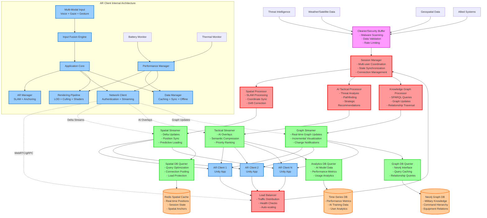
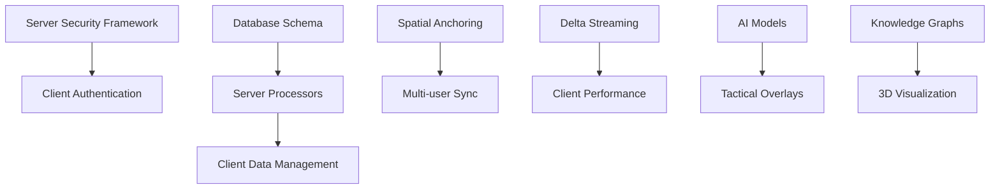

# AR Defense Training System - Master Roadmap

## 🎯 Project Overview

Building a **Scalable Multi-User AR Holographic Terrain Simulation System** for defense training applications. The system integrates cutting-edge AR technologies with AI-driven tactical analysis, multimodal interaction, and semantic compression for immersive, synchronized training environments.

## 📋 Component Roadmaps

| Component | Roadmap File | Primary Team | Dependencies |
|-----------|-------------|--------------|--------------|
| **AR Client App** | `01_client_side_roadmap.md` | Unity/AR Developers | Server APIs, Data streams |
| **Backend Infrastructure** | `02_server_side_roadmap.md` | Backend Engineers | Database schemas, Security framework |
| **Data Infrastructure** | `03_data_infrastructure_roadmap.md` | Data Engineers | Server processors, Client caching |
| **Integration & Deployment** | `04_integration_deployment_roadmap.md` | DevOps/QA Teams | All components |

## 🗓️ Master Timeline (32 Weeks)

### **Phase 1: Foundation (Weeks 1-6)**
- **Parallel Development Start**
  - Client: Basic AR framework + performance foundation
  - Server: Two-tier security architecture + session management
  - Data: Database design + initial setup
  - Integration: Development environment + CI/CD

### **Phase 2: Core Features (Weeks 7-16)**
- **Client-Server Integration**
  - Client: Spatial tracking + multi-user sync
  - Server: Specialized processors + streaming infrastructure
  - Data: Knowledge graphs + spatial data management
  - Integration: Cross-component testing + early field validation

### **Phase 3: Advanced Features (Weeks 17-28)**
- **Feature Completion**
  - Client: Multi-modal input + rendering optimization
  - Server: AI tactical overlays + predictive systems
  - Data: Semantic compression + analytics
  - Integration: Performance optimization + security hardening

### **Phase 4: Deployment (Weeks 29-32)**
- **Production Readiness**
  - Client: Device-specific optimization + offline capabilities
  - Server: Scalability testing + production deployment
  - Data: Production database tuning + backup strategies
  - Integration: Real-world testing + training scenarios

## 🏗️ **Complete System Architecture**



## 🔄 Critical Dependencies



## 🔗 **Component Interaction Specifications**

### **API Contracts & Communication Protocols**

#### **Client ↔ Server APIs**
```typescript
// Authentication API
POST /auth/device-login
Content: { deviceId, biometricHash, certificates }
Response: { jwtToken, sessionId, permissions }

// Spatial Synchronization API  
WebSocket /spatial/sync
Events: { positionUpdate, anchorCreate, driftCorrection }
Protocol: Delta-compressed JSON with 100ms heartbeat

// AI Tactical Overlay API
GET /tactical/overlays/{sessionId}
Query: { userPosition, viewFrustum, threatLevel }
Response: { overlays[], priorities[], validUntil }
```

#### **Server ↔ Database Protocols**
```sql
-- Spatial Queries (via Spatial DB Querier)
CALL GetNearbyAnchors(@lat, @lon, @radius, @sessionId)
CALL UpdateUserPosition(@userId, @position, @timestamp)

-- Graph Queries (via Graph DB Querier)  
MATCH (u:Unit)-[:COMMANDS]->(s:Subordinate)
WHERE u.sessionId = $sessionId
RETURN s.position, s.status, s.equipment
```

### **Real-Time Event Flows**

#### **User Join Session Workflow**
1. **Client** → Authentication API → **Server Security**
2. **Session Manager** → Spatial anchor query → **Spatial DB Querier**
3. **Spatial Processor** → Current user positions → **Spatial Streamer**  
4. **Knowledge Graph Processor** → Unit hierarchy → **Graph Streamer**
5. **AI Tactical Processor** → Threat analysis → **Tactical Streamer**
6. **All Streamers** → Delta updates → **All Clients**

#### **Spatial Update Cascade**
```
Device A moves → Spatial Processor → Drift detection → 
Kalman filter → Position correction → Delta calculation →
Spatial Streamer → WebRTC broadcast → Other devices
```

### **Error Handling & Recovery Patterns**

#### **Component Failure Recovery**
- **Spatial Processor Down**: Clients switch to local-only mode, queue updates
- **Database Timeout**: DB Queriers activate circuit breakers, serve from cache  
- **Network Partition**: Clients enter offline mode, sync on reconnection
- **AI Model Failure**: Tactical Streamer serves cached recommendations with warnings

#### **Data Conflict Resolution**
```python
def resolve_spatial_conflict(updates: List[SpatialUpdate]) -> SpatialUpdate:
    # Priority: UWB > IMU > Visual tracking
    # Timestamp-based ordering with device trust scores
    # Kalman filter fusion of conflicting positions
    pass
```

### **Performance Coordination**

#### **Adaptive Quality Pipeline**
```
Client Battery < 20% → Performance Manager → Network Client →
"low_power" flag → Load Balancer → Session Manager →
Reduce AI processing → Lower streaming quality → 
Extend session duration
```

#### **Back-Pressure Handling**
- **Client Overloaded**: Streamers reduce update frequency, prioritize critical data
- **Server CPU High**: Load Balancer routes new sessions to other instances
- **Database Slow**: DB Queriers increase cache TTL, batch queries

### **State Synchronization Mechanisms**

#### **Eventually Consistent Model**
- **Spatial State**: Strong consistency for safety-critical data (<100ms)
- **UI State**: Eventual consistency acceptable (1-2 second lag)
- **Knowledge Graph**: Session-level consistency, background reconciliation
- **Analytics**: Eventual consistency with hourly batch processing

#### **Conflict-Free Replicated Data Types (CRDTs)**
```javascript
// User presence CRDT - handles concurrent joins/leaves
class UserPresenceSet extends GSet {
    add(user) { /* Vector clock timestamp */ }
    remove(user) { /* Tombstone with TTL */ }
    merge(other) { /* Union with conflict resolution */ }
}
```

## 📊 Success Metrics

### **Technical Targets**
- **Latency**: <100ms for spatial synchronization
- **Accuracy**: cm-level spatial precision
- **Scalability**: 20+ simultaneous users
- **Frame Rate**: 60+ FPS on target devices
- **Compression**: 24x reduction for annotation data
- **Uptime**: 80%+ in challenging field conditions
- **Continuous Operation**: 1hr+ without major issues

### **Deployment Targets**
- **User Satisfaction**: 90%+ after 3 months
- **Security Performance**: Zero incidents in first year
- **Training Effectiveness**: 30%+ improvement vs traditional methods

## 🚨 Cross-Component Risks

### **High-Risk Integration Points**
1. **Client-Server Spatial Sync** → Implement robust testing framework early
2. **Multi-device Authentication** → Standardize security protocols across teams
3. **Data Stream Performance** → Regular load testing between client and data layers
4. **Network Resilience** → Build offline capabilities into all components

### **Timeline Dependencies & Integration Checkpoints**

#### **Week 6: Foundation Integration**
- **Client Authentication** ↔ **Server Security Framework** 
- **Basic Database Schema** ↔ **Server Processors**
- **API Contracts Finalized** across all components
- **Integration Testing Framework** operational

#### **Week 10: Core Integration** 
- **Client Spatial Tracking** ↔ **Server Spatial Processor**
- **Multi-user Synchronization** across all streamers
- **Real-time Communication** protocols validated
- **Basic Error Handling** patterns implemented

#### **Week 16: Advanced Integration**
- **Data Streaming Infrastructure** supports full client load
- **AI Tactical Overlays** integrated with client rendering
- **Knowledge Graph Visualization** real-time updates
- **Performance Coordination** mechanisms active

#### **Week 22: System Integration**
- **End-to-End Event Flows** fully operational  
- **Adaptive Quality Systems** respond to client conditions
- **Advanced Error Recovery** patterns tested
- **Multi-Modal Input** integrated with server processing

#### **Week 28: Production Integration**
- **State Synchronization** handles all edge cases
- **Performance Optimization** cross-component coordination
- **Security Hardening** full two-tier validation
- **Offline/Online Transition** seamless operation

## 📅 Key Milestones

| Week | Milestone | Components Involved |
|------|-----------|-------------------|
| 4 | Foundation Complete | All components have basic architecture |
| 10 | Multi-user Sync Working | Client + Server + Data integration |
| 16 | Core Features Complete | Full client-server-data pipeline |
| 22 | Advanced Features Ready | All components feature-complete |
| 28 | System Integration Complete | End-to-end testing successful |
| 32 | Production Deployment | Real-world validation complete |

## 🛠️ Development Environment Setup

### **Shared Infrastructure**
- **Version Control**: Git with component-specific branches
- **CI/CD**: Docker containers for each component
- **Communication**: gRPC for inter-service communication
- **Monitoring**: Prometheus + Grafana for all components
- **Security**: Shared JWT/certificate infrastructure

### **Team Coordination**
- **Daily Standups**: Component-specific teams
- **Weekly Integration**: Cross-team dependency reviews
- **Bi-weekly Demos**: End-to-end system demonstrations
- **Monthly Reviews**: Architecture and roadmap adjustments

---

## 📖 How to Use This Roadmap Structure

1. **Start with Master Roadmap** (this file) for overall project understanding
2. **Dive into Component Roadmaps** for detailed implementation guidance
3. **Track Dependencies** using the dependency graph and milestone tables
4. **Coordinate Teams** using the shared infrastructure and communication guidelines

Each component roadmap contains:
- **Detailed technical specifications**
- **Week-by-week implementation tasks**
- **Component-specific architecture diagrams**
- **Testing and validation strategies**
- **Real-world deployment considerations**

This modular approach allows teams to work in parallel while maintaining system coherence and clear integration points. 