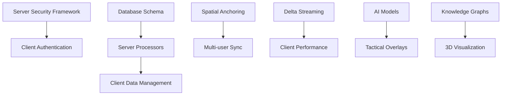

# AR Defense Training System - Master Roadmap

## 🎯 Project Overview

Building a **Scalable Multi-User AR Holographic Terrain Simulation System** for defense training applications. The system integrates cutting-edge AR technologies with AI-driven tactical analysis, multimodal interaction, and semantic compression for immersive, synchronized training environments.

## 📋 Component Roadmaps

| Component | Roadmap File | Primary Team | Dependencies |
|-----------|-------------|--------------|--------------|
| **AR Client App** | `01_client_side_roadmap.md` | Unity/AR Developers | Server APIs, Data streams |
| **Backend Infrastructure** | `02_server_side_roadmap.md` | Backend Engineers | Database schemas, Security framework |
| **Data Infrastructure** | `03_data_infrastructure_roadmap.md` | Data Engineers | Server processors, Client caching |
| **Integration & Deployment** | `04_integration_deployment_roadmap.md` | DevOps/QA Teams | All components |

## 🗓️ Master Timeline (32 Weeks)

### **Phase 1: Foundation (Weeks 1-6)**
- **Parallel Development Start**
  - Client: Basic AR framework + performance foundation
  - Server: Two-tier security architecture + session management
  - Data: Database design + initial setup
  - Integration: Development environment + CI/CD

### **Phase 2: Core Features (Weeks 7-16)**
- **Client-Server Integration**
  - Client: Spatial tracking + multi-user sync
  - Server: Specialized processors + streaming infrastructure
  - Data: Knowledge graphs + spatial data management
  - Integration: Cross-component testing + early field validation

### **Phase 3: Advanced Features (Weeks 17-28)**
- **Feature Completion**
  - Client: Multi-modal input + rendering optimization
  - Server: AI tactical overlays + predictive systems
  - Data: Semantic compression + analytics
  - Integration: Performance optimization + security hardening

### **Phase 4: Deployment (Weeks 29-32)**
- **Production Readiness**
  - Client: Device-specific optimization + offline capabilities
  - Server: Scalability testing + production deployment
  - Data: Production database tuning + backup strategies
  - Integration: Real-world testing + training scenarios

## 🔄 Critical Dependencies

## 📊 Success Metrics

### **Technical Targets**
- **Latency**: <100ms for spatial synchronization
- **Accuracy**: cm-level spatial precision
- **Scalability**: 20+ simultaneous users
- **Frame Rate**: 60+ FPS on target devices
- **Compression**: 24x reduction for annotation data
- **Uptime**: 80%+ in challenging field conditions
- **Continuous Operation**: 1hr+ without major issues

### **Deployment Targets**
- **User Satisfaction**: 90%+ after 3 months
- **Security Performance**: Zero incidents in first year
- **Training Effectiveness**: 30%+ improvement vs traditional methods

## 🚨 Cross-Component Risks

### **High-Risk Integration Points**
1. **Client-Server Spatial Sync** → Implement robust testing framework early
2. **Multi-device Authentication** → Standardize security protocols across teams
3. **Data Stream Performance** → Regular load testing between client and data layers
4. **Network Resilience** → Build offline capabilities into all components

### **Timeline Dependencies**
- **Week 6**: All teams must have basic authentication working
- **Week 10**: Client-server spatial sync must be functional
- **Week 16**: Data streaming infrastructure must support full load
- **Week 22**: All components must integrate for end-to-end testing

## 📅 Key Milestones

| Week | Milestone | Components Involved |
|------|-----------|-------------------|
| 4 | Foundation Complete | All components have basic architecture |
| 10 | Multi-user Sync Working | Client + Server + Data integration |
| 16 | Core Features Complete | Full client-server-data pipeline |
| 22 | Advanced Features Ready | All components feature-complete |
| 28 | System Integration Complete | End-to-end testing successful |
| 32 | Production Deployment | Real-world validation complete |

## 🛠️ Development Environment Setup

### **Shared Infrastructure**
- **Version Control**: Git with component-specific branches
- **CI/CD**: Docker containers for each component
- **Communication**: gRPC for inter-service communication
- **Monitoring**: Prometheus + Grafana for all components
- **Security**: Shared JWT/certificate infrastructure

### **Team Coordination**
- **Daily Standups**: Component-specific teams
- **Weekly Integration**: Cross-team dependency reviews
- **Bi-weekly Demos**: End-to-end system demonstrations
- **Monthly Reviews**: Architecture and roadmap adjustments

---

## 📖 How to Use This Roadmap Structure

1. **Start with Master Roadmap** (this file) for overall project understanding
2. **Dive into Component Roadmaps** for detailed implementation guidance
3. **Track Dependencies** using the dependency graph and milestone tables
4. **Coordinate Teams** using the shared infrastructure and communication guidelines

Each component roadmap contains:
- **Detailed technical specifications**
- **Week-by-week implementation tasks**
- **Component-specific architecture diagrams**
- **Testing and validation strategies**
- **Real-world deployment considerations**

This modular approach allows teams to work in parallel while maintaining system coherence and clear integration points. 