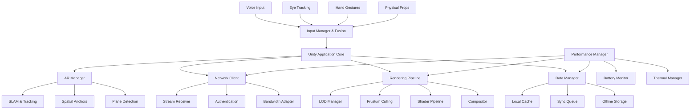

# AR Defense Training System - Client-Side Roadmap

## 🎯 Client-Side Overview

Development of the **Unity AR Client Application** that provides immersive, multi-user AR training experiences on military devices. The client handles spatial tracking, multi-modal input processing, adaptive rendering, and offline capabilities while maintaining 60+ FPS performance.

## 🏗️ Client Architecture



## 📁 Unity Project Structure

```
AR Defense Client/
├── Core/
│   ├── ApplicationManager.cs      # Main app lifecycle
│   ├── SceneManager.cs           # Scene transitions
│   ├── InputManager.cs           # Multi-modal input fusion
│   └── PerformanceManager.cs     # Resource optimization
├── AR/
│   ├── ARManager.cs              # AR session management
│   ├── SpatialTracker.cs         # SLAM and anchoring
│   ├── PlaneDetector.cs          # Environment understanding
│   └── CollaborationSync.cs      # Multi-user coordination
├── Rendering/
│   ├── LODManager.cs             # Level-of-detail system
│   ├── FrustumCuller.cs          # Visibility optimization
│   ├── ShaderManager.cs          # Custom shader pipeline
│   └── CompositorPipeline.cs     # Final frame composition
├── Networking/
│   ├── NetworkClient.cs          # Server communication
│   ├── StreamReceiver.cs         # Delta stream handling
│   ├── AuthenticationClient.cs   # Device authentication
│   └── BandwidthAdapter.cs       # Network optimization
├── Data/
│   ├── CacheManager.cs           # Local data caching
│   ├── SyncQueue.cs              # Synchronization queue
│   ├── OfflineStorage.cs         # Offline data persistence
│   └── DataCompression.cs        # Client-side compression
├── UI/
│   ├── TacticalOverlay.cs        # Military UI elements
│   ├── GazePointAR.cs            # Gaze-based interaction
│   ├── VoiceCommands.cs          # Voice processing
│   └── HapticFeedback.cs         # Tactile responses
└── Tests/
    ├── UnitTests/                # Component unit tests
    ├── IntegrationTests/         # Cross-component tests
    └── PerformanceTests/         # Performance benchmarks
```

## 📋 Development Timeline

### **Phase 1: Foundation (Weeks 1-6)**

#### **Week 1-2: Unity Project Setup**
- **Development Environment**
  - Unity 2024.x with URP and AR packages
  - ARFoundation + OpenXR configuration
  - Project structure and coding standards
  - Version control setup with Git LFS

- **Core Architecture**
  - `ApplicationManager` with scene lifecycle management
  - `PerformanceManager` with battery/thermal monitoring
  - Basic `InputManager` framework
  - Initial `NetworkClient` structure

#### **Week 3-4: Basic AR Implementation**
- **AR Foundation Integration**
  - `ARManager` with session state management
  - `SpatialTracker` for basic SLAM functionality
  - `PlaneDetector` for environment understanding
  - Camera feed and tracking initialization

- **Initial Rendering Pipeline**
  - URP configuration for AR optimization
  - Basic `LODManager` implementation
  - Performance baseline establishment
  - Frame rate monitoring and logging

#### **Week 5-6: Security & Authentication**
- **Client Security Foundation**
  - `AuthenticationClient` with device fingerprinting
  - Local data encryption (AES-256)
  - Secure storage implementation
  - Certificate-based server authentication

- **Network Foundation**
  - Basic server communication via gRPC
  - Connection management and retry logic
  - Initial bandwidth monitoring
  - Network quality adaptation

**✅ Milestone 1**: Basic AR app with authentication running at 60+ FPS

### **Phase 2: Spatial Foundation (Weeks 7-10)**

#### **Week 7-8: Advanced Spatial Tracking**
- **SLAM Enhancement**
  - Visual-inertial odometry integration
  - Real-time map generation and persistence
  - Azure Spatial Anchors integration
  - Tracking quality monitoring and recovery

- **Multi-Device Preparation**
  - Coordinate system standardization
  - Initial anchor sharing mechanisms
  - Device-to-device communication setup
  - Spatial drift detection algorithms

#### **Week 9-10: Multi-User Synchronization**
- **Collaborative Spatial System**
  - `CollaborationSync` implementation
  - UWB distance measurement integration
  - Kalman filtering for drift correction
  - Support for 5+ simultaneous users

- **Early Field Testing**
  - GPS-denied environment testing
  - Basic battery life optimization
  - Network connectivity variation handling
  - User experience feedback collection

**✅ Milestone 2**: Multi-user spatial sync with <2cm accuracy

### **Phase 3: Data Management (Weeks 11-14)**

#### **Week 11-12: Local Data Architecture**
- **Caching System Implementation**
  - `CacheManager` with three-tier strategy
  - Hot/Warm/Cold storage management
  - Memory pressure handling
  - Cache invalidation policies

- **Offline Capabilities**
  - `OfflineStorage` for essential scenarios
  - Local scenario execution framework
  - Sync queue for reconnection
  - Offline map persistence

#### **Week 13-14: Stream Processing**
- **Delta Stream Handling**
  - `StreamReceiver` for real-time updates
  - Delta compression and decompression
  - Object interpolation and prediction
  - Bandwidth-aware quality adaptation

- **Data Synchronization**
  - `SyncQueue` with priority management
  - Conflict resolution algorithms
  - Eventually consistent data model
  - Performance monitoring and alerting

**✅ Milestone 3**: Efficient data streaming with 24x compression

### **Phase 4: Rendering Optimization (Weeks 15-18)**

#### **Week 15-16: Advanced Rendering Pipeline**
- **LOD System Enhancement**
  - Distance-based quality scaling
  - Semantic importance weighting
  - Dynamic mesh optimization
  - Texture streaming and compression

- **Performance Optimization**
  - `FrustumCuller` with occlusion culling
  - Shader optimization for mobile GPUs
  - Draw call batching and instancing
  - Memory allocation optimization

#### **Week 17-18: Adaptive Quality System**
- **Dynamic Quality Management**
  - Battery-aware rendering adjustment
  - Thermal throttling response
  - Network-based quality scaling
  - User preference integration

- **Rendering Analytics**
  - Frame time monitoring
  - GPU utilization tracking
  - Memory usage profiling
  - Performance bottleneck identification

**✅ Milestone 4**: Consistent 60+ FPS across device types

### **Phase 5: Multi-Modal Input (Weeks 19-22)**

#### **Week 19-20: Voice & Gaze Integration**
- **Voice Processing Pipeline**
  - Local wake word detection
  - Server streaming for full recognition
  - Context-aware command interpretation
  - Offline basic command support

- **Gaze Tracking Implementation**
  - Tobii SDK integration
  - High-frequency tracking (90+ Hz)
  - Predictive object pre-loading
  - Context-sensitive UI highlighting

#### **Week 21-22: Gesture & Haptic Feedback**
- **Hand Gesture Recognition**
  - ARFoundation hand tracking
  - Custom military gesture library
  - Gesture + gaze fusion algorithms
  - 6-DOF object manipulation

- **Haptic Integration**
  - `HapticFeedback` implementation
  - Force feedback for object interaction
  - Spatial audio integration
  - Multi-sensory experience coordination

**✅ Milestone 5**: Seamless multi-modal interaction

### **Phase 6: Advanced Features (Weeks 23-26)**

#### **Week 23-24: Tactical UI Implementation**
- **Military-Specific Interface**
  - `TacticalOverlay` with threat visualization
  - Unit tracking and status display
  - Command hierarchy visualization
  - Real-time map overlays

- **GazePointAR Enhancement**
  - Context-aware object selection
  - Pronoun disambiguation
  - Natural language command processing
  - Spatial reference understanding

#### **Week 25-26: AI Integration**
- **Client-Side AI Processing**
  - Lightweight tactical analysis
  - Predictive user behavior modeling
  - Intelligent UI adaptation
  - Local decision support

- **Performance Intelligence**
  - ML-based performance prediction
  - Adaptive resource allocation
  - Intelligent pre-loading strategies
  - User pattern recognition

**✅ Milestone 6**: Advanced tactical features operational

### **Phase 7: Optimization & Polish (Weeks 27-30)**

#### **Week 27-28: Performance Tuning**
- **System-Wide Optimization**
  - Memory leak detection and fixing
  - CPU/GPU usage optimization
  - Network traffic minimization
  - Battery life maximization

- **Device-Specific Tuning**
  - HoloLens 2 optimization
  - Magic Leap 2 adaptation
  - Mobile AR device support
  - Hardware capability detection

#### **Week 29-30: Testing & Validation**
- **Comprehensive Testing**
  - Unit test coverage >90%
  - Integration testing across components
  - Performance benchmark validation
  - Real-world scenario testing

- **User Experience Polish**
  - UI/UX refinement based on feedback
  - Accessibility improvements
  - Error handling and recovery
  - Help system and tutorials

**✅ Milestone 7**: Production-ready client application

### **Phase 8: Deployment Preparation (Weeks 31-32)**

#### **Week 31-32: Production Readiness**
- **Deployment Optimization**
  - App size optimization
  - Update mechanism implementation
  - Configuration management
  - Monitoring and analytics setup

- **Field Validation**
  - Extended operation testing (1hr+)
  - Environmental stress testing
  - Security penetration testing
  - Performance regression testing

**✅ Final Milestone**: Client ready for production deployment

## 🔧 Technical Specifications

### **Performance Targets**
- **Frame Rate**: 60+ FPS sustained, 90+ FPS target
- **Memory Usage**: <2GB RAM for base scenarios
- **Battery Life**: 2+ hours continuous operation
- **Startup Time**: <10 seconds from launch to AR session
- **Network Usage**: <1MB/minute for basic collaboration

### **Device Support**
- **Primary**: Microsoft HoloLens 2
- **Secondary**: Magic Leap 2
- **Mobile**: iOS ARKit, Android ARCore
- **Minimum Specs**: Snapdragon 855, 6GB RAM, OpenGL ES 3.2

### **Input Capabilities**
- **Voice**: 95% accuracy in normal conditions
- **Gaze**: Sub-degree precision, <50ms latency
- **Gestures**: Real-time hand tracking, custom military commands
- **Touch**: Multi-touch support for 2D UI elements

## 🛡️ Security Implementation

### **Client-Side Security**
- **Data Protection**: AES-256 encryption for local storage
- **Communication**: TLS 1.3 for all network traffic
- **Authentication**: Certificate-based device authentication
- **Runtime Protection**: Code obfuscation and anti-tampering

### **Privacy Considerations**
- **Biometric Data**: Secure enclave storage for gaze/voice patterns
- **Location Data**: Encrypted and anonymized when possible
- **User Behavior**: Local processing with opt-in server analytics
- **Device Information**: Minimal fingerprinting for security only

## 🧪 Testing Strategy

### **Automated Testing**
- **Unit Tests**: >90% code coverage
- **Integration Tests**: Cross-component functionality
- **Performance Tests**: Frame rate, memory, battery benchmarks
- **Regression Tests**: Continuous validation of core functionality

### **Manual Testing**
- **User Experience**: Military personnel feedback sessions
- **Environmental**: Various lighting, weather, location conditions
- **Device Compatibility**: Cross-platform validation
- **Stress Testing**: Extended operation and edge cases

## 📊 Success Metrics

### **Technical Metrics**
- **Performance**: 60+ FPS in 95% of scenarios
- **Reliability**: <1% crash rate in production
- **Accuracy**: <2cm spatial tracking error
- **Responsiveness**: <100ms input to visual feedback

### **User Experience Metrics**
- **Task Completion**: >95% success rate for training scenarios
- **Learning Curve**: <30 minutes to basic proficiency
- **User Satisfaction**: >4.5/5 rating from military trainers
- **Adoption Rate**: >80% of trained users prefer AR system

This client-side roadmap provides a comprehensive development plan for creating a production-ready AR training application that meets the demanding requirements of military defense scenarios. 