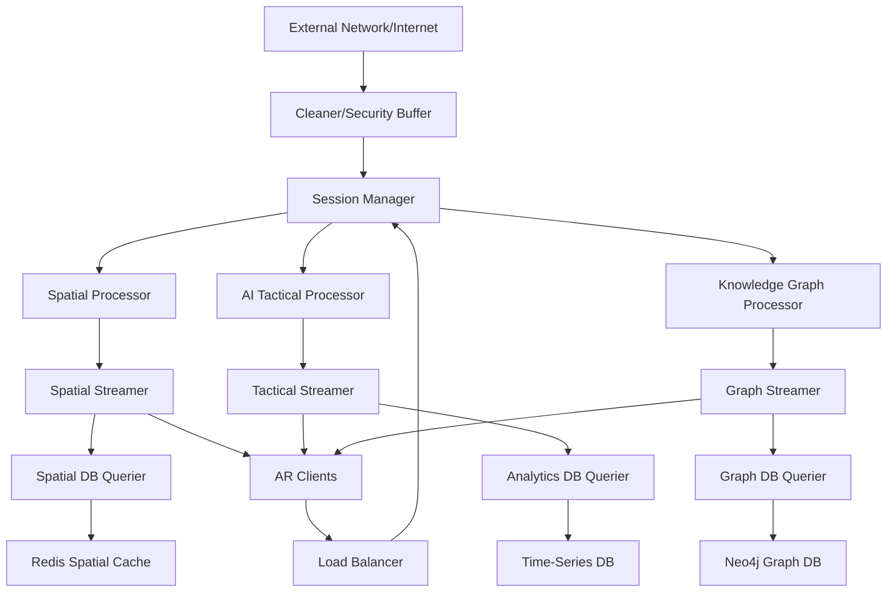

# AR Defense Training System - Server-Side Roadmap

## 🎯 Server-Side Overview

Development of the **Backend Infrastructure** that powers the AR Defense Training System. The server handles real-time multi-user synchronization, AI-powered tactical analysis, secure data processing, and scalable streaming for 20+ simultaneous users while maintaining <100ms latency.

## 🏗️ Server Architecture



## 📁 Server Project Structure

```
AR Defense Server/
├── core/
│   ├── session-manager/          # Central coordination hub
│   ├── load-balancer/           # Traffic distribution
│   ├── security-cleaner/        # External data filtering
│   └── monitoring/              # System health & metrics
├── processors/
│   ├── spatial-processor/       # SLAM & spatial coordination
│   ├── ai-tactical-processor/   # ML & tactical analysis
│   └── knowledge-graph-processor/ # Graph queries & visualization
├── streaming/
│   ├── spatial-streamer/        # Real-time spatial updates
│   ├── tactical-streamer/       # AI & overlay data
│   └── graph-streamer/          # Knowledge graph updates
├── data-access/
│   ├── spatial-db-querier/      # Redis spatial cache access
│   ├── analytics-db-querier/    # Time-series data access
│   └── graph-db-querier/        # Neo4j graph access
├── shared/
│   ├── auth/                    # Authentication & authorization
│   ├── compression/             # Data compression utilities
│   ├── networking/              # gRPC & WebRTC utilities
│   └── utils/                   # Shared utilities
├── deployment/
│   ├── docker/                  # Container configurations
│   ├── kubernetes/              # K8s manifests
│   └── terraform/               # Infrastructure as code
└── tests/
    ├── unit/                    # Component unit tests
    ├── integration/             # Cross-service tests
    ├── load/                    # Performance & load tests
    └── security/                # Security validation tests
```

## 📋 Development Timeline

### **Phase 1: Foundation & Security (Weeks 1-6)**

#### **Week 1-2: Infrastructure Setup**
- **Development Environment**
  - Docker containerization setup
  - Kubernetes cluster configuration
  - CI/CD pipeline with GitLab/GitHub Actions
  - Monitoring infrastructure (Prometheus + Grafana)

- **Core Services Foundation**
  - Node.js + TypeScript base services
  - gRPC service definitions and stubs
  - Shared authentication framework
  - Basic logging and error handling

#### **Week 3-4: Security Architecture**
- **Cleaner/Security Buffer Implementation**
  - External data validation and sanitization
  - Malware scanning integration
  - Rate limiting and DDoS protection
  - Content filtering pipeline

- **Two-Tier Security Model**
  - Network perimeter defense setup
  - Internal trusted network configuration
  - JWT token management system
  - Certificate-based client authentication

#### **Week 5-6: Session Management**
- **Session Manager Core**
  - Multi-user session coordination
  - Real-time state synchronization
  - Load balancing algorithm implementation
  - Connection management and failover

- **Load Balancer Implementation**
  - Traffic distribution algorithms
  - Health check mechanisms
  - Auto-scaling integration
  - Performance monitoring

**✅ Milestone 1**: Secure server foundation with session management

### **Phase 2: Core Processors (Weeks 7-12)**

#### **Week 7-8: Spatial Processor**
- **Spatial Coordination Engine**
  - Multi-user spatial state management
  - Coordinate system synchronization
  - Drift correction algorithms
  - Spatial anchor conflict resolution

- **Real-Time SLAM Processing**
  - Point cloud processing and fusion
  - Map merging from multiple devices
  - Quality assessment and filtering
  - Spatial query optimization

#### **Week 9-10: Knowledge Graph Processor**
- **Graph Processing Engine**
  - SPARQL query optimization
  - Real-time graph updates
  - Relationship traversal algorithms
  - Knowledge inference engine

- **Military Domain Models**
  - Command hierarchy structures
  - Equipment and logistics graphs
  - Tactical doctrine representation
  - Real-time battlefield state

#### **Week 11-12: AI Tactical Processor**
- **AI Model Integration**
  - TensorFlow/PyTorch model serving
  - Real-time inference pipeline
  - Model versioning and A/B testing
  - GPU resource management

- **Tactical Analysis Engine**
  - Threat assessment algorithms
  - Pathfinding and route optimization
  - Strategic recommendation system
  - Predictive scenario modeling

**✅ Milestone 2**: All core processors operational

### **Phase 3: Streaming Infrastructure (Weeks 13-18)**

#### **Week 13-14: Data Streaming Foundation**
- **Streaming Architecture**
  - Apache Kafka for message queuing
  - WebRTC for real-time communication
  - Delta compression algorithms
  - Stream prioritization framework

- **Spatial Streamer Implementation**
  - Real-time spatial update broadcasting
  - Delta-only position updates
  - Predictive pre-loading
  - Bandwidth optimization

#### **Week 15-16: Advanced Streaming**
- **Tactical Streamer Development**
  - AI overlay data streaming
  - Semantic importance ranking
  - Adaptive quality scaling
  - Multi-device synchronization

- **Graph Streamer Implementation**
  - Real-time graph update propagation
  - Incremental graph visualization
  - Change notification system
  - Conflict resolution mechanisms

#### **Week 17-18: Stream Optimization**
- **Compression & Performance**
  - Semantic compression implementation
  - Adaptive bitrate streaming
  - Network condition adaptation
  - Cache-friendly data structures

- **Quality of Service**
  - Priority-based streaming
  - Bandwidth allocation algorithms
  - Latency optimization
  - Error recovery mechanisms

**✅ Milestone 3**: Optimized streaming infrastructure operational

### **Phase 4: Database Integration (Weeks 19-22)**

#### **Week 19-20: Database Queriers**
- **Spatial DB Querier (Redis)**
  - Connection pooling and management
  - Spatial indexing optimization
  - Real-time query processing
  - Cache invalidation strategies

- **Analytics DB Querier (Time-Series)**
  - InfluxDB/TimescaleDB integration
  - Performance metrics collection
  - Real-time analytics queries
  - Data retention policies

#### **Week 21-22: Advanced Data Access**
- **Graph DB Querier (Neo4j)**
  - Cypher query optimization
  - Graph traversal algorithms
  - Real-time relationship updates
  - Distributed graph processing

- **Database Protection Layer**
  - Query rate limiting
  - Resource usage monitoring
  - Automatic scaling triggers
  - Performance bottleneck detection

**✅ Milestone 4**: Complete database integration with protection

### **Phase 5: AI & Optimization (Weeks 23-28)**

#### **Week 23-24: Advanced AI Features**
- **Predictive Analytics**
  - LSTM-based user behavior prediction
  - Tactical outcome modeling
  - Resource usage forecasting
  - Anomaly detection systems

- **Intelligent Resource Management**
  - Dynamic load balancing
  - Predictive scaling algorithms
  - Resource allocation optimization
  - Cost optimization strategies

#### **Week 25-26: Performance Optimization**
- **System-Wide Performance Tuning**
  - CPU/Memory optimization
  - Network latency reduction
  - Database query optimization
  - Caching strategy enhancement

- **Scalability Enhancement**
  - Horizontal scaling implementation
  - Microservices communication optimization
  - State management improvements
  - Fault tolerance mechanisms

#### **Week 27-28: Advanced Security**
- **Security Hardening**
  - Advanced threat detection
  - Intrusion prevention systems
  - Audit logging and compliance
  - Zero-trust architecture implementation

- **Monitoring & Alerting**
  - Real-time security monitoring
  - Performance anomaly detection
  - Automated incident response
  - Comprehensive logging system

**✅ Milestone 5**: AI-enhanced and optimized server system

### **Phase 6: Production Deployment (Weeks 29-32)**

#### **Week 29-30: Production Infrastructure**
- **Deployment Automation**
  - Infrastructure as Code (Terraform)
  - Automated deployment pipelines
  - Environment management
  - Rollback mechanisms

- **Production Monitoring**
  - Comprehensive health checks
  - Performance dashboard setup
  - Alerting system configuration
  - Log aggregation and analysis

#### **Week 31-32: Validation & Tuning**
- **Load Testing & Validation**
  - 20+ concurrent user testing
  - Stress testing under peak load
  - Failover scenario validation
  - Performance regression testing

- **Production Optimization**
  - Real-world performance tuning
  - Capacity planning and scaling
  - Security validation testing
  - Documentation completion

**✅ Final Milestone**: Production-ready server infrastructure

## 🔧 Technical Specifications

### **Performance Targets**
- **Latency**: <100ms for spatial synchronization
- **Throughput**: Support 20+ concurrent users per instance
- **Scalability**: Auto-scale to 100+ users across instances
- **Uptime**: 99.9% availability target
- **Response Time**: <50ms for API responses

### **Infrastructure Requirements**
- **CPU**: 8+ cores per processing node
- **Memory**: 32GB+ RAM per node
- **Storage**: SSD with 10K+ IOPS
- **Network**: 10Gbps+ bandwidth
- **GPU**: NVIDIA V100/A100 for AI processing

### **Scalability Design**
- **Horizontal Scaling**: Kubernetes-based auto-scaling
- **Load Distribution**: Consistent hashing for session distribution
- **Database Scaling**: Read replicas and sharding strategies
- **CDN Integration**: Geographic content distribution

## 🛡️ Security Implementation

### **Two-Tier Security Architecture**
- **External Perimeter**: Cleaner/Security Buffer with DPI
- **Internal Network**: Trusted communication with mTLS
- **Authentication**: Multi-factor authentication for admin access
- **Authorization**: Role-based access control (RBAC)

### **Data Protection**
- **Encryption**: AES-256 for data at rest
- **Communication**: TLS 1.3 for all network traffic
- **Key Management**: Hardware Security Module (HSM)
- **Compliance**: FIPS 140-2 Level 3 compliance

### **Security Monitoring**
- **SIEM Integration**: Real-time security event monitoring
- **Threat Intelligence**: Integration with defense threat feeds
- **Vulnerability Management**: Automated security scanning
- **Incident Response**: Automated containment procedures

## 🚀 Deployment Strategy

### **Container Orchestration**
- **Kubernetes**: Production-grade container orchestration
- **Helm Charts**: Standardized deployment packages
- **Service Mesh**: Istio for advanced traffic management
- **Observability**: Distributed tracing with Jaeger

### **Multi-Environment Strategy**
- **Development**: Local Docker Compose setup
- **Staging**: Kubernetes cluster for integration testing
- **Production**: Multi-region Kubernetes deployment
- **Disaster Recovery**: Cross-region backup and failover

### **Continuous Deployment**
- **GitOps**: ArgoCD for declarative deployments
- **Blue-Green Deployment**: Zero-downtime updates
- **Canary Releases**: Gradual feature rollouts
- **Automated Rollbacks**: Failure detection and recovery

## 🧪 Testing Strategy

### **Automated Testing**
- **Unit Tests**: >90% code coverage
- **Integration Tests**: Cross-service functionality validation
- **Load Tests**: Performance under realistic conditions
- **Security Tests**: Automated vulnerability assessment

### **Performance Testing**
- **Load Testing**: Gradual load increase testing
- **Stress Testing**: Breaking point identification
- **Spike Testing**: Sudden load burst handling
- **Endurance Testing**: Long-duration stability validation

## 📊 Success Metrics

### **Performance Metrics**
- **Response Time**: 95th percentile <100ms
- **Throughput**: 1000+ requests per second per node
- **Error Rate**: <0.1% error rate in production
- **Resource Utilization**: <70% CPU/Memory usage

### **Reliability Metrics**
- **Uptime**: >99.9% availability
- **MTTR**: <15 minutes mean time to recovery
- **MTBF**: >720 hours mean time between failures
- **Data Integrity**: Zero data loss incidents

### **Security Metrics**
- **Incident Response**: <30 minutes detection to containment
- **Compliance**: 100% compliance with security standards
- **Vulnerability Management**: <24 hours critical patch deployment
- **Access Control**: Zero unauthorized access incidents

This server-side roadmap provides a comprehensive development plan for building a production-ready, scalable, and secure backend infrastructure that can handle the demanding requirements of military AR defense training scenarios. 