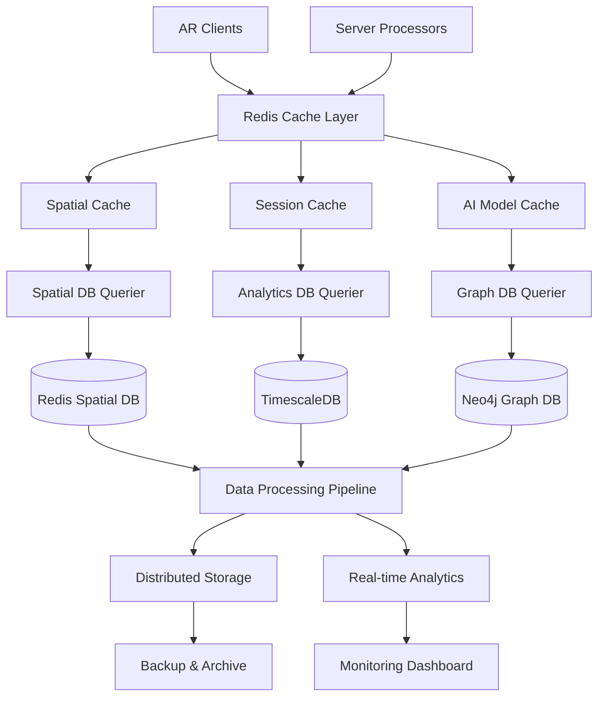

# AR Defense Training System - Data Infrastructure Roadmap

## 🎯 Data Infrastructure Overview

Development of the **Data Layer Architecture** that powers the AR Defense Training System. This includes spatial data management, knowledge graphs, real-time analytics, caching strategies, and data protection systems that enable <100ms query responses while handling 20+ concurrent users.

## 🏗️ Data Architecture



## 📁 Data Infrastructure Structure

```
AR Defense Data/
├── databases/
│   ├── spatial/                 # Redis spatial data management
│   ├── knowledge-graph/         # Neo4j graph database
│   ├── time-series/            # TimescaleDB analytics
│   └── object-storage/         # MinIO/S3 file storage
├── queriers/
│   ├── spatial-querier/        # Redis query optimization
│   ├── graph-querier/          # Neo4j query engine
│   ├── analytics-querier/      # TimescaleDB queries
│   └── cache-manager/          # Multi-tier caching
├── processing/
│   ├── data-pipeline/          # ETL data processing
│   ├── compression/            # Data compression algorithms
│   ├── validation/             # Data quality assurance
│   └── migration/              # Schema migrations
├── monitoring/
│   ├── performance/            # Database performance metrics
│   ├── health-checks/          # System health monitoring
│   ├── alerting/               # Automated alerting system
│   └── analytics/              # Usage analytics dashboard
├── backup/
│   ├── automated-backup/       # Scheduled backup system
│   ├── disaster-recovery/      # DR procedures
│   ├── data-archival/          # Long-term storage
│   └── compliance/             # Audit trail management
└── tests/
    ├── performance/            # Database performance tests
    ├── scalability/            # Load testing
    ├── integrity/              # Data integrity validation
    └── security/               # Data security tests
```

## 📋 Development Timeline

### **Phase 1: Foundation Setup (Weeks 1-6)**

#### **Week 1-2: Infrastructure Planning**
- **Database Architecture Design**
  - Multi-database strategy planning
  - Data flow architecture design
  - Caching strategy definition
  - Backup and recovery planning

- **Environment Setup**
  - Docker containers for all databases
  - Kubernetes StatefulSets configuration
  - Persistent volume provisioning
  - Network security configuration

#### **Week 3-4: Core Database Installation**
- **Redis Spatial Database**
  - Redis Cluster setup with spatial modules
  - Spatial indexing configuration
  - Memory optimization settings
  - Replication and failover setup

- **Neo4j Knowledge Graph**
  - Neo4j cluster deployment
  - Graph schema design and validation
  - Index optimization for spatial queries
  - Security configuration and user management

#### **Week 5-6: Analytics & Storage**
- **TimescaleDB Time-Series Database**
  - TimescaleDB cluster setup
  - Hypertable configuration for time-series data
  - Compression and retention policies
  - Continuous aggregation setup

- **Object Storage**
  - MinIO/S3 distributed storage setup
  - Bucket policies and access control
  - CDN integration for static assets
  - Data lifecycle management

**✅ Milestone 1**: All core databases operational with basic configuration

### **Phase 2: Data Schema & Models (Weeks 7-10)**

#### **Week 7-8: Spatial Data Schema**
- **Spatial Data Models**
  - 3D coordinate system standardization
  - Spatial anchor data structures
  - Real-time position tracking schema
  - Multi-device synchronization models

- **Spatial Indexing**
  - R-tree spatial indexing implementation
  - Geohashing for quick spatial queries
  - 3D spatial partitioning strategies
  - Query optimization for real-time access

#### **Week 9-10: Knowledge Graph Schema**
- **Military Domain Ontology**
  - Command hierarchy graph structure
  - Equipment and resource relationships
  - Tactical doctrine representation
  - Training scenario models

- **Graph Optimization**
  - Relationship indexing strategies
  - Graph traversal optimization
  - Query pattern analysis
  - Performance tuning for complex queries

**✅ Milestone 2**: Optimized data schemas for all databases

### **Phase 3: Query Optimization & Caching (Weeks 11-14)**

#### **Week 11-12: Database Queriers**
- **Spatial DB Querier Implementation**
  - Connection pooling and management
  - Spatial query optimization
  - Real-time data streaming
  - Error handling and retry logic

- **Graph DB Querier Development**
  - Cypher query optimization
  - Graph traversal algorithms
  - Relationship caching strategies
  - Batch query processing

#### **Week 13-14: Advanced Caching**
- **Multi-Tier Caching Strategy**
  - L1: In-memory application cache
  - L2: Redis distributed cache
  - L3: Database query cache
  - Cache invalidation policies

- **Cache Performance Optimization**
  - Cache hit ratio optimization
  - Intelligent pre-loading algorithms
  - Memory pressure management
  - Cache warming strategies

**✅ Milestone 3**: Optimized query performance with comprehensive caching

### **Phase 4: Data Processing Pipeline (Weeks 15-18)**

#### **Week 15-16: ETL Pipeline**
- **Data Processing Framework**
  - Apache Kafka for data streaming
  - Real-time data transformation
  - Data quality validation
  - Error handling and dead letter queues

- **Compression & Optimization**
  - Semantic compression algorithms
  - Delta compression for spatial data
  - Lossless compression for critical data
  - Bandwidth optimization strategies

#### **Week 17-18: Real-time Analytics**
- **Analytics Querier Development**
  - TimescaleDB query optimization
  - Real-time aggregation queries
  - Performance metrics collection
  - User behavior analytics

- **Data Streaming**
  - Real-time data pipeline setup
  - Stream processing with Apache Flink
  - Event-driven data updates
  - Low-latency data delivery

**✅ Milestone 4**: Complete data processing pipeline operational

### **Phase 5: Monitoring & Security (Weeks 19-22)**

#### **Week 19-20: Performance Monitoring**
- **Database Performance Monitoring**
  - Query performance analytics
  - Resource utilization monitoring
  - Slow query identification
  - Automated performance tuning

- **Health Check System**
  - Database health monitoring
  - Replication lag monitoring
  - Connection pool monitoring
  - Automated failover triggers

#### **Week 21-22: Security Implementation**
- **Data Security**
  - Encryption at rest (AES-256)
  - Encryption in transit (TLS 1.3)
  - Row-level security policies
  - Database access auditing

- **Compliance & Auditing**
  - GDPR/CCPA compliance measures
  - Military data classification
  - Audit trail implementation
  - Data retention policies

**✅ Milestone 5**: Secure and monitored data infrastructure

### **Phase 6: Backup & Disaster Recovery (Weeks 23-26)**

#### **Week 23-24: Backup Systems**
- **Automated Backup Implementation**
  - Continuous backup for critical data
  - Point-in-time recovery capability
  - Cross-region backup replication
  - Backup validation and testing

- **Data Archival**
  - Long-term storage strategies
  - Data lifecycle management
  - Cold storage for historical data
  - Compliance-driven retention

#### **Week 25-26: Disaster Recovery**
- **DR Planning & Implementation**
  - Multi-region failover setup
  - Recovery time objective (RTO) optimization
  - Recovery point objective (RPO) minimization
  - Automated disaster recovery testing

- **Business Continuity**
  - Backup verification procedures
  - Failover testing protocols
  - Data consistency validation
  - Recovery documentation

**✅ Milestone 6**: Comprehensive backup and disaster recovery

### **Phase 7: Scalability & Optimization (Weeks 27-30)**

#### **Week 27-28: Horizontal Scaling**
- **Database Sharding**
  - Spatial data sharding strategies
  - Graph database clustering
  - Read replica configuration
  - Load balancing optimization

- **Auto-scaling Implementation**
  - Resource-based auto-scaling
  - Predictive scaling algorithms
  - Cost optimization strategies
  - Performance threshold management

#### **Week 29-30: Final Optimization**
- **Performance Tuning**
  - Query execution plan optimization
  - Index tuning and maintenance
  - Memory allocation optimization
  - Network latency reduction

- **Capacity Planning**
  - Growth projection modeling
  - Resource requirement forecasting
  - Cost analysis and optimization
  - Scalability testing validation

**✅ Milestone 7**: Scalable and optimized data infrastructure

### **Phase 8: Production Deployment (Weeks 31-32)**

#### **Week 31-32: Production Readiness**
- **Production Deployment**
  - Production environment setup
  - Data migration procedures
  - Performance validation testing
  - Security compliance verification

- **Final Validation**
  - End-to-end data flow testing
  - Performance benchmark validation
  - Disaster recovery testing
  - Documentation completion

**✅ Final Milestone**: Production-ready data infrastructure

## 🔧 Technical Specifications

### **Database Performance Targets**
- **Query Response Time**: <50ms for spatial queries
- **Graph Traversal**: <100ms for complex relationship queries
- **Analytics Queries**: <200ms for time-series aggregations
- **Cache Hit Ratio**: >95% for frequently accessed data
- **Throughput**: 10,000+ queries per second per database

### **Storage Requirements**
- **Spatial Data**: 100GB+ for base scenarios
- **Knowledge Graph**: 50GB+ for military ontologies
- **Time-series Data**: 1TB+ for analytics and logs
- **Object Storage**: 10TB+ for media and assets
- **Backup Storage**: 3x primary storage capacity

### **Scalability Specifications**
- **Horizontal Scaling**: Auto-scale based on load
- **Vertical Scaling**: Dynamic resource allocation
- **Multi-region**: Active-active replication
- **Concurrent Users**: Support 100+ simultaneous connections
- **Data Volume**: Petabyte-scale storage capability

## 🛡️ Data Security & Compliance

### **Encryption Standards**
- **At Rest**: AES-256 encryption for all stored data
- **In Transit**: TLS 1.3 for all data movement
- **Key Management**: Hardware Security Module (HSM)
- **Database Encryption**: Transparent Data Encryption (TDE)

### **Access Control**
- **Authentication**: Multi-factor authentication required
- **Authorization**: Role-based access control (RBAC)
- **Row-Level Security**: Fine-grained data access control
- **Audit Logging**: Comprehensive access audit trails

### **Compliance Requirements**
- **Military Standards**: NIST 800-53 compliance
- **Data Classification**: Proper handling of classified data
- **Privacy Regulations**: GDPR/CCPA compliance where applicable
- **Audit Requirements**: SOC 2 Type II compliance

## 📊 Data Quality & Governance

### **Data Quality Assurance**
- **Validation Rules**: Automated data quality checks
- **Consistency Checks**: Cross-database validation
- **Integrity Constraints**: Foreign key and unique constraints
- **Data Profiling**: Regular data quality assessment

### **Data Governance**
- **Data Lineage**: Track data flow and transformations
- **Metadata Management**: Comprehensive data cataloging
- **Data Stewardship**: Assigned data ownership
- **Change Management**: Controlled schema evolution

## 🧪 Testing Strategy

### **Performance Testing**
- **Load Testing**: Simulate realistic user loads
- **Stress Testing**: Test breaking points
- **Endurance Testing**: Long-duration stability
- **Spike Testing**: Sudden load burst handling

### **Data Integrity Testing**
- **ACID Testing**: Transaction integrity validation
- **Consistency Testing**: Multi-database consistency
- **Recovery Testing**: Backup and restore validation
- **Migration Testing**: Schema migration verification

## 📈 Success Metrics

### **Performance Metrics**
- **Query Performance**: 95th percentile <100ms
- **Availability**: >99.9% uptime
- **Throughput**: 10,000+ ops/second sustained
- **Storage Efficiency**: >80% storage utilization

### **Reliability Metrics**
- **Data Integrity**: Zero data corruption incidents
- **Backup Success**: 100% successful backup rate
- **Recovery Time**: <15 minutes for critical systems
- **Consistency**: Zero data inconsistency issues

### **Security Metrics**
- **Access Violations**: Zero unauthorized access
- **Encryption Coverage**: 100% sensitive data encrypted
- **Audit Compliance**: 100% audit log coverage
- **Vulnerability Management**: <24 hours patch deployment

This data infrastructure roadmap provides a comprehensive development plan for building a robust, scalable, and secure data layer that can handle the demanding requirements of military AR defense training scenarios. 