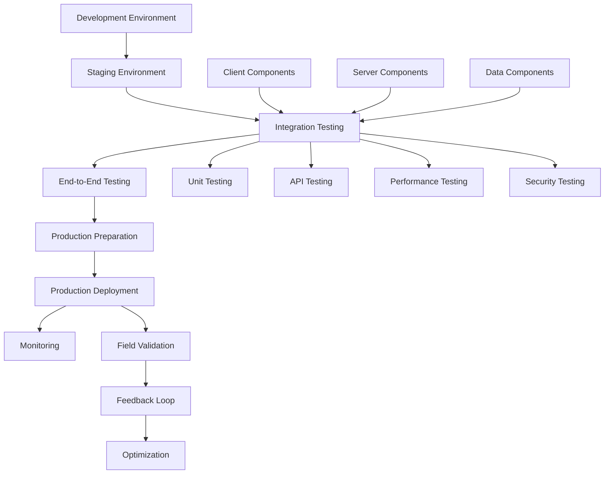

# AR Defense Training System - Integration & Deployment Roadmap

## 🎯 Integration & Deployment Overview

Orchestration of the **End-to-End System Integration** and **Production Deployment** for the AR Defense Training System. This roadmap focuses on bringing together client, server, and data components into a cohesive system, comprehensive testing, real-world validation, and production deployment with military-grade reliability.

## 🏗️ Integration Architecture



## 📁 Integration Project Structure

```
AR Defense Integration/
├── environments/
│   ├── development/            # Local development setup
│   ├── staging/               # Integration testing environment
│   ├── production/            # Production deployment configs
│   └── disaster-recovery/     # DR environment setup
├── testing/
│   ├── unit-tests/           # Component unit testing
│   ├── integration-tests/    # Cross-component testing
│   ├── e2e-tests/           # End-to-end scenario testing
│   ├── performance-tests/    # Load and stress testing
│   ├── security-tests/       # Security validation testing
│   └── field-tests/         # Real-world environment testing
├── deployment/
│   ├── ci-cd/               # Continuous integration/deployment
│   ├── infrastructure/       # Infrastructure as Code
│   ├── monitoring/          # Production monitoring setup
│   └── rollback/            # Automated rollback procedures
├── validation/
│   ├── scenarios/           # Military training scenarios
│   ├── benchmarks/          # Performance benchmarks
│   ├── compliance/          # Security compliance validation
│   └── user-acceptance/     # Military personnel testing
├── documentation/
│   ├── technical/           # Technical documentation
│   ├── operational/         # Operations runbooks
│   ├── training/            # User training materials
│   └── compliance/          # Audit and compliance docs
└── tools/
    ├── automation/          # Deployment automation scripts
    ├── monitoring/          # Custom monitoring tools
    ├── testing/             # Testing utilities
    └── migration/           # Data migration tools
```

## 📋 Development Timeline

### **Phase 1: Integration Foundation (Weeks 1-6)**

#### **Week 1-2: Environment Setup**
- **Development Environment Integration**
  - Docker Compose multi-service setup
  - Local development workflow standardization
  - Shared configuration management
  - Inter-service communication testing

- **CI/CD Pipeline Setup**
  - GitLab CI / GitHub Actions configuration
  - Automated build and test pipelines
  - Container registry setup
  - Deployment automation scripts

#### **Week 3-4: Staging Environment**
- **Staging Infrastructure**
  - Kubernetes staging cluster setup
  - Production-like environment configuration
  - Service mesh implementation (Istio)
  - Monitoring and logging infrastructure

- **Cross-Component Integration**
  - Client-server communication validation
  - Server-database integration testing
  - Authentication flow end-to-end testing
  - Basic multi-user session testing

#### **Week 5-6: Integration Testing Framework**
- **Testing Infrastructure**
  - Automated testing framework setup
  - Test data management system
  - Performance testing infrastructure
  - Security testing tools integration

- **Initial Integration Validation**
  - Basic AR client connection to server
  - Spatial synchronization between devices
  - Knowledge graph query integration
  - Real-time data streaming validation

**✅ Milestone 1**: Integrated development and staging environments operational

### **Phase 2: Component Integration (Weeks 7-12)**

#### **Week 7-8: Client-Server Integration**
- **Real-time Communication**
  - WebRTC connection establishment
  - gRPC service integration
  - Authentication and authorization flow
  - Error handling and retry mechanisms

- **Spatial Synchronization**
  - Multi-device spatial anchor sharing
  - Real-time position synchronization
  - Drift correction algorithm integration
  - Coordinate system standardization

#### **Week 9-10: Server-Data Integration**
- **Database Integration**
  - Spatial data querier integration
  - Knowledge graph processor connection
  - Analytics data pipeline validation
  - Cache layer optimization

- **Streaming Infrastructure**
  - Delta streaming implementation
  - Compression algorithm integration
  - Bandwidth adaptation testing
  - Quality of service validation

#### **Week 11-12: End-to-End Feature Integration**
- **Advanced Features Integration**
  - Multi-modal input processing
  - AI tactical overlay generation
  - Knowledge graph 3D visualization
  - Performance optimization validation

- **Security Integration**
  - Two-tier security validation
  - Encryption end-to-end testing
  - Authentication system integration
  - Audit logging validation

**✅ Milestone 2**: All components integrated with basic functionality

### **Phase 3: Comprehensive Testing (Weeks 13-18)**

#### **Week 13-14: Performance Testing**
- **Load Testing**
  - 20+ concurrent user simulation
  - Spatial synchronization under load
  - Database performance validation
  - Network bandwidth optimization

- **Stress Testing**
  - System breaking point identification
  - Resource exhaustion scenarios
  - Recovery mechanism validation
  - Performance degradation analysis

#### **Week 15-16: Security Testing**
- **Penetration Testing**
  - External security assessment
  - Vulnerability scanning
  - Authentication bypass attempts
  - Data encryption validation

- **Compliance Validation**
  - Military security standards compliance
  - NIST 800-53 framework validation
  - Audit trail verification
  - Data classification compliance

#### **Week 17-18: Reliability Testing**
- **Failover Testing**
  - Database failover scenarios
  - Server component failure recovery
  - Network partition handling
  - Client reconnection validation

- **Endurance Testing**
  - 1hr+ continuous operation validation
  - Memory leak detection
  - Performance consistency over time
  - Resource usage stability

**✅ Milestone 3**: Comprehensive testing validation complete

### **Phase 4: Real-World Validation (Weeks 19-24)**

#### **Week 19-20: Environment Testing**
- **Field Environment Validation**
  - GPS-denied environment testing
  - Various lighting condition testing
  - Network connectivity variation testing
  - Device compatibility validation

- **Military Scenario Testing**
  - Command and control scenarios
  - Tactical planning exercises
  - Multi-team coordination testing
  - Equipment integration validation

#### **Week 21-22: User Acceptance Testing**
- **Military Personnel Testing**
  - User experience validation
  - Training effectiveness measurement
  - Feedback collection and analysis
  - Interface usability assessment

- **Instructor Tools Validation**
  - Training scenario creation tools
  - Assessment and analytics systems
  - Session control and monitoring
  - Reporting and compliance tools

#### **Week 23-24: Performance Optimization**
- **Real-World Performance Tuning**
  - Field performance optimization
  - Network adaptation improvements
  - Battery life optimization
  - User experience enhancements

- **Scenario Refinement**
  - Training scenario optimization
  - Military doctrine alignment
  - Assessment criteria refinement
  - User training program development

**✅ Milestone 4**: Real-world validation and optimization complete

### **Phase 5: Production Preparation (Weeks 25-28)**

#### **Week 25-26: Production Infrastructure**
- **Production Environment Setup**
  - Multi-region production deployment
  - High-availability configuration
  - Disaster recovery setup
  - Production monitoring implementation

- **Security Hardening**
  - Production security configuration
  - Network security implementation
  - Access control finalization
  - Compliance validation

#### **Week 27-28: Deployment Automation**
- **Automated Deployment Pipeline**
  - Blue-green deployment setup
  - Canary release implementation
  - Automated rollback procedures
  - Health check automation

- **Monitoring and Alerting**
  - Production monitoring dashboard
  - Real-time alerting system
  - Performance metrics collection
  - Incident response automation

**✅ Milestone 5**: Production-ready infrastructure and automation

### **Phase 6: Production Deployment (Weeks 29-32)**

#### **Week 29-30: Staged Production Rollout**
- **Pilot Deployment**
  - Limited user production deployment
  - Real-time monitoring and validation
  - Performance optimization
  - Issue identification and resolution

- **Gradual Rollout**
  - Phased user onboarding
  - Capacity scaling validation
  - Performance monitoring
  - User feedback integration

#### **Week 31-32: Full Production Deployment**
- **Complete System Deployment**
  - Full-scale production rollout
  - All features enabled and validated
  - Complete training scenario library
  - Full user onboarding

- **Final Validation**
  - Production performance validation
  - Security compliance verification
  - User satisfaction measurement
  - Training effectiveness assessment

**✅ Final Milestone**: Complete production deployment with validated performance

## 🔧 Integration Technical Specifications

### **System Integration Requirements**
- **Inter-Service Latency**: <50ms between components
- **End-to-End Latency**: <100ms client to database
- **Concurrent Users**: 20+ users per deployment instance
- **System Uptime**: 99.9% availability target
- **Data Consistency**: Eventual consistency within 100ms

### **Performance Integration Targets**
- **Client-Server Sync**: <100ms spatial synchronization
- **Database Queries**: <50ms average response time
- **Streaming Performance**: 24x compression efficiency
- **Network Efficiency**: 370% reduction vs traditional methods
- **Resource Utilization**: <70% CPU/Memory across all components

### **Security Integration Standards**
- **End-to-End Encryption**: TLS 1.3 for all communications
- **Authentication**: Multi-factor authentication for all access
- **Authorization**: RBAC across all system components
- **Audit Logging**: Comprehensive logging across all systems
- **Compliance**: NIST 800-53 and military security standards

## 🚀 Deployment Strategy

### **Multi-Environment Strategy**
- **Development**: Local Docker Compose setup for developers
- **Staging**: Kubernetes cluster mirroring production
- **Production**: Multi-region Kubernetes with high availability
- **DR**: Cross-region disaster recovery environment

### **Deployment Methodology**
- **Blue-Green Deployment**: Zero-downtime production updates
- **Canary Releases**: Gradual feature rollouts to minimize risk
- **Feature Flags**: Runtime feature control without deployment
- **Automated Rollbacks**: Immediate rollback on failure detection

### **Infrastructure as Code**
- **Terraform**: Infrastructure provisioning and management
- **Helm Charts**: Kubernetes application deployment
- **ArgoCD**: GitOps-based continuous deployment
- **Prometheus + Grafana**: Monitoring and alerting

## 🧪 Testing Strategy

### **Testing Pyramid**
- **Unit Tests**: 90%+ code coverage across all components
- **Integration Tests**: Cross-component functionality validation
- **E2E Tests**: Complete user journey validation
- **Performance Tests**: Load, stress, and endurance testing
- **Security Tests**: Vulnerability and compliance validation

### **Real-World Testing**
- **Environmental Testing**: Various field conditions
- **User Acceptance Testing**: Military personnel validation
- **Scenario Testing**: Complete training scenarios
- **Compliance Testing**: Security and regulatory validation

## 📊 Success Metrics

### **Integration Success Metrics**
- **System Integration**: 100% component integration success
- **Test Coverage**: >90% automated test coverage
- **Performance Validation**: All performance targets met
- **Security Validation**: Zero critical security issues
- **User Acceptance**: >90% user satisfaction in testing

### **Deployment Success Metrics**
- **Deployment Success Rate**: >99% successful deployments
- **Rollback Rate**: <1% deployments requiring rollback
- **Mean Time to Deploy**: <30 minutes for standard updates
- **Mean Time to Recovery**: <15 minutes for critical issues
- **System Availability**: >99.9% uptime in production

### **Real-World Validation Metrics**
- **Training Effectiveness**: 30%+ improvement vs traditional methods
- **User Adoption**: >80% trained users prefer AR system
- **System Reliability**: 1hr+ continuous operation success
- **Field Performance**: 90%+ scenarios complete successfully
- **Military Compliance**: 100% compliance with security standards

## 📋 Risk Mitigation

### **Integration Risks**
- **Component Compatibility**: Comprehensive interface testing
- **Performance Degradation**: Continuous performance monitoring
- **Security Vulnerabilities**: Regular security assessments
- **Data Consistency**: Multi-level validation procedures

### **Deployment Risks**
- **Production Failures**: Automated rollback mechanisms
- **Data Loss**: Comprehensive backup and recovery procedures
- **Security Breaches**: Multi-layer security validation
- **User Adoption**: Extensive training and support programs

This integration and deployment roadmap provides a comprehensive plan for bringing together all system components into a production-ready AR Defense Training System that meets the demanding requirements of military applications. 